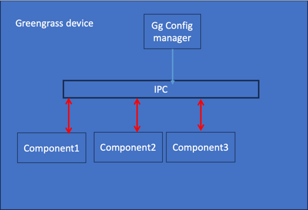
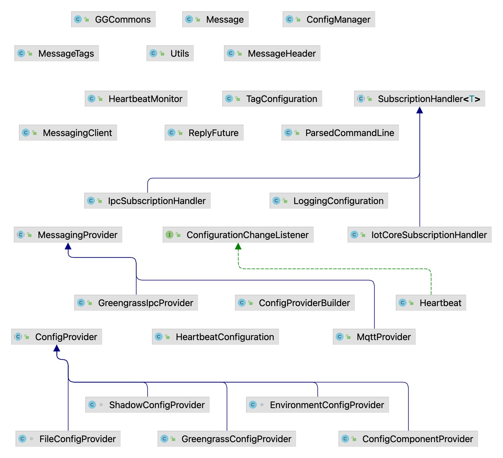

# ggcommons-java-lib
  
#### Getting started

```
cd existing_repo
git remote add origin https://gitlab.aws.dev/greengrass-commons/ggcommons-java-lib.git
git branch -M main
git push -uf origin main
```
# Table of Contents

1. [Overview](#overview)
2. [Getting Started](#getting-started) 
3. [Providers](#Providers)
4. [Usage](#Usage)
5. [Test and deploy](#Test-and-Deploy)
6. [Support](#Support)
7. [Roadmap](#Roadmap)
8. [Contributing](#Contributing)
9. [Authors and acknowledgment](#Authors-and-acknowledgment)

## Overview

Greengrass commons is a java based library that is aimed to solve configuration updates for one or more components deployed
across multiple devices. It helps with providing out of box support for config management, heartbeat configuration, logging configuration, tagging and messaging configuration. 

#### Providers

Possible configuration options
1. **Environment** 
Good for development and local testing but does not scale well for industrial settings
2. **File**
Embedding unique configuration in the deployment configuration, while possible, removes the ability to do binary updates to multiple devices.
3. **Shadow**
Has core limitations:
 * 7 layers of json nesting
*  Other considerations when using SHADOW include:
The configuration should be contained in a single property named ComponentConfig the value of the ComponentConfig property must be a single "stringified" JSON object that matches the structure defined in the configuration reference.  It is stringified to work around the json depth limitation enforced by AWS IoT Shadows
be aware of the 8K shadow document size limitation (inclusive of desired and reported states).  It is recommended to minify your JSON configuration prior to stringifying it.
requires the deployment of the Greengrass ShadowManager plug-in component
4. **Greengrass native**
Deployment configuration
Industrial use cases require unique component configuration per device. 
5. **gg component config** 
Deploy GGCommonsComponent ( for “static” config and separating out unique configuration enables the use of GG deployment for updating component versions at scale
* Configs are stored in S3, one per component + common/site config
* Component pulls configs and caches locally
* Other components retrieve their configuration via IPC from the configuration manager

#### Architecture diagram 
     



#### Using library
The below diagram is a hawk eye view of major classes in this project.

Classes that have implementation for an interface or extending abstract classes are depicted using arrow marks.    

###### Command line options

There are two optional command line options that can be used to affect the behavior of the component.

`-c, --config`
The optional --config option determines from where the component will load its configuration.  There is one optional argument, <source>, that must follow the option.  There are five potential sources:

| Source        |      AdditionalArguments      |                                                                                                                                                                                                                      Description |
| ------------- |:-----------------------------:|---------------------------------------------------------------------------------------------------------------------------------------------------------------------------------------------------------------------------------:|
| GG_CONFIG     |         right-aligned         |                                                                                                                                                  [Default]  Retrieves configuration from the Greengrass deployment configuration |
| GG_CONFIG      | <component_name> <config_key> | Retrieves the configuration from the Greengrass deployment configuration of the specified component using the optionally specified <config_key> to extract the portion of the configuration relevant to the configured component |
| FILE |          <file_path>          |                                                                                                                                                  Retrieves the configuration from the file specified by the <file_path> argument |
|ENV    |        <env_var_name>         |                                                                                                                               Retrieves the configuration from the environment variable specified by the <env_var_name> argument |
|SHADOW  |         <shadow_name>         |                                                                                          Retrieves the configuration from the specified named shadow associated with the AWS IoT Thing.  The <shadow_name> argument is optional. |

The default configuration source is the Greengrass component configuration (the equivalent of specifying --config GG_CONFIG).
When using SHADOW, changes to the cloud named shadow are applied immediately on the running component.  Other sources require a restart of the component.  


`-m, --messaging`
The optional --messaging option determines the messaging system to use for publishing and subscribing to messages.  The greengrass component has the capability to use either MQTT or Greengrass IPC as its messaging provider.  The intent of using MQTT is to allow for interactive debugging in an IDE without the overhead of deploying to an Greengrass device and mining logs to test/debug the core business capabilities of the component.  Note that when using MQTT, the configuration source must be non-Greengrass dependent - i.e., either FILE or ENV.
There is one optional argument, <provider>, that must follow the -m option.  Valid values are IPC or MQTT.  The default is IPC, which requires no additional arguments.  When specifying MQTT, two additional arguments are required: <host> which is the hostname/ip address of the MQTT broker; and <port> which is the port on which the broker is listening.  Note that the MQTT option, as it is intended for development purposes only, does not support secure connections.

## Test and Deploy

Use the built-in continuous integration in GitLab.

- [ ] [Get started with GitLab CI/CD](https://docs.gitlab.com/ee/ci/quick_start/index.html)

***


## Usage


## Support


## Roadmap


## Contributing


## Authors and acknowledgment
