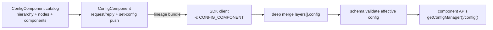

# Hierarchical Configuration

EdgeCommons components read one effective JSON configuration document at runtime. For direct sources
(`FILE`, `ENV`, `CONFIGMAP`, `GG_CONFIG`, and `SHADOW`), that document comes directly from the
source. For `CONFIG_COMPONENT`, the document is assembled from an ordered hierarchy served by
`com.mbreissi.edgecommons.ConfigComponent`.

The model supports any user-defined hierarchy depth, for example:

```text
enterprise -> site -> building -> zone -> line -> device
```

The catalog defines shared scopes above the runtime device. The device itself is the resolved thing
name for the running platform and is not repeated as a catalog node.

## Goals

- Define shared framework settings once at the highest useful scope.
- Avoid repeating enterprise, site, building, zone, or line config in every component config.
- Preserve the existing runtime contract: component code reads one validated effective config.
- Use the ConfigComponent on every platform, with a platform-appropriate transport.
- Keep direct config providers simple: they supply one effective document and do not resolve sidecar
  shared files.

## Runtime Flow



The ConfigComponent serves raw lineage bundles. The SDK client merges and validates locally. The
server never pre-merges and never schema-validates a raw partial layer as if it were an effective
component config.

## Catalog Shape

```json
{
  "schemaVersion": 1,
  "version": "enterprise-site-zone-line-v1",
  "provenance": { "source": "file", "uri": "/etc/edgecommons/catalog.json" },
  "hierarchy": {
    "levels": ["enterprise", "site", "zone", "line", "device"]
  },
  "nodes": {
    "enterprise/acme": {
      "scope": { "enterprise": "acme" },
      "config": {
        "hierarchy": {
          "levels": ["enterprise", "site", "zone", "line", "device"]
        },
        "identity": { "enterprise": "acme" },
        "logging": { "level": "INFO" }
      }
    },
    "site/dallas": {
      "parent": "enterprise/acme",
      "scope": { "enterprise": "acme", "site": "dallas" },
      "config": { "identity": { "site": "dallas" } }
    },
    "zone/packaging": {
      "parent": "site/dallas",
      "scope": {
        "enterprise": "acme",
        "site": "dallas",
        "zone": "packaging"
      },
      "config": { "identity": { "zone": "packaging" } }
    },
    "line/line-7": {
      "parent": "zone/packaging",
      "scope": {
        "enterprise": "acme",
        "site": "dallas",
        "zone": "packaging",
        "line": "line-7"
      },
      "config": { "identity": { "line": "line-7" } }
    }
  },
  "components": {
    "opcua-adapter": {
      "parent": "line/line-7",
      "config": {
        "component": {
          "token": "opcua-adapter",
          "global": { "endpoint": "opc.tcp://10.10.7.20:4840" },
          "instances": []
        }
      }
    }
  }
}
```

Catalog rules:

- `schemaVersion` is `1`.
- `hierarchy.levels` is non-empty, unique, and ends with `device`.
- Node ids are `<level>/<value>`.
- Node `scope` is required, non-empty, includes the node id's own `<level>:<value>` claim, and
  never includes `device`.
- Each node has at most one parent.
- Parent chains must be acyclic and at most 64 levels deep.
- Child scope values must not overwrite ancestor scope values.
- Layer `identity` values must not overwrite ancestor-owned identity values.
- Component keys are sanitized lookup tokens. Full Greengrass component names are reduced to the
  last dotted segment before sanitization.

## Lineage Bundle Shape

```json
{
  "lineageVersion": 1,
  "catalogVersion": "enterprise-site-zone-line-v1",
  "component": "opcua-adapter",
  "provenance": { "source": "file", "uri": "/etc/edgecommons/catalog.json" },
  "layers": [
    {
      "id": "enterprise/acme",
      "kind": "scope",
      "scope": { "enterprise": "acme" },
      "config": {
        "hierarchy": {
          "levels": ["enterprise", "site", "zone", "line", "device"]
        },
        "identity": { "enterprise": "acme" }
      }
    },
    {
      "id": "component/opcua-adapter",
      "kind": "component",
      "component": "opcua-adapter",
      "config": {
        "component": { "token": "opcua-adapter", "instances": [] }
      }
    }
  ]
}
```

Client rules:

- Reject missing or unsupported `lineageVersion`.
- Reject old `{base, component}` bundles and legacy component-only replies.
- Reject empty `layers`.
- Require every layer to declare `id`, `kind`, and object `config`.
- Require scope layers to declare object `scope`.
- Require the final layer to be the only `kind: "component"` layer and to name the requested
  component token.
- Merge only `layers[].config`, in array order.
- Later layers win.
- Validate the merged effective config against the canonical schema.
- On invalid reload, keep the previous effective config and do not notify listeners.

## Merge Rules

| Value shape | Behavior |
| --- | --- |
| Object | Merge recursively by key. |
| Array | Later array replaces earlier array. |
| Scalar | Later scalar replaces earlier value. |
| `null` | Later `null` replaces earlier value, then the effective config is validated. |

Type conflicts are allowed by the merge and resolved by "later layer wins"; implementations may log
a warning for diagnostics.

## Platform Fit

The ConfigComponent is the shared resolver on every platform:

| Platform | ConfigComponent bootstrap | Client transport |
| --- | --- | --- |
| HOST / supervisord | `FILE` or `ENV` | MQTT |
| Kubernetes | `CONFIGMAP` | MQTT |
| Greengrass | `GG_CONFIG` | IPC |

Direct providers still have value:

- `FILE` is the simple local/host single-document source.
- `ENV` is useful for container-injected single documents.
- `CONFIGMAP` is the Kubernetes single-document source with kubelet `..data` hot reload.
- `GG_CONFIG` is the Greengrass deployment config source.
- `SHADOW` is the Greengrass ShadowManager-backed single-document source.

They do not perform hierarchy resolution.

## Volatile Catalog Updates

`update-catalog` is a non-production debug and validation path. It is disabled by default and must
be enabled with:

```json
{
  "component": {
    "global": {
      "configComponent": {
        "allowVolatileCatalogUpdates": true
      }
    }
  }
}
```

A valid update replaces the active in-memory catalog, optionally pushes lineage bundles to all
catalog components, and does not write back to the backing file or ConfigMap. Restarting the
ConfigComponent or receiving a later source-side reload discards the volatile update.

## Validation Artifacts

Shared conformance vectors live in:

```text
hierarchical-config-test-vectors/
```

Platform harnesses:

- Kubernetes: `test-infra/k8s/hierarchical-config/run.sh`.
- Greengrass: `test-infra/interop/gg_hierarchical_config/package.ps1`.
- Full deployed runbook: `test-infra/interop/FULL_INTEROP_GREENGRASS_K8S.md`.
