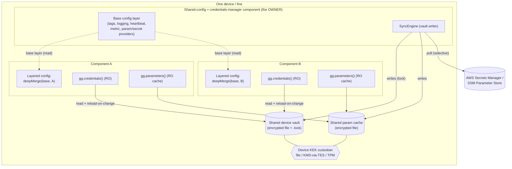
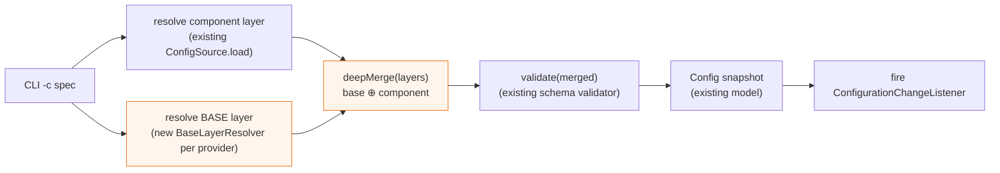
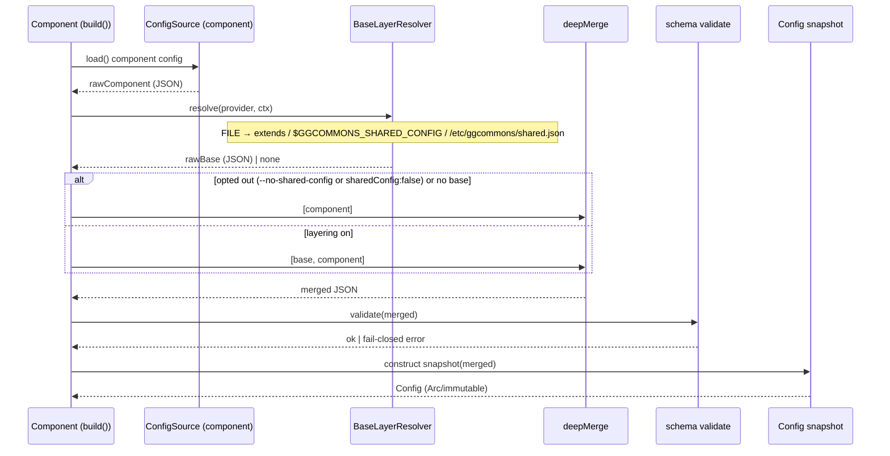
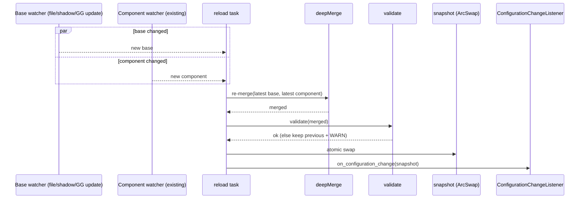
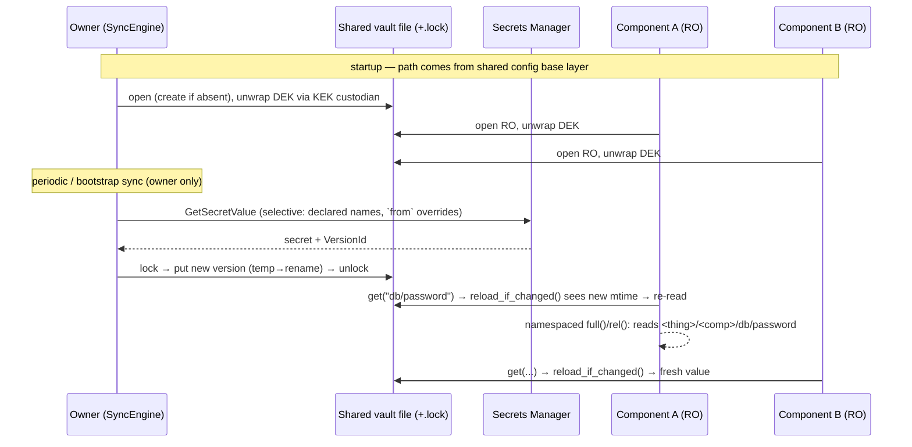

# Shared / Layered Configuration & Shared Vault — Detailed Design (PROPOSED)

> **Status: design only — nothing here is implemented.** This is a review document: where a
> decision is open, the **Recommended** option is marked ✅ and the alternatives are listed so you
> can choose. Java is the canonical reference; any build lands in all four libraries
> (Java / Python / Rust / TS) with identical semantics. Companion docs: `CREDENTIALS.md`,
> `PARAMETERS.md`. Supersedes the earlier high-level sketch of this file.

---

## 1. Problem & scope

In industrial deployments many components run together on one device/line and **must share
identical configuration** (e.g. `tags.appId/site/shop/line`, the `logging` format, `heartbeat` and
`metricEmission` targets, and the *source/provider* of `parameters`/`credentials`). Today that
config is **replicated per component**, and — critically — the credentials **vault** and the
parameters **cache** are also **per component** (every recipe points them at
`{ComponentFullName}/…`), so nothing is actually shared even though `CREDENTIALS.md` envisions a
shared device vault.

This spec unifies three deferred needs:

| # | Need | What it is |
|---|------|-----------|
| A | **Shared config** | A base config *document* each component deep-merges under its own. |
| B | **Shared vault** | One encrypted credentials *file* all components read; one owner writes. |
| C | **Shared parameter cache** | One encrypted cache *file*, offline-first, refreshed by one owner. |

**Unifying insight:** A is the primary mechanism; B and C reduce to **(A) shared-config values**
(their `path` / provider / sync settings, set once in the base layer) **plus (D) one device-wide,
runtime-user-writable filesystem location**. So the real work is: a **layered-config engine**
(§4–§7), a **per-provider base-layer resolver** (§6), and a **device-wide location** convention for
the two on-disk files (§9).

### Goals
- Define shared framework config once; components inherit it and override per-key.
- Work across **all** config providers (`FILE`/`ENV`/`GG_CONFIG`/`SHADOW`/`CONFIG_COMPONENT`) and
  **all** modes (GREENGRASS / STANDALONE / future K8S).
- Identical merge + resolution semantics across the four languages.
- Make a true shared vault/cache possible with **no rewrite** — only config + a shared path.

### Non-goals (v1)
- Not a secrets-distribution channel (secret *values* still flow through the vault/central sync).
- Not multi-level site/line hierarchy yet (designed-for, not built — §5.3).
- No server-side merging in `CONFIG_COMPONENT` beyond what §6 specifies.

---

## 2. Decisions register (review these)

| # | Question | Options | Recommended |
|---|----------|---------|-------------|
| D1 | Merge granularity | whole-section replace · **per-key deep merge** | ✅ per-key deep merge (locked in) |
| D2 | Array merge | **replace** · concatenate · keyed-merge | ✅ replace (component array wins); add `$mergeArrays` directive later |
| D3 | Layer count v1 | **2 (base⊕component)** · N (device<site<line<component) | ✅ 2 now; resolver returns an *ordered list* so N is additive later |
| D4 | Opt-out mechanism | config key · CLI flag · **both** | ✅ both: `sharedConfig:false` (component layer) **and** `--no-shared-config`; flag wins |
| D5 | Default | **layering ON** · off | ✅ ON when a base resolves; silently no-op if none |
| D6 | Validation timing | per-layer · **after merge only** | ✅ after merge only (layers are partial fragments) |
| D7 | FILE base location | env var · conventional path · `extends` key · **all three** | ✅ all three, in precedence: `extends` > `$GGCOMMONS_SHARED_CONFIG` > `/etc/ggcommons/shared.json` |
| D8 | GG_CONFIG base | **dedicated shared-config component** · nucleus-level config | ✅ shared-config component, read via `GetConfiguration` (same path as `CONFIG_COMPONENT`) |
| D9 | SHADOW base | **shared named shadow** (`ggcommons-shared`) · classic shadow | ✅ shared named shadow on the same Thing |
| D10 | Cross-provider mixing (base from a different provider than component) | allow · **disallow v1** | ✅ disallow v1 (base uses the same provider family); revisit later |
| D11 | Device-wide path (GG) | shared component work dir · dedicated `/var/lib/ggcommons` chowned ggc_user · keep per-component | ✅ **`/var/lib/ggcommons` (provisioned `ggc_user:ggc_group` 0750 in the owner's Install)** for lifecycle durability. Cross-read from the shared-component work dir is now **verified to work** (§9.1) and is a valid zero-provision fallback, but couples the vault to that component's work-dir lifecycle. |
| D12 | Vault/cache path source | hardcode · **shared-config value** | ✅ shared-config value (the A↔B/C unification) |
| D13 | Sync/write owner | every component · **one owner** (advisory-lock + `syncOwner`) | ✅ one owner (already designed in `CREDENTIALS.md`) — the shared-config/credentials-manager component |

---

## 3. Component architecture

How the pieces fit at runtime on one device. The **shared-config component** (also the vault sync
owner) publishes the base layer and owns the shared on-disk files; every other component merges the
base under its own config and reads the shared vault/cache read-only.

Key points: components are **readers**; the owner is the single **writer**; the base layer is just a
config document the owner exposes through whatever provider the device uses (§6); the KEK custodian
unlocks the shared DEK once per process.

---

## 4. Layered-config engine — overview

The engine is a **pure, provider-agnostic** function plus a per-provider **base resolver**. It slots
into the existing load pipeline between *source.load()* and *validate()/snapshot* (verified seam —
see the per-language map in §8).

Only the two orange boxes are new. Everything else already exists.

---

## 5. Merge semantics

### 5.1 Algorithm (normative — identical in all four libs)
`effective = deepMerge([... ordered layers ..., component])` where later layers win:

- **object ⊕ object** → recursive key-by-key merge.
- **scalar / array / null** in a later layer → **replaces** the earlier value (D2). Arrays are *not*
  concatenated (a component setting `heartbeat.targets` fully replaces the shared list — predictable).
- A key present only in the base is inherited; a key present in the component overrides just that key
  (this is what enables "device-wide `logging.level=INFO`, override one component to `DEBUG` while
  keeping the shared `logging.<lang>_format`").
- Type conflict (base object vs component scalar at the same key) → component wins, with a `WARN`.

### 5.2 Validation timing (D6)
Validate **only the merged result** against `schema/ggcommons-config-schema.json`. Individual layers
are legitimate *partial fragments* (the base omits `component`; an overlay may omit framework
sections), so per-layer validation would false-fail. Top-level `additionalProperties:false` /
`required:[component]` apply post-merge. (The schema is now fully specified per section, so the merged
doc is meaningfully validated.)

### 5.3 Precedence & future hierarchy (D3)
v1 has two layers. The engine takes an **ordered list** `[base, component]`; a later release can
populate `[device, site, line, component]` (e.g. base itself carries an `extends` chain) with **zero
algorithm change**.

### 5.4 Opt-out (D4/D5)
Default ON. Resolution order:
1. `--no-shared-config` CLI flag → skip base entirely (operator override, wins).
2. `sharedConfig: false` at the top of the *component* layer (read pre-merge) → skip base.
3. Else, if a base resolves for the provider, merge it; if none resolves, no-op.

---

## 6. The core question — base-layer resolution per provider (D7–D10)

Each provider gets a `BaseLayerResolver` that returns the base document (or "none"). Recommended
mechanism per provider:

| `-c` provider | Base layer source (✅ recommended) | Notes / alternatives |
|---------------|-----------------------------------|----------------------|
| `FILE` | `extends` key in component file → path; else `$GGCOMMONS_SHARED_CONFIG`; else `/etc/ggcommons/shared.json` (D7) | All three supported; first hit wins. `extends` may be relative to the component file. |
| `ENV` | `$GGCOMMONS_SHARED_CONFIG` = JSON (or `@/path`) | Containers/K8s project a shared ConfigMap into this var. |
| `GG_CONFIG` | `GetConfiguration` on a **shared-config component** (D8), name from `$GGCOMMONS_SHARED_COMPONENT` (default `aws.proserve.greengrass.GGCommonsSharedConfig`) | Reuses the cross-component IPC read that `CONFIG_COMPONENT` already does. Alt: nucleus-level config (rejected — fights the per-component deploy model). |
| `SHADOW` | A shared **named shadow** `ggcommons-shared` on the same Thing (D9) | Read with `GetThingShadow(thing, "ggcommons-shared")`, watch its delta. |
| `CONFIG_COMPONENT` | The config component serves a base + per-component overlay (it is already the "shared" model) | The client requests the reserved base id, then its own; or the component returns `{base, overlay}`. |

**Per mode**, the provider in play and the device-wide file location (§9) follow from the deployment:
GREENGRASS→`GG_CONFIG`/`SHADOW`; STANDALONE→`FILE`/`ENV`; K8S→`ENV`/`FILE` via ConfigMaps.

### 6.1 Sequence — startup load + merge + validate (FILE / STANDALONE shown)

### 6.2 Sequence — hot reload when EITHER layer changes

Both the component source's existing watch and a new base watch feed one reload path; on any change,
re-resolve → re-merge → validate → atomic swap → fire listeners.

---

## 7. Code structure (config) — where the new pieces live

Minimal, additive. New modules in orange; existing seams reused. Rust shown (canonical); the other
three mirror it at the same seams (per-language seam map in §8).

New files (Rust; mirror in each lib):
- `config/merge.rs` — `deep_merge(layers: &[Value]) -> Value` (pure; the cross-language conformance target).
- `config/base/mod.rs` — `BaseLayerResolver` trait + `resolve_base(spec, ctx) -> Result<Option<(Value, Option<Watch>)>>` dispatch (sibling to `source::build`).
- `config/base/{file,env,greengrass,shadow,config_component}.rs` — per-provider resolvers, each reusing the matching source's transport.
- Build-path change in `lib.rs` (and `ConfigManagerFactory`/`ConfigManagerBuilder`/`GgCommons.build`): insert resolve-base + merge between load and validate; subscribe the base watch into the existing reload task.

Per-language seam (from §8): Rust `config::source::build` / `lib.rs build()`; Java
`ConfigProviderBuilder.build` + `ConfigManagerFactory.create`; Python `ConfigManagerBuilder.build`
(+ `ConfigManager._apply_config`); TS `buildConfigSource` + `GgCommons.build`.

---

## 8. Per-language seam summary (verified against current code)

| Concern | Rust | Java | Python | TS |
|---------|------|------|--------|----|
| Source dispatch | `config::source::build()` | `ConfigProviderBuilder.build()` | `ConfigManagerBuilder.build()` | `buildConfigSource()` |
| Merge insert point | `lib.rs build()` after `source.load()` before `validation::validate()` | `ConfigManagerFactory.create()` after `loadConfiguration()` before `ConfigurationValidator.validate()` | `ConfigManagerBuilder.build()` before `init()/_apply_config()` | `GgCommons.build()` after `source.load()` before `validate()` |
| Snapshot | `Config` + `ArcSwap` | `ConfigManager.applyConfig()` | `ConfigManager._apply_config()` | `Config.fromValue()` + ref swap |
| Listener sig | `async on_configuration_change(Arc<Config>)->bool` | `onConfigurationChanged()->boolean` | `on_configuration_change(cfg)->bool` | `onConfigurationChange(Config)->bool` |
| Validation | `config::validation::validate` (jsonschema) | `ConfigurationValidator` (networknt) | `ConfigurationValidator` (jsonschema) | `validate` (ajv) |

---

## 9. Shared vault + parameter cache (B & C)

Both are encrypted *files*. The **only genuinely new problem** is a device-wide, runtime-user-writable
location; everything else (collision-safe `<thing>/<component>/` namespacing, advisory file lock,
atomic temp→rename, reload-on-change, single sync owner, KEK custodian) **already exists** in the
credentials subsystem (verified — see `CREDENTIALS.md` and the vault map). The vault/cache **path is
set by the shared config base layer** (D12), so flipping from per-component to shared is a config change.

### 9.1 Device-wide location per mode (D11)

| Mode | Shared location (✅ recommended) | Notes |
|------|----------------------------------|-------|
| GREENGRASS | **`/var/lib/ggcommons/{vault,paramcache}`** (provisioned `ggc_user:ggc_group` 0750 in the owner's `Install` lifecycle). Zero-provision fallback: the shared-config component's work dir `/greengrass/v2/work/<SharedComponent>/vault`. | **Verified on the lab nucleus (2026-06-22):** `/greengrass/v2/work` is `drwxr-xr-x` (world-traversable); component work dirs are mode 0700 owned by `ggc_user`; all components run as that one `ggc_user` (uid 994), so a component *can* read another's work-dir files (proven by reading one skeleton's `metric.log`+`vault` as `ggc_user`). **Caveats:** (1) holds only under the default single-`ggc_user` model — `runWith` multi-user deployments need a `ggc_group`-readable `0750` dir; (2) a vault in a component's work dir is tied to that component's lifecycle (GG may clean it on remove/redeploy). Both push toward `/var/lib/ggcommons` for production. |
| STANDALONE | a shared host path / mounted volume, e.g. `/etc/ggcommons` (config) + `/var/lib/ggcommons` (vault/cache) | Shared across the co-located containers. |
| K8S | shared **ConfigMap** (config) + **Secret** (vault seed) projected into pods; shared **PVC** if the cache must persist | Sync owner = a sidecar/Deployment. |

### 9.2 Single-writer model (D13) — already designed
One **sync owner** (the shared-config / credentials-manager component, `syncOwner: true`) holds the
advisory `.lock` during writes; all other components open the vault **read-only** and pick up changes
via `reload_if_changed()` (mtime/size stamp + MAC verify). Readers never take the lock.

### 9.3 Sequence — two components sharing one vault

### 9.4 Code structure (vault) — what changes
Almost nothing in code; the change is **configuration + a provisioning step**:
- Base layer sets `credentials.vault.path` / `parameters.cache.path` to the §9.1 device-wide location
  (instead of `{ComponentFullName}/…`).
- One component is marked `syncOwner: true` (new boolean already anticipated in `CREDENTIALS.md`);
  consumers open read-only.
- A provisioning step (recipe `Install` lifecycle or container init) ensures the shared dir exists and
  is `ggc_user`-writable.
- The existing `open_namespaced()` / `LocalVault::open()` / `SyncEngine` / `KeyProvider` paths are
  unchanged — they already lock, namespace, reload, and wrap the DEK.

### 9.5 Security
Shared vault ⇒ **the device is the trust boundary**: any component that can unlock it reads every
secret. On GG all components are `ggc_user` anyway, so OS perms can't separate them — least privilege
moves to **(a) selective sync** (the owner pulls only declared secrets) and **(b) central IAM/TES**
(the device role bounds what *can* be fetched). Per-namespace sub-DEK hard isolation remains reserved
in the format for later. Values are never logged; `Secret` is zeroizing + Debug-redacted (existing).

---

## 10. Shared parameter cache (C)
Identical pattern to the vault: the cache is an encrypted file (it reuses the vault crypto for remote
sources). The base layer sets `parameters.cache.path` to the shared location and the `parameters.source`
(provider) once; each component still declares its own `sync.names/paths` (which params it needs). One
owner refreshes; consumers read offline-first. No new mechanism beyond §9.

---

## 11. Parity & testing
- `deep_merge` is the cross-language conformance target: a shared **merge test-vector suite**
  (`{layers[], expected}`) run in all four libs (like the vault vectors).
- Per-provider base resolvers get unit tests + the existing interop harness gains a multi-component
  "shared base + two overlays" case.
- On-device: a 2-component GG deployment sharing one vault + one base config, validated on the lab
  nucleus (extends `test_deployed_component.py`).

## 12. Phasing
1. **Merge engine + opt-out + post-merge validation** in all four libs, base passed in (no sourcing). + vectors.
2. **Base resolvers**: `FILE`/`ENV` first (covers STANDALONE/K8S), then `GG_CONFIG` shared component, then `SHADOW`.
3. **Shared vault + cache**: point paths at the device-wide location via the base layer; solve the GG `ggc_user` shared dir + `syncOwner` wiring; validate on lab.
4. **Conformance + docs**: merge vectors, multi-component on-device, update recipes/READMEs.

## 13. Open questions (please confirm)
1. **D7/D8/D9** base-location mechanisms — accept the recommended defaults?
2. ~~**D11** — verify GG cross-component work-dir readability on the lab.~~ **DONE (2026-06-22):** cross-read works under the shared `ggc_user` model; recommendation settled on `/var/lib/ggcommons` for lifecycle durability with the work dir as a zero-provision fallback (see D11 / §9.1).
3. **D4** opt-out knob naming (`sharedConfig` / `--no-shared-config`) acceptable?
4. **D2** arrays replace (not concat) — OK for `heartbeat.targets` etc.?
5. Naming of the shared-config component (`aws.proserve.greengrass.GGCommonsSharedConfig`) and whether it doubles as the credentials sync owner.
