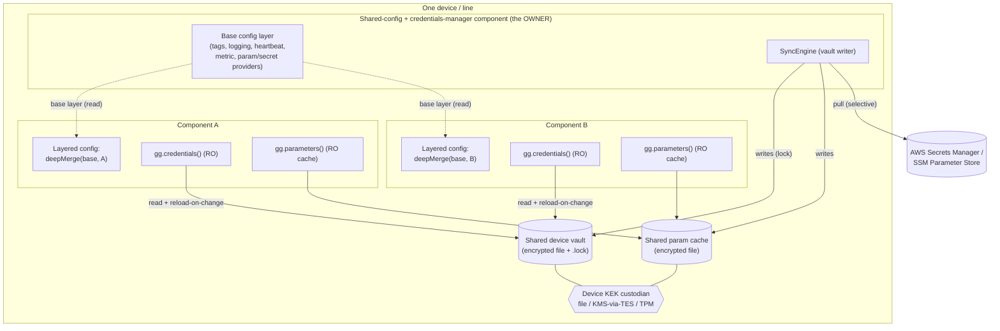
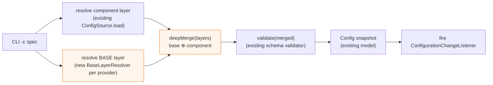
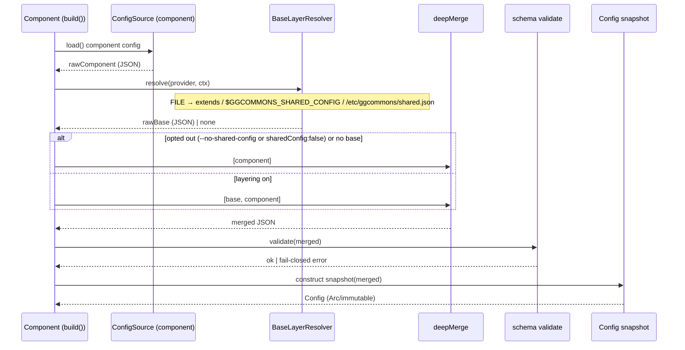
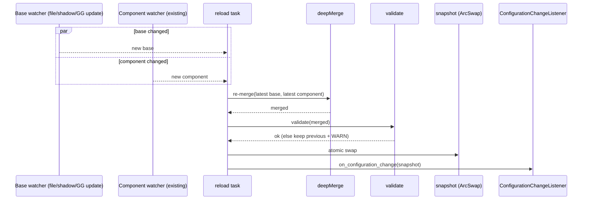
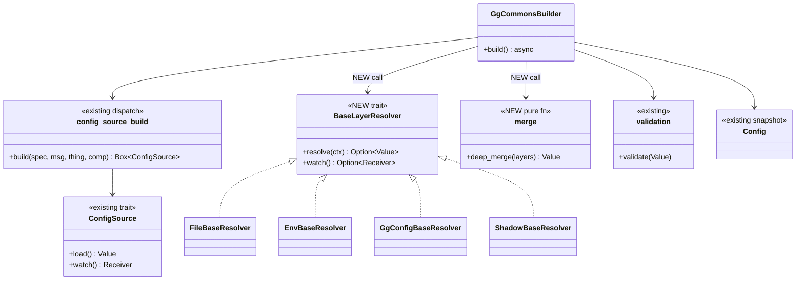

# Shared / Layered Configuration & Shared Vault — Detailed Design (PROPOSED)

> **Status: design only — nothing here is implemented.** This is a review document: where a
> decision is open, the **Recommended** option is marked ✅ and the alternatives are listed so you
> can choose. Java is the canonical reference; any build lands in all four libraries
> (Java / Python / Rust / TS) with identical semantics. Companion docs: `CREDENTIALS.md`,
> `PARAMETERS.md`. Supersedes the earlier high-level sketch of this file.

---

## 1. Problem & scope

In industrial deployments many components run together on one device/line and **must share
identical configuration** (e.g. `tags.appId/site/shop/line`, the `logging` format, `heartbeat` and
`metricEmission` targets, and the *source/provider* of `parameters`/`credentials`). Today that
config is **replicated per component**, and — critically — the credentials **vault** and the
parameters **cache** are also **per component** (every recipe points them at
`{ComponentFullName}/…`), so nothing is actually shared even though `CREDENTIALS.md` envisions a
shared device vault.

This spec unifies three deferred needs:

| # | Need | What it is |
|---|------|-----------|
| A | **Shared config** | A base config *document* each component deep-merges under its own. |
| B | **Shared vault** | One encrypted credentials *file* all components read; one owner writes. |
| C | **Shared parameter cache** | One encrypted cache *file*, offline-first, refreshed by one owner. |

**Unifying insight:** A is the primary mechanism; B and C reduce to **(A) shared-config values**
(their `path` / provider / sync settings, set once in the base layer) **plus (D) one device-wide,
runtime-user-writable filesystem location**. So the real work is: a **layered-config engine**
(§4–§7), a **per-provider base-layer resolver** (§6), and a **device-wide location** convention for
the two on-disk files (§9).

### Goals
- Define shared framework config once; components inherit it and override per-key.
- Work across **all** config providers (`FILE`/`ENV`/`GG_CONFIG`/`SHADOW`/`CONFIG_COMPONENT`) and
  **all** modes (GREENGRASS / STANDALONE / future K8S).
- Identical merge + resolution semantics across the four languages.
- Make a true shared vault/cache possible with **no rewrite** — only config + a shared path.

### Non-goals (v1)
- Not a secrets-distribution channel (secret *values* still flow through the vault/central sync).
- Not multi-level site/line hierarchy yet (designed-for, not built — §5.3).
- No server-side merging in `CONFIG_COMPONENT` beyond what §6 specifies.

---

## 2. Decisions register (review these)

| # | Question | Options | Recommended |
|---|----------|---------|-------------|
| D1 | Merge granularity | whole-section replace · **per-key deep merge** | ✅ per-key deep merge (locked in) |
| D2 | Array merge | **replace** · concatenate · keyed-merge | ✅ replace (component array wins); add `$mergeArrays` directive later |
| D3 | Layer count v1 | **2 (base⊕component)** · N (device<site<line<component) | ✅ 2 now; resolver returns an *ordered list* so N is additive later |
| D4 | Opt-out mechanism | config key · CLI flag · **both** | ✅ both: `sharedConfig:false` (component layer) **and** `--no-shared-config`; flag wins |
| D5 | Default | **layering ON** · off | ✅ ON when a base resolves; silently no-op if none |
| D6 | Validation timing | per-layer · **after merge only** | ✅ after merge only (layers are partial fragments) |
| D7 | FILE base location | env var · conventional path · `extends` key · **all three** | ✅ all three, in precedence: `extends` > `$GGCOMMONS_SHARED_CONFIG` > `/etc/ggcommons/shared.json` |
| D8 | GG_CONFIG base | **dedicated shared-config component** · nucleus-level config | ✅ shared-config component, read via `GetConfiguration` (same path as `CONFIG_COMPONENT`) |
| D9 | SHADOW base | **shared named shadow** (`ggcommons-shared`) · classic shadow | ✅ shared named shadow on the same Thing |
| D10 | Cross-provider mixing (base from a different provider than component) | allow · **disallow v1** | ✅ disallow v1 (base uses the same provider family); revisit later |
| D11 | **How to share secrets/params across components** (reframed from "device-wide path") | shared on-disk file (work-dir / shared-group) · served manager · per-component vault + shared central | ✅ **per-component vault + shared *central* (option 3) near-term**; **served manager (option 2) for robust on-device sharing later** (§9). A shared on-disk vault **file is REJECTED as the primary** — it assumes all components share one OS user; lab cross-read worked only by that coincidence (verified) and breaks under `runWith`/multi-user. |
| D12 | Vault/cache path source | hardcode · **shared-config value** | ✅ shared-config value (the A↔B/C unification) |
| D13 | Write owner (only where a shared store exists) | every component · one owner | ✅ one owner for the shared-file/served-manager options (1/2); **N/A for option (3)** — each component owns its own vault/cache and writes only its own |

---

## 3. Component architecture

How the pieces fit at runtime on one device. The **shared-config component** (also the vault sync
owner) publishes the base layer and owns the shared on-disk files; every other component merges the
base under its own config and reads the shared vault/cache read-only.



Key points: the **base config layer** is just a document the owner exposes through whatever provider
the device uses (§6) and each component merges in-process — this part has no filesystem-sharing
concern. The **shared vault/cache** shown here is *conceptual*: a single on-disk shared file (drawn
above) is **rejected** because it assumes all components share one OS user (§9). The actual sharing
mechanism is **option (3)** (per-component vault + shared central) or **option (2)** (a served
credentials manager) — see §9; the diagram's "shared vault" should be read as "shared *secret*", not
necessarily a shared file.

---

## 4. Layered-config engine — overview

The engine is a **pure, provider-agnostic** function plus a per-provider **base resolver**. It slots
into the existing load pipeline between *source.load()* and *validate()/snapshot* (verified seam —
see the per-language map in §8).



Only the two orange boxes are new. Everything else already exists.

---

## 5. Merge semantics

### 5.1 Algorithm (normative — identical in all four libs)
`effective = deepMerge([... ordered layers ..., component])` where later layers win:

- **object ⊕ object** → recursive key-by-key merge.
- **scalar / array / null** in a later layer → **replaces** the earlier value (D2). Arrays are *not*
  concatenated (a component setting `heartbeat.targets` fully replaces the shared list — predictable).
- A key present only in the base is inherited; a key present in the component overrides just that key
  (this is what enables "device-wide `logging.level=INFO`, override one component to `DEBUG` while
  keeping the shared `logging.<lang>_format`").
- Type conflict (base object vs component scalar at the same key) → component wins, with a `WARN`.

### 5.2 Validation timing (D6)
Validate **only the merged result** against `schema/ggcommons-config-schema.json`. Individual layers
are legitimate *partial fragments* (the base omits `component`; an overlay may omit framework
sections), so per-layer validation would false-fail. Top-level `additionalProperties:false` /
`required:[component]` apply post-merge. (The schema is now fully specified per section, so the merged
doc is meaningfully validated.)

### 5.3 Precedence & future hierarchy (D3)
v1 has two layers. The engine takes an **ordered list** `[base, component]`; a later release can
populate `[device, site, line, component]` (e.g. base itself carries an `extends` chain) with **zero
algorithm change**.

### 5.4 Opt-out (D4/D5)
Default ON. Resolution order:
1. `--no-shared-config` CLI flag → skip base entirely (operator override, wins).
2. `sharedConfig: false` at the top of the *component* layer (read pre-merge) → skip base.
3. Else, if a base resolves for the provider, merge it; if none resolves, no-op.

---

## 6. The core question — base-layer resolution per provider (D7–D10)

Each provider gets a `BaseLayerResolver` that returns the base document (or "none"). Recommended
mechanism per provider:

| `-c` provider | Base layer source (✅ recommended) | Notes / alternatives |
|---------------|-----------------------------------|----------------------|
| `FILE` | `extends` key in component file → path; else `$GGCOMMONS_SHARED_CONFIG`; else `/etc/ggcommons/shared.json` (D7) | All three supported; first hit wins. `extends` may be relative to the component file. |
| `ENV` | `$GGCOMMONS_SHARED_CONFIG` = JSON (or `@/path`) | Containers/K8s project a shared ConfigMap into this var. |
| `GG_CONFIG` | `GetConfiguration` on a **shared-config component** (D8), name from `$GGCOMMONS_SHARED_COMPONENT` (default `aws.proserve.greengrass.GGCommonsSharedConfig`) | Reuses the cross-component IPC read that `CONFIG_COMPONENT` already does. Alt: nucleus-level config (rejected — fights the per-component deploy model). |
| `SHADOW` | A shared **named shadow** `ggcommons-shared` on the same Thing (D9) | Read with `GetThingShadow(thing, "ggcommons-shared")`, watch its delta. |
| `CONFIG_COMPONENT` | The config component serves a base + per-component overlay (it is already the "shared" model) | The client requests the reserved base id, then its own; or the component returns `{base, overlay}`. |

**Per mode**, the provider in play and the device-wide file location (§9) follow from the deployment:
GREENGRASS→`GG_CONFIG`/`SHADOW`; STANDALONE→`FILE`/`ENV`; K8S→`ENV`/`FILE` via ConfigMaps.

### 6.1 Sequence — startup load + merge + validate (FILE / STANDALONE shown)



### 6.2 Sequence — hot reload when EITHER layer changes

Both the component source's existing watch and a new base watch feed one reload path; on any change,
re-resolve → re-merge → validate → atomic swap → fire listeners.



---

## 7. Code structure (config) — where the new pieces live

Minimal, additive. New modules in orange; existing seams reused. Rust shown (canonical); the other
three mirror it at the same seams (per-language seam map in §8).



New files (Rust; mirror in each lib):
- `config/merge.rs` — `deep_merge(layers: &[Value]) -> Value` (pure; the cross-language conformance target).
- `config/base/mod.rs` — `BaseLayerResolver` trait + `resolve_base(spec, ctx) -> Result<Option<(Value, Option<Watch>)>>` dispatch (sibling to `source::build`).
- `config/base/{file,env,greengrass,shadow,config_component}.rs` — per-provider resolvers, each reusing the matching source's transport.
- Build-path change in `lib.rs` (and `ConfigManagerFactory`/`ConfigManagerBuilder`/`GgCommons.build`): insert resolve-base + merge between load and validate; subscribe the base watch into the existing reload task.

Per-language seam (from §8): Rust `config::source::build` / `lib.rs build()`; Java
`ConfigProviderBuilder.build` + `ConfigManagerFactory.create`; Python `ConfigManagerBuilder.build`
(+ `ConfigManager._apply_config`); TS `buildConfigSource` + `GgCommons.build`.

---

## 8. Per-language seam summary (verified against current code)

| Concern | Rust | Java | Python | TS |
|---------|------|------|--------|----|
| Source dispatch | `config::source::build()` | `ConfigProviderBuilder.build()` | `ConfigManagerBuilder.build()` | `buildConfigSource()` |
| Merge insert point | `lib.rs build()` after `source.load()` before `validation::validate()` | `ConfigManagerFactory.create()` after `loadConfiguration()` before `ConfigurationValidator.validate()` | `ConfigManagerBuilder.build()` before `init()/_apply_config()` | `GgCommons.build()` after `source.load()` before `validate()` |
| Snapshot | `Config` + `ArcSwap` | `ConfigManager.applyConfig()` | `ConfigManager._apply_config()` | `Config.fromValue()` + ref swap |
| Listener sig | `async on_configuration_change(Arc<Config>)->bool` | `onConfigurationChanged()->boolean` | `on_configuration_change(cfg)->bool` | `onConfigurationChange(Config)->bool` |
| Validation | `config::validation::validate` (jsonschema) | `ConfigurationValidator` (networknt) | `ConfigurationValidator` (jsonschema) | `validate` (ajv) |

---

## 9. Shared vault + parameter cache (B & C)

Unlike shared *config* (a document delivered via the provider and merged in-process — no filesystem
sharing), the vault and cache are encrypted **files**, and **sharing a file inherently depends on the
OS user/group model**. A robust library **cannot assume all components run as one user**: Greengrass
`runWith` (and K8s `securityContext`, and any hardened deployment) can put each component under a
**different** OS user, which makes an owner-only file unreadable across components.

> **Lab verification (2026-06-22) — and why it does NOT settle the design.** On the lab,
> `/greengrass/v2/work` is `drwxr-xr-x`, component work dirs are mode `0700` owned by `ggc_user`, and
> every component runs as that one `ggc_user` (uid 994) — so cross-component read *worked* (proven by
> reading a skeleton's `metric.log` + `vault` as `ggc_user`). **But that works only because of the
> shared uid.** Under per-component users it breaks. So a shared on-disk vault **file is rejected as
> the primary design** — it would silently fail on hardened/multi-user deployments.

### 9.1 The three user-isolation-agnostic options

| Option | How "sharing" happens | OS-user-safe? | Trade-offs |
|--------|----------------------|---------------|-----------|
| **(1) Shared-group file** | one vault file `0640` owned `<owner>:ggcommons`; every consumer's `runWith` user joins group `ggcommons` (incl. a group-readable KEK) | only if the operator provisions every component's user into the shared group | fragile on GG (per-user group provisioning; group-readable KEK weakens the custodian); maps cleanly to **K8s `fsGroup` + shared volume** though |
| **(2) Served manager** ✅ *(robust on-device sharing)* | a **credentials-manager component owns the vault and serves secrets over the ggcommons messaging seam** — GG **IPC** on-device, local MQTT in STANDALONE/K8s; consumers fetch via `gg.credentials()` and keep a local per-component cache | **yes** — transport is nucleus/broker-mediated, not the filesystem | biggest build (a request/reply secrets protocol + manager component + consumer fetch path); adds a runtime dependency + first-fetch latency. **Only option that also gives per-component least-privilege** (GG recipe `accessControl` / MQTT topic ACLs decide who may fetch what) — strictly better than "device = trust boundary". This is what `aws.greengrass.SecretManager` does. |
| **(3) Per-component vault + shared *central* source** ✅ *(near-term default)* | keep today's per-component vault; sharing happens at the **central store** — all components pull the same Secrets Manager id via the existing `from` override | **yes** — no shared on-device file at all | already built; cost is N× central fetches (bounded by per-component cache + refresh interval); "define once" lives in the cloud, not the device. Offline-first per component. |

### 9.2 Recommendation
- **Shared config** → build the layering engine (§4–§8); robust regardless of OS user model.
- **Shared secrets/params, near-term → option (3)**: per-component vault, shared *centrally* via
  `from`. It's done, robust, offline-first, and needs no shared file. The "shared" benefit (define the
  secret once) is realized in Secrets Manager; on-device each component still names what it needs.
- **Shared secrets/params, the "right" on-device answer → option (2)** (served manager over the
  messaging seam) as a **later phase** — it's user-isolation-agnostic *and* adds real per-component
  authorization, which a shared file can never provide.
- **Drop the shared on-disk vault file** (work-dir or shared-group) as the primary path. Keep
  shared-group/`fsGroup` only as a K8s-specific convenience if a deployment specifically wants it.

### 9.3 Sequence — option (3): per-component vault, shared via central (near-term)

```mermaid
sequenceDiagram
    participant A as Component A (own vault, user a)
    participant B as Component B (own vault, user b)
    participant SM as Secrets Manager (central)
    Note over A,B: each declares the same shared secret via a 'from' override
    A->>SM: GetSecretValue site/shared/db-pw
    SM-->>A: value + VersionId → A caches in its OWN vault
    B->>SM: GetSecretValue site/shared/db-pw
    SM-->>B: value + VersionId → B caches in its OWN vault
    Note over A,B: no shared file; offline-first per local cache; same value via same central id
```

### 9.4 Sequence — option (2): served credentials manager (robust, later)

```mermaid
sequenceDiagram
    participant C as Consumer (any OS user)
    participant MSG as Messaging seam (IPC / local MQTT)
    participant MGR as Credentials-manager component (owns vault)
    participant SM as Secrets Manager
    Note over MGR: owns ONE vault in ITS OWN dir (no cross-user file access)
    MGR->>SM: selective sync → MGR vault (single writer)
    C->>MSG: get db/password request
    MSG->>MGR: deliver (GG accessControl / topic ACL authorizes THIS component)
    MGR-->>MSG: secret value (local transport only; never IoT Core)
    MSG-->>C: value → C keeps a small per-component local cache (offline-first)
```

### 9.5 Security / least-privilege comparison
- **Shared file (1):** device (or group) = trust boundary; anyone who can unlock reads everything.
- **Central-shared (3):** each component's reach is bounded by what it *declares* + central IAM/TES;
  no on-device cross-component exposure.
- **Served manager (2):** *best* — the manager enforces **per-component** access (GG `accessControl`
  on the IPC operation / per-component MQTT topic ACLs), so a component can fetch only its authorized
  secrets even though they live in one vault. Secrets travel only over the **local** transport (IPC or
  local broker), never IoT Core. Values never logged; `Secret` stays zeroizing + Debug-redacted.

### 9.6 What changes in code
- **Option (3):** essentially nothing new — the per-component vault + `SyncEngine` + `from` override
  already exist; this is a configuration/usage pattern (set the same `from` in each component's base
  layer via shared config). The base layer can carry the shared `from` mappings so they're defined once.
- **Option (2):** new — a `credentials-manager` component + a request/reply secrets protocol over the
  messaging seam, and a `RemoteCredentialService` (consumer side) that fetches + caches, behind the
  same `gg.credentials()` interface. Mirrors the streaming "owner + consumers" split. Deferred to a
  later phase.

---

## 10. Shared parameter cache (C)
Same constraint and the same three options as the vault (§9) — parameters reuse the vault crypto for
remote sources, so the file-sharing problem is identical. Near-term default = **option (3)**:
per-component cache, with the **shared `parameters.source` (provider) defined once in the base
config layer** so every component reads the same SSM/mountedDir/env source (each still declaring its
own `sync.names/paths`). A served parameter manager is the option-(2) analogue for a later phase. No
shared on-disk cache file is required.

---

## 11. Parity & testing
- `deep_merge` is the cross-language conformance target: a shared **merge test-vector suite**
  (`{layers[], expected}`) run in all four libs (like the vault vectors).
- Per-provider base resolvers get unit tests + the existing interop harness gains a multi-component
  "shared base + two overlays" case.
- On-device: a 2-component GG deployment sharing one vault + one base config, validated on the lab
  nucleus (extends `test_deployed_component.py`).

## 12. Phasing
1. **Merge engine + opt-out + post-merge validation** in all four libs, base passed in (no sourcing). + vectors.
2. **Base resolvers**: `FILE`/`ENV` first (covers STANDALONE/K8S), then `GG_CONFIG` shared component, then `SHADOW`.
3. **Shared secrets/params (option 3)**: define the shared `from` mappings / `parameters.source` once in the base layer; each component keeps its own vault/cache and pulls the shared central id. Validate a 2-component "shared central secret" case on the lab. (No shared on-disk file.)
4. **Conformance + docs**: merge vectors, multi-component on-device, update recipes/READMEs.
5. **(Later) Served manager (option 2)**: credentials/parameter manager component + request/reply over the messaging seam + `RemoteCredentialService` consumer, with per-component `accessControl`/topic-ACL authorization — the robust on-device-sharing path.

## 13. Open questions (please confirm)
1. **D7/D8/D9** base-location mechanisms — accept the recommended defaults?
2. **D11 (reframed)** — verified cross-read works *only* under the single-`ggc_user` model, so a shared on-disk vault file is rejected as primary (§9). Confirm the path: **option (3)** per-component vault + shared central as the near-term default, and **option (2)** served manager as the robust later phase? (And: is per-component duplicate central fetching acceptable near-term, or do you want option (2) sooner?)
3. **D4** opt-out knob naming (`sharedConfig` / `--no-shared-config`) acceptable?
4. **D2** arrays replace (not concat) — OK for `heartbeat.targets` etc.?
5. Naming of the shared-config component (`aws.proserve.greengrass.GGCommonsSharedConfig`) and whether it doubles as the credentials sync owner.
