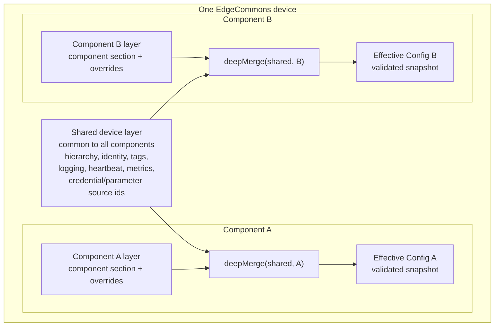
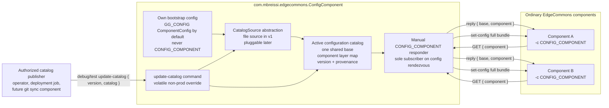
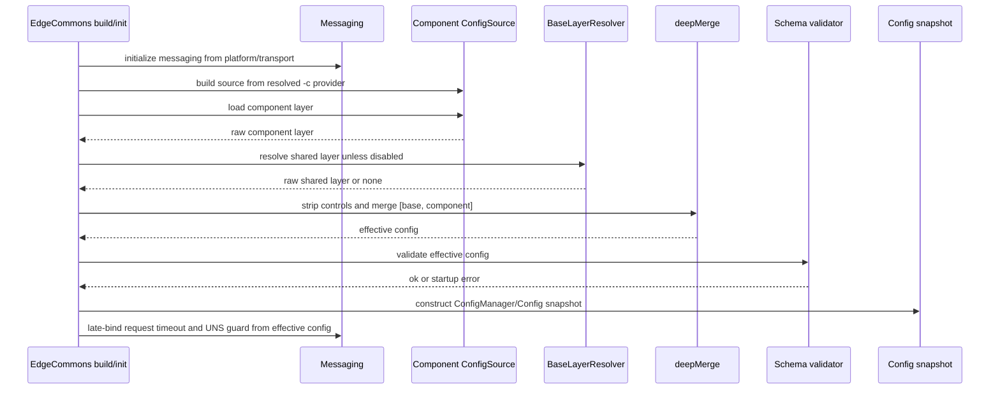
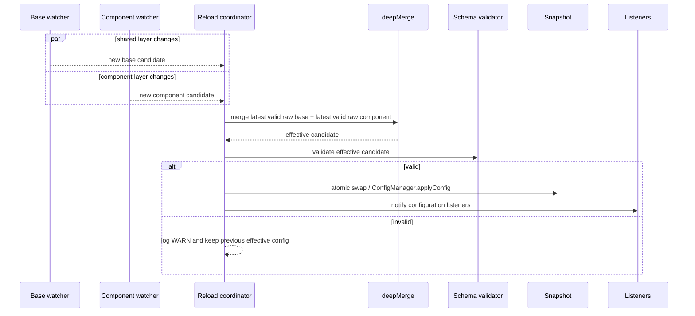
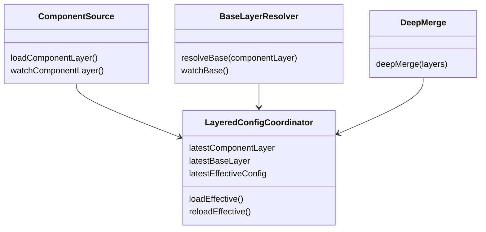

# Split Configuration - Binding Implementation Specification

> Status: binding specification for human review. Do not start implementation until this document is
> explicitly approved.
>
> Source proposal: [`SHARED_CONFIG.md`](SHARED_CONFIG.md).
>
> Scope: EdgeCommons core library configuration behavior across Java, Python, Rust, and TypeScript.
> Java remains canonical; all observable core-library behavior defined here must be implemented
> with four-way parity. This specification also defines the dedicated deployable
> `com.mbreissi.edgecommons.ConfigComponent` server component for `CONFIG_COMPONENT` scenarios.

## 1. Purpose

Industrial EdgeCommons deployments commonly run multiple components on the same device. Those
components need one device-local configuration layer that is shared by every component on that device
and one component-specific layer that stays unique to that component deployment.

This specification turns the exploratory shared/layered configuration design into a buildable
contract:

- A **shared device layer** defines common framework settings such as `hierarchy`, `identity`,
  business `tags`, logging defaults, heartbeat defaults, metric targets, credential source ids, and
  parameter source settings, and streaming definitions.
- A **component layer** defines the component's own `component` section and any overrides.
- The runtime **effective config** is produced by `deepMerge(sharedDevice, componentLayer)`, then
  schema-validated and exposed through today's config APIs.
- A dedicated **ConfigComponent** may serve raw layer bundles to other components over the existing
  `CONFIG_COMPONENT` request/reply protocol.

The term **split config** means this two-layer model. The term **shared config** means the shared
device layer.

## 2. Design Sources And Reconciliation

This specification is faithful to the proposed design in `SHARED_CONFIG.md`, with the following
explicit reconciliations against current code and platform docs:

| Area | Binding resolution |
|---|---|
| Status | `SHARED_CONFIG.md` is design-only. This file is the implementation spec to review before build. |
| KUBERNETES | `CONFIGMAP` has shipped and must be included as a first-class config source. Treat `CONFIGMAP` as the Kubernetes-mounted-file analogue of `FILE`, with ConfigMap-specific watching semantics preserved. |
| UNS identity | The current shipped UNS implementation resolves `hierarchy` and `identity` from the component's own effective config. After split config, it still resolves once from the effective config, but that effective config may inherit `hierarchy`/`identity` from the shared device layer. This reconciles `UNS-CANONICAL-DESIGN.md` section 1.5 with `DESIGN-uns.md` section 5.4. |
| Shared vault/cache | A shared on-disk vault/cache file is not part of this implementation. Shared secrets and parameters use per-component local storage plus shared central ids, as defined below. |
| `CONFIG_COMPONENT` ambiguity | The config server will return either today's legacy component document or a layer bundle `{ "base": ..., "component": ... }`. The client remains responsible for merging. The server must not merge layers. |
| Config server ownership | The server role is a dedicated deployable component named `com.mbreissi.edgecommons.ConfigComponent`. Normal EdgeCommons components consume `CONFIG_COMPONENT` configs; they do not automatically serve configs merely because they link the core library. |

## 3. Non-Goals

This implementation must not include:

- A shared on-disk credentials vault file as the primary design.
- A shared on-disk parameter cache file as the primary design.
- The served credentials/parameters manager described as the later robust option in
  `SHARED_CONFIG.md`.
- N-layer inheritance such as site -> line -> device -> component. The merge engine must accept an
  ordered list internally so N layers can be added later, but v1 resolves at most one shared layer
  plus one component layer.
- Server-side merge behavior in `CONFIG_COMPONENT`.
- Automatic config-server behavior in every EdgeCommons component. Serving config is an explicit
  role of the dedicated ConfigComponent or another application that intentionally implements the
  same server protocol.
- Changes to message envelope semantics except the `CONFIG_COMPONENT` configuration-fetch body shape
  described in this spec.

## 4. Normative Language

The words MUST, MUST NOT, SHOULD, SHOULD NOT, and MAY are normative.

## 5. Runtime Model



### 5.1 Dedicated `CONFIG_COMPONENT` Server Model



The `config` token in `ecv1/{device}/config/main/cmd/get-configuration` is a protocol
rendezvous token, not the ConfigComponent's own `component.token`. The dedicated component MUST
subscribe to that rendezvous manually. It MUST NOT rely on the normal built-in
`get-configuration` command for its own component identity to serve other components.

The effective config is the only config seen by existing runtime subsystems:

- `getFullConfig()` / `get_full_config()` / `Config.raw` / `Config.raw` returns the effective,
  merged config.
- The UNS `cfg` publisher publishes the redacted effective config.
- `hierarchy` and `identity` resolution reads the effective config.
- Template substitution reads the effective config.
- Subsystem initializers for credentials, parameters, streaming, metrics, heartbeat, health, and
  logging read the effective config.

No public API is added in v1 to expose raw layers separately.

## 6. Binding Decisions

| Id | Decision | Binding |
|---|---|---|
| SC-1 | Merge shape | `effective = deepMerge([sharedDeviceLayer, componentLayer])`; if no shared layer resolves, `effective = componentLayer`. |
| SC-2 | Merge granularity | JSON object values merge recursively by key. |
| SC-3 | Arrays | A later array replaces the earlier array. Arrays are never concatenated or keyed-merged in v1. |
| SC-4 | Scalars and `null` | A later scalar or `null` replaces the earlier value. `null` is not a delete operator; schema validation decides whether the resulting value is valid. |
| SC-5 | Type conflicts | If both layers define a path and the types are incompatible, the later component value wins and the implementation logs a WARN naming the JSON path. Array replacement is not a type-conflict warning. |
| SC-6 | Validation timing | Validate only the stripped, merged effective config. Individual layers are partial documents and must not be schema-validated independently. |
| SC-7 | Control fields | `extends` and `sharedConfig` are raw-layer control fields. They are read before merge, then stripped from all layers before validation and before the effective config snapshot is stored or published. |
| SC-8 | Opt-out | `--no-shared-config` disables shared-layer resolution. If the flag is absent, top-level `sharedConfig: false` in the component layer disables shared-layer resolution. CLI flag wins. |
| SC-9 | Default | Shared config is enabled by default. If no base resolves, startup and reload continue with the component layer only. |
| SC-10 | Layer count | v1 resolves at most one shared layer plus the component layer. If a resolved shared layer contains `extends`, v1 MUST reject it with a clear "N-layer inheritance not implemented" error. |
| SC-11 | Config source family | The shared layer is resolved from the same provider family as the component config. Cross-provider mixing is not supported in v1. |
| SC-12 | `CONFIGMAP` | `CONFIGMAP` is a first-class provider family and uses the same base-location precedence as `FILE`, preserving directory-watch and kubelet `..data` behavior. |
| SC-13 | Shared secrets near term | Shared secret values are not stored in one shared local vault. The shared layer may define central `from` ids; each component still owns its own local vault/cache. |
| SC-14 | Shared parameters near term | Shared parameter source settings may live in the shared layer. Each component still owns its own parameter cache and declares its own sync names/paths. |
| SC-15 | `CONFIG_COMPONENT` layer bundle | A config server MAY reply with a layer bundle: a JSON object whose `base` field is either the shared device-layer object or `null`, and whose `component` field is the component-layer object. When this shape is present, the client MUST deep-merge the two layers locally, strip raw control fields, validate the merged effective config, and publish only that effective snapshot to callers. The server MUST NOT pre-merge and return an already-effective config inside `component`. A legacy reply without top-level `base` remains a component-only document with no shared layer. `set-config` push messages use the same rule: a full bundle replaces both raw layers, while a legacy document replaces only the component layer. Malformed bundles fail reload/startup according to the same reject-and-keep-current policy used by other providers. |
| SC-16 | Dedicated config server | The built implementation MUST include a deployable `com.mbreissi.edgecommons.ConfigComponent` that implements the `CONFIG_COMPONENT` server protocol. The core library remains client-side by default; ordinary components MUST NOT automatically subscribe to the config rendezvous or serve configuration. |
| SC-17 | ConfigComponent bootstrap | `com.mbreissi.edgecommons.ConfigComponent` MUST bootstrap its own configuration from a non-`CONFIG_COMPONENT` source. The Greengrass default is `GG_CONFIG` key `ComponentConfig` on the ConfigComponent's own deployment configuration. If launched with `-c CONFIG_COMPONENT`, the component MUST fail fast with a clear recursive-bootstrap error. |
| SC-18 | ConfigComponent catalog | The ConfigComponent serves from a catalog containing at most one shared base object and a map of component-layer documents keyed by sanitized short component token. It MUST serve raw layers, not pre-merged effective configs. |
| SC-19 | ConfigComponent errors | For bad requests or unknown component tokens, the ConfigComponent MUST reply with a structured error body instead of silently timing out. `CONFIG_COMPONENT` clients MUST recognize that error body and fail startup or reject reload with the provided code and message. |
| SC-20 | Shared stream definitions | The shared layer MAY define standard schema `streaming.streams`. Inherited stream definitions are configuration only: each component that receives them MUST create and own its own stream service, stream handles, disk buffers, drains, metrics bridge, and shutdown lifecycle. There is no shared on-device stream service or shared stream buffer in v1. |
| SC-21 | Pluggable catalog source | The ConfigComponent MUST load catalogs through a `CatalogSource` abstraction. v1 implements local JSON file and Kubernetes ConfigMap-mounted file sources, but the server must not hard-code file access into request handling, validation, or push logic. Future sources such as a git repository must be addable behind the same source contract. |
| SC-22 | Volatile message catalog updates | The ConfigComponent MUST expose a message-based update interface for debug, verification, and test environments. It MUST be disabled by default. When explicitly enabled, a valid complete catalog update is validated, promoted only to the active in-memory cache, acknowledged, and then pushed to served components when configured. It MUST NOT write the update to the file, ConfigMap, git, or any other catalog source, and the override MUST NOT survive restart. Invalid or disabled updates are rejected and the previous active catalog remains in service. |
| SC-23 | Catalog version/provenance | Every accepted catalog MUST have an opaque version string and SHOULD record provenance such as source type, URI, and revision. File-loaded catalogs may derive a version from file metadata/content when no explicit version is present. Message-delivered catalogs MUST include a version. |

## 7. Raw Layer Control Fields

Two top-level fields are allowed only in raw layer documents:

```jsonc
{
  "extends": "shared.json",
  "sharedConfig": true,
  "component": { "global": {} }
}
```

### 7.1 `extends`

`extends` is honored only in the component layer for `FILE` and `CONFIGMAP`.

- If `extends` is an absolute path, read that path.
- If `extends` is relative, resolve it relative to the component config file's parent directory.
- For `CONFIGMAP`, the same rule works for another key in the mounted ConfigMap directory; for
  example `/etc/edgecommons/config.json` can set `"extends": "shared.json"`.
- If `extends` is present but not a non-empty string, startup fails.
- If `extends` points at a missing or unreadable file, startup fails.
- If no `extends` is present, provider-specific fallback rules apply.

`extends` MUST NOT appear in the effective config.

### 7.2 `sharedConfig`

`sharedConfig` is read only from the component layer before merge.

- Missing or `true`: shared layer resolution remains enabled.
- `false`: shared layer resolution is skipped.
- Any other value: startup fails with a config error.

`sharedConfig` MUST NOT appear in the effective config.

## 8. Base Resolution Matrix

```mermaid
flowchart LR
    start["Resolved -c provider"] --> file["FILE"]
    start --> configmap["CONFIGMAP"]
    start --> env["ENV"]
    start --> gg["GG_CONFIG"]
    start --> shadow["SHADOW"]
    start --> cc["CONFIG_COMPONENT"]

    file --> fileBase["extends -> EDGECOMMONS_SHARED_CONFIG -> /etc/edgecommons/shared.json"]
    configmap --> cmBase["extends -> EDGECOMMONS_SHARED_CONFIG -> mountDir/shared.json"]
    env --> envBase["EDGECOMMONS_SHARED_CONFIG JSON or @path"]
    gg --> ggBase["Shared Greengrass config component<br/>EDGECOMMONS_SHARED_COMPONENT or default"]
    shadow --> shadowBase["Named shadow edgecommons-shared"]
    cc --> ccBase["Layer bundle from config server"]
```



| Component provider | Shared layer source | Missing-base behavior | Explicit-error behavior |
|---|---|---|---|
| `FILE` | 1. component `extends`; 2. `$EDGECOMMONS_SHARED_CONFIG`; 3. `/etc/edgecommons/shared.json` | Missing conventional default is no-op. | Missing/invalid `extends`, missing/invalid env path, malformed JSON, or non-object base fails startup. |
| `CONFIGMAP` | 1. component `extends`; 2. `$EDGECOMMONS_SHARED_CONFIG`; 3. `<mountDir>/shared.json` | Missing `<mountDir>/shared.json` is no-op. | Same as `FILE`. The base watcher must watch the mount directory and survive kubelet `..data` swaps. |
| `ENV` | `$EDGECOMMONS_SHARED_CONFIG`, either inline JSON or `@/path/to/shared.json` | Env var absent is no-op. | Malformed inline JSON, missing `@path`, malformed file JSON, or non-object base fails startup. |
| `GG_CONFIG` | `GetConfiguration` on `$EDGECOMMONS_SHARED_COMPONENT`, default `com.mbreissi.edgecommons.EdgeCommonsSharedConfig`, key `SharedComponentConfig` | If the env var is unset and the default shared component/key is absent, treat as no base and log INFO once. | If env var is set and the shared component/key cannot be read, fail startup. Malformed/non-object base fails startup. |
| `SHADOW` | Named shadow `edgecommons-shared` on the same Thing, using stringified `ComponentConfig` like the current shadow source | Missing shadow is no-op. | If the shadow exists but contains malformed/non-object `ComponentConfig`, fail startup. The base resolver must not create a default shared shadow. |
| `CONFIG_COMPONENT` | Layer bundle returned by the dedicated ConfigComponent or another compatible config server | Legacy component-only reply means no base. Bundle with `"base": null` means no base. | Bundle missing `"component"`, non-object `"component"`, non-object non-null `"base"`, structured server error, or malformed payload fails startup. |

### 8.1 `CONFIGMAP` default path

The `CONFIGMAP` fallback base is `<mountDir>/shared.json`, not always `/etc/edgecommons/shared.json`.
When the component uses the default mount directory, these are the same path.

This preserves the Kubernetes pattern where one projected ConfigMap can contain:

- `config.json`: component layer
- `shared.json`: shared device layer

### 8.2 No cross-provider mixing

Provider family follows the selected component source. For example:

- `-c FILE` may use file/env-path based shared config.
- `-c CONFIGMAP` may use mounted ConfigMap files.
- `-c GG_CONFIG` may use a shared Greengrass config component.
- `-c SHADOW` may use the shared named shadow.
- `-c CONFIG_COMPONENT` may use the layer bundle.

Do not implement a component `GG_CONFIG` source with a `FILE` base in v1.

## 9. Startup Pipeline



The existing init-order invariant must hold:

1. Platform/transport and identity are resolved from parse-time inputs and environment.
2. Messaging is initialized before config because `GG_CONFIG`, `SHADOW`, and `CONFIG_COMPONENT`
   need IPC or messaging to fetch config.
3. Component config and shared config are loaded.
4. Layers are merged and validated.
5. The config snapshot is constructed.
6. Messaging request timeout and reserved-class guard settings are late-bound from the effective
   config.

The split-config implementation MUST NOT introduce a dependency from platform resolution on loaded
component config.

## 10. Hot Reload Pipeline



The reload coordinator must keep three values:

- latest accepted raw component layer
- latest accepted raw shared layer, or none
- latest accepted effective config

Reload semantics:

- Initial startup fails loud on invalid component layer, invalid explicit shared layer, invalid merge,
  or invalid effective config.
- Runtime reload is reject-and-keep. A bad component update or bad shared update never crashes the
  running component.
- Component and base watcher events are serialized through one merge/validate/swap path.
- If both layers change close together, the coordinator may process two reloads, but every accepted
  snapshot must be the merge of the latest accepted raw values at that moment.
- `reload-config` command must re-fetch both layers, not only the component layer.
- The effective config publisher and `get-configuration` command must return the merged effective
  config after a successful reload.

## 11. Merge Algorithm

The merge algorithm is the cross-language conformance target. Implement it as a pure function in all
four languages.

Pseudocode:

```text
deepMerge(layers):
  result = {}
  for layer in layers:
    result = mergeValue(result, stripControls(layer), path="$")
  return result

mergeValue(left, right, path):
  if left is object and right is object:
    out = shallow copy of left
    for key in right.keys:
      if key exists in out:
        out[key] = mergeValue(out[key], right[key], path + "." + key)
      else:
        out[key] = right[key]
    return out

  if typeConflictShouldWarn(left, right):
    warn(path, leftType, rightType)

  return right
```

Rules:

- JSON objects merge recursively.
- Arrays replace.
- Scalars replace.
- `null` replaces.
- The input layers must not be mutated.
- Object key order is not semantically meaningful. Test vectors must compare JSON structures, not
  serialized text.
- WARN messages are diagnostics only and must not affect behavior.

## 12. Effective Config Schema

The canonical schema continues to describe the effective config, not raw provider documents.

Implementation requirements:

- Do not add `extends` or `sharedConfig` to the effective config schema unless this spec is amended.
- Strip `extends` and `sharedConfig` before validation.
- Continue validating against `schema/edgecommons-config-schema.json`.
- After any schema edits for adjacent behavior, run `schema/sync-schema.sh` or
  `schema/sync-schema.ps1` and keep per-language copies synchronized.

Because raw layer documents are partial and may contain control fields, they are not independently
valid EdgeCommons effective configs.

## 13. Provider-Specific Contracts

### 13.1 `FILE`

The component source keeps its current behavior:

- default component path: `config.json`
- directory watcher catches atomic rename replacement
- initial load fails loud
- runtime malformed read is reject-and-keep

New behavior:

- Build a `FileBaseLayerResolver` from the resolved component file path.
- Resolve base by `extends`, env var, then conventional path.
- Watch both the component file and base file, if a base file resolves.
- If `extends` changes to a different path on component reload, close the old base watcher and arm the
  new one after the component layer is accepted.

### 13.2 `CONFIGMAP`

The component source keeps its current Kubernetes-specific behavior:

- default mount dir `/etc/edgecommons`
- default key `config.json`
- directory watcher reacts to kubelet `..data` swaps
- `subPath` warning remains
- dotfile/projection artifact keys are rejected

New behavior:

- Build a `ConfigMapBaseLayerResolver` from the resolved mount dir and key.
- Resolve base by `extends`, env var, then `<mountDir>/shared.json`.
- Watch the mount directory for both component and base key changes.
- Never watch a projected key file inode directly.
- If the configured base key is a kubelet projection artifact, fail startup.

### 13.3 `ENV`

The component source keeps its current behavior:

- component document comes from `CONFIG` by default, or from the configured env var.
- there is no hot reload.

New behavior:

- If `$EDGECOMMONS_SHARED_CONFIG` is absent, no base.
- If it starts with `@`, read JSON from the path after `@`.
- Otherwise parse the env value as inline JSON.
- There is no base watcher.

### 13.4 `GG_CONFIG`

The component source keeps its current behavior:

- component document comes from Greengrass `GetConfiguration`.
- default key remains `ComponentConfig`.
- messaging/IPC must already be initialized.

New behavior:

- Build a `GreengrassBaseLayerResolver` that uses the same native IPC client path as the current
  `GG_CONFIG` source.
- Read base from component `$EDGECOMMONS_SHARED_COMPONENT` when set, otherwise
  `com.mbreissi.edgecommons.EdgeCommonsSharedConfig`.
- Read key `SharedComponentConfig`.
- The shared base key is intentionally distinct from the component source key `ComponentConfig` so a
  Greengrass component that serves shared config through `GetConfiguration` cannot be confused with a
  component's own config document.
- If `$EDGECOMMONS_SHARED_COMPONENT` is set, a missing/unreadable component/key is an error.
- If `$EDGECOMMONS_SHARED_COMPONENT` is not set, a missing default component/key is no base.
- If the base is present, it must be an object.

Hot reload:

- Greengrass deployment config does not hot-reload in process today; it is picked up on restart.
- `reload-config` must re-fetch both component and shared Greengrass config.

### 13.5 `SHADOW`

The component source keeps its current behavior for component-specific named shadows.

New behavior:

- Build a `ShadowBaseLayerResolver` for named shadow `edgecommons-shared` on the same Thing.
- The shared named shadow uses the existing stringified `ComponentConfig` convention.
- Missing shared shadow means no base.
- The base resolver must not create a default shared shadow.
- If the shadow exists but the `ComponentConfig` payload is malformed or non-object, fail startup or
  reject-and-keep on reload.

Hot reload:

- Subscribe to the shared shadow's update topics in addition to the component shadow's topics.
- Component shadow updates and shared shadow updates must enter the same merge/validate/swap path.

### 13.6 `CONFIG_COMPONENT`

The current `CONFIG_COMPONENT` rendezvous remains:

- request topic: `ecv1/{device}/config/main/cmd/get-configuration`
- set-config push topic: `ecv1/{device}/{component}/main/cmd/set-config`
- bootstrap request carries no envelope identity and self-identifies by body component token.

New response contract:

```jsonc
{
  "base": {
    "hierarchy": { "levels": ["site", "device"] },
    "identity": { "site": "dallas" },
    "logging": { "level": "INFO" }
  },
  "component": {
    "component": {
      "token": "opcua-adapter",
      "global": { "endpoint": "opc.tcp://plc-1:4840" }
    }
  }
}
```

Client behavior:

- If the reply body has a top-level `base` field, treat it as a layer bundle.
- In a layer bundle, top-level `component` is the component layer document, not the config
  document's `component` section.
- `base` may be `null`.
- `component` must be an object.
- If the reply body is a structured error with top-level `ok:false` and an `error` object, fail
  startup or reject reload with that error code and message.
- Legacy replies without top-level `base` are treated as a component-only layer.
- The client performs the merge and validation.

Push behavior:

- `set-config` push bodies follow the same rule: either a legacy component-only document or a layer
  bundle.
- A config server that wants to push a base change MUST push a complete current layer bundle to each
  affected component. Clients do not implement partial bundle patching in v1.

Compatibility:

- Existing legacy config servers continue to work as component-only providers.
- Layered config servers can serve shared layers without changing the UNS topic shape.
- Dedicated ConfigComponent error replies are additive. Legacy clients that do not understand the
  error body will fail validation; split-config clients must surface the server error directly.

### 13.7 Dedicated `com.mbreissi.edgecommons.ConfigComponent`

The implementation MUST include a dedicated deployable component named
`com.mbreissi.edgecommons.ConfigComponent`. Its job is intentionally narrow: load a configuration
catalog, answer `CONFIG_COMPONENT` GET requests, and push complete layer bundles when the served
catalog changes.

Implementation placement:

- Create a first-class EdgeCommons component repo/directory named `config-component` unless review
  explicitly chooses a different placement before build.
- The Greengrass `ComponentName` is `com.mbreissi.edgecommons.ConfigComponent`.
- The component implementation language is Rust, chosen for size, performance, and reliability.
- The component source, recipe, tests, and component docs live with that component, not inside each
  adapter/processor repo.
- Add the component to `registry/components.json` only after the deployable recipe and docs are
  ready. Do not hand-edit the generated org profile.

#### 13.7.1 Role Boundary

- The ConfigComponent is the only built-in server role in this implementation.
- Normal EdgeCommons components are `CONFIG_COMPONENT` clients only.
- The core libraries MAY expose reusable helpers for parsing request bodies, formatting layer
  bundles, formatting error bodies, and computing topics, but linking the core library MUST NOT
  automatically make a component a config server.
- The `config` topic token is reserved for the rendezvous. The ConfigComponent's own
  `component.token` SHOULD be `edgecommons-config-component` and MUST NOT be `config`, so its
  built-in `get-configuration` command does not collide with the protocol rendezvous.
- The ConfigComponent MUST manually subscribe to
  `ecv1/{device}/config/main/cmd/get-configuration` through the messaging service and reply using
  the existing request/reply mechanism.

#### 13.7.2 Bootstrap Configuration

The ConfigComponent cannot obtain its own config through `CONFIG_COMPONENT`; doing so would create
a recursive dependency before the server is running.

Binding bootstrap behavior:

- Greengrass default: run the component with `-c GG_CONFIG` and read the ConfigComponent's own
  deployment configuration from key `ComponentConfig`.
- Local/dev modes MAY use `FILE`, `ENV`, or `CONFIGMAP`.
- `-c CONFIG_COMPONENT` is invalid for this component and MUST fail before subscribing to any
  topics.
- The bootstrap config is the ConfigComponent's own effective config. It is not served to other
  components unless explicitly included as a component entry in the catalog.
- The bootstrap config MUST identify the catalog source under
  `component.global.configComponent`.

Example bootstrap config:

```jsonc
{
  "component": {
    "token": "edgecommons-config-component",
    "global": {
      "configComponent": {
        "catalogSource": {
          "type": "file",
          "path": "/greengrass/v2/work/com.mbreissi.edgecommons.ConfigComponent/catalog.json",
          "watch": true
        },
        "pushOnCatalogReload": true,
        "allowVolatileCatalogUpdates": false
      }
    }
  },
  "logging": { "level": "INFO" },
  "messaging": { "requestTimeoutSeconds": 30 }
}
```

Required bootstrap fields and defaults:

- `component.global.configComponent.catalogSource`: catalog source descriptor. v1 supports only
  `file` and `configmap` source objects.
- `component.global.configComponent.pushOnCatalogReload`: optional boolean, default `true`.
- `component.global.configComponent.allowVolatileCatalogUpdates`: optional boolean, default `false`.
  This MUST remain false in production.

The component MAY later support alternate catalog backends, but v1 MUST implement the pluggable
source seam, local JSON file source, and Kubernetes ConfigMap-mounted file source first. The
implementation MUST NOT bake file-path access into request handling or push logic; those paths
consume the active catalog snapshot exposed by the catalog source/coordinator.

#### 13.7.3 Catalog Source Abstraction

The ConfigComponent MUST use an internal `CatalogSource` abstraction. Naming may vary by
implementation language, but the responsibilities are binding:

- load the current raw catalog bytes or parsed value
- expose an opaque catalog version and source provenance for the loaded snapshot
- optionally watch or poll for source-side changes
- never persist a catalog delivered over the message update interface
- never merge component configs; it only supplies catalog snapshots

The ConfigComponent MUST have a separate catalog coordinator that validates a source snapshot,
atomically promotes it to the active catalog, and triggers downstream `set-config` pushes. Request
handling reads only the active catalog snapshot and MUST NOT read files or source backends directly.

v1 source contract:

| Source type | Required in v1 | Read | Watch | Message update persistence | Notes |
|---|---:|---|---|---|---|
| `file` | yes | Read one local JSON catalog file from `path`. | Honor `watch`; if false, load at startup and rely on restart or explicit source reload. | no | File changes are made outside the ConfigComponent and observed through load/watch. |
| `configmap` | yes | Read a Kubernetes-mounted catalog file from `path`, or from `mountDir` plus `key`. | Honor `watch`; watch/poll the mounted file so kubelet ConfigMap projection updates promote new source versions. | no | The ConfigComponent MUST NOT write back to the ConfigMap. ConfigMap changes are the durable update path. |
| `git` | no | Future source that reads a catalog from a git repository revision. | Future poll/webhook behavior. | no | This is a primary future target because it gives detailed version history and review workflow for configuration. |

All built-in and future catalog sources are read/watch sources from the perspective of
`update-catalog`. Message-delivered updates are volatile cache overrides only; they MUST NOT call
back into a source write API.

#### 13.7.4 Catalog Format

The v1 catalog is a JSON object:

```jsonc
{
  "schemaVersion": 1,
  "version": "2026-07-07T18:30:00Z",
  "provenance": {
    "source": "file",
    "uri": "/greengrass/v2/work/com.mbreissi.edgecommons.ConfigComponent/catalog.json"
  },
  "base": {
    "hierarchy": { "levels": ["site", "device"] },
    "identity": { "site": "dallas" },
    "logging": { "level": "INFO" }
  },
  "components": {
    "opcua-adapter": {
      "component": {
        "token": "opcua-adapter",
        "global": { "endpoint": "opc.tcp://plc-1:4840" }
      }
    },
    "modbus-adapter": {
      "component": {
        "token": "modbus-adapter",
        "global": { "unitId": 1 }
      }
    }
  }
}
```

Catalog rules:

- `schemaVersion` MUST be `1`.
- `version` SHOULD be present. If absent in a source-loaded catalog, the source MUST derive a stable
  opaque version from source identity and/or content. Message-delivered volatile catalogs MUST
  include `version`.
- `provenance` MAY record source metadata such as source type, URI, branch, commit, authoring
  system, or deployment job id. The ConfigComponent should include provenance in logs and update
  acknowledgements without exposing secrets.
- `base` MAY be absent or `null`; otherwise it MUST be an object.
- `components` MUST be an object.
- Each key in `components` is the sanitized short component token sent by the client request body.
- Each component value MUST be an object containing the component layer for that token.
- Component layer values MAY contain raw layer control fields such as `sharedConfig:false`; clients
  still own interpretation, stripping, merging, and effective-config validation.
- The ConfigComponent MUST reject a catalog whose top-level shape is invalid. It SHOULD log
  component entries with invalid non-object values and refuse to serve those entries.

The ConfigComponent MUST serve success replies in the split bundle shape:

```jsonc
{
  "base": { "logging": { "level": "INFO" } },
  "component": { "component": { "token": "opcua-adapter" } }
}
```

It MAY support legacy component-only replies only as an explicit compatibility mode. The default
server behavior for this implementation is the layer bundle. Success replies SHOULD use message
name `Configuration` and version `1.0`.

#### 13.7.5 Request Handling

For each message on `ecv1/{device}/config/main/cmd/get-configuration`:

1. Ignore malformed messages that cannot be parsed as an EdgeCommons message, matching existing
   messaging behavior.
2. Require a JSON object body with string field `component`.
3. Normalize the requested component with the same short-name and UNS token sanitizer used by
   `CONFIG_COMPONENT` clients.
4. Look up the normalized token in catalog `components`.
5. Reply with a layer bundle containing the current catalog `base` and the matching component
   layer.

If the request is syntactically valid but cannot be served, reply with:

```jsonc
{
  "ok": false,
  "error": {
    "code": "CONFIG_NOT_FOUND",
    "message": "No configuration catalog entry for component 'opcua-adapter'"
  }
}
```

Required error codes:

- `BAD_REQUEST`: missing body, non-object body, or missing/non-string `component`.
- `CONFIG_NOT_FOUND`: requested component token is not present in the catalog.
- `CATALOG_UNAVAILABLE`: no valid catalog is loaded.

Error replies SHOULD use message name `ConfigurationError` and version `1.0`. Clients MUST make
their accept/reject decision from the body shape, not from the reply message name.

#### 13.7.6 Volatile Catalog Update Command

The ConfigComponent MUST expose a privileged message-based interface for delivering new complete
catalog versions in debug, verification, and test environments. This interface is a volatile
override of the component's active in-memory cache. It MUST NOT be treated as a production
configuration delivery mechanism.

Update topic:

```text
ecv1/{device}/config/main/cmd/update-catalog
```

The update command uses the existing EdgeCommons request/reply mechanism. Callers SHOULD send it as
a request and wait for acknowledgement. Fire-and-forget updates MAY be accepted, but because the
caller cannot observe disabled or validation failures, debug tools SHOULD NOT use fire-and-forget.

The update command is controlled by `component.global.configComponent.allowVolatileCatalogUpdates`:

| Setting | Default | Behavior |
|---|---:|---|
| `false` | yes | Reject every syntactically valid update with `CATALOG_UPDATE_DISABLED` and keep the current active catalog. Production deployments MUST use this setting. |
| `true` | no | Accept valid complete catalog replacements as volatile in-memory overrides for non-prod debug, verification, and test workflows. |

Request body:

```jsonc
{
  "version": "git:8f2c9c7",
  "catalog": {
    "schemaVersion": 1,
    "version": "git:8f2c9c7",
    "provenance": {
      "source": "git",
      "uri": "https://github.com/example/edge-configs.git",
      "revision": "8f2c9c7"
    },
    "base": {
      "logging": { "level": "INFO" }
    },
    "components": {
      "opcua-adapter": {
        "component": { "token": "opcua-adapter" }
      }
    }
  }
}
```

Update semantics:

1. Require a JSON object body with string `version` and object `catalog`.
2. Require `catalog.version` to match the top-level `version`.
3. If `allowVolatileCatalogUpdates` is false, reject the update with `CATALOG_UPDATE_DISABLED`.
4. If volatile updates are enabled, validate the catalog shape and all catalog-level invariants.
5. Atomically promote the new catalog to the active in-memory
   snapshot only.
6. Reply with `ok:true`, the accepted `version`, and message provenance.
7. If `pushOnCatalogReload` is true, push complete layer bundles to served components from the new
   catalog.

The update command MUST NOT support partial patches in v1. Every update is a complete catalog
replacement. The ConfigComponent MUST NOT write a message-delivered catalog to its active file,
ConfigMap, future git source, or any other durable source. An accepted volatile update is lost on
restart and may be replaced by any later valid source-side reload.

Successful acknowledgement body:

```jsonc
{
  "ok": true,
  "version": "git:8f2c9c7",
  "provenance": {
    "source": "message",
    "interface": "update-catalog",
    "volatile": true
  }
}
```

Failure acknowledgement body:

```jsonc
{
  "ok": false,
  "error": {
    "code": "CATALOG_INVALID",
    "message": "Catalog schemaVersion must be 1"
  }
}
```

Required update error codes:

- `BAD_REQUEST`: missing body, non-object body, missing/non-string `version`, or missing/non-object
  `catalog`.
- `CATALOG_INVALID`: catalog shape or catalog invariants are invalid.
- `CATALOG_UPDATE_DISABLED`: `allowVolatileCatalogUpdates` is false.

On any update failure:

- keep serving the previous active catalog
- do not modify the active cache
- do not write the file, ConfigMap, or any durable source
- do not push `set-config`
- reply with the structured failure body when the request has `reply_to`

#### 13.7.7 Catalog Reload And Push

The ConfigComponent MUST receive durable catalog changes through the active `CatalogSource`. For
the v1 file source, this means watching or polling the configured catalog file. For the v1
ConfigMap source, this means watching or polling the mounted ConfigMap key so kubelet projection
updates promote the new source version. On a valid catalog reload:

- Atomically replace the in-memory catalog.
- If `pushOnCatalogReload` is true, push a complete layer bundle to every component key present in
  the new catalog.
- Push topics use `ecv1/{device}/{component}/main/cmd/set-config`.
- Push bodies MUST be complete layer bundles. Partial patches are not supported.
- If a source watcher observes the same source fingerprint already active, the coordinator MUST
  de-duplicate it and avoid a second push.

On an invalid catalog reload:

- Keep serving the previous valid catalog.
- Log the failure with enough detail to identify the catalog source, version/provenance when known,
  and validation error.
- Do not push anything.

#### 13.7.8 Security And Permissions

The Greengrass recipe for `com.mbreissi.edgecommons.ConfigComponent` MUST grant only the server
permissions required for the protocol:

- subscribe to `ecv1/{device}/config/main/cmd/get-configuration`
- subscribe to `ecv1/{device}/config/main/cmd/update-catalog`
- publish replies to request `reply_to` topics through the normal messaging provider
- publish `set-config` pushes to configured component tokens
- read its own `ComponentConfig` bootstrap key
- read the configured v1 file or ConfigMap-mounted catalog path

Greengrass IPC authorization resources use Greengrass `*` matching, not MQTT `+` or `#` wildcards.
The deployable recipe should therefore express the device-token portions as patterns such as
`ecv1/*/config/main/cmd/get-configuration`, while still avoiding a catch-all pub/sub resource.

Consumer components using `-c CONFIG_COMPONENT` need only client permissions: publish GET requests,
subscribe to reply topics, and subscribe to their own `set-config` inbox. They do not receive the
server's broad set-config publish permission.

Publishing to `update-catalog` is a non-production diagnostic capability. Ordinary consumer
components MUST NOT receive permission to publish catalog updates. Production deployments MUST keep
`allowVolatileCatalogUpdates:false` and SHOULD deny publish access to the update topic in broker or
Greengrass IPC policy where that policy boundary is available. Non-prod debug, verification, or test
tools that publish catalog updates must be granted that permission explicitly.

## 14. CLI Contract

Add one standard flag across all four languages:

```text
--no-shared-config
```

Semantics:

- Boolean flag, default false.
- It disables shared-layer resolution for this process.
- It wins over raw `sharedConfig: true`.
- It does not change the selected component config source.
- It is parse-time input only and must be available before any config source is loaded.

Per-language carry fields:

| Language | Parsed field |
|---|---|
| Java | `ParsedCommandLine.noSharedConfig` |
| Python | `argparse.Namespace.no_shared_config` |
| Rust | `ParsedArgs.no_shared_config` |
| TypeScript | `ParsedArgs.noSharedConfig` |

No programmatic builder method is required in v1. Tests may pass the CLI flag through the existing
argument injection surfaces.

## 15. Internal Structure

The implementation should introduce three internal concepts in every language:



Recommended names may vary idiomatically, but the responsibilities must not:

- **Component source**: existing `FILE`/`CONFIGMAP`/`ENV`/`GG_CONFIG`/`SHADOW`/`CONFIG_COMPONENT`
  provider/source/manager.
- **Base resolver**: new provider-family-specific resolver that returns `None` or a raw base layer.
- **Layered config coordinator**: one reload path that merges, validates, swaps, and notifies.
- **Deep merge**: pure conformance-tested merge function.

### 15.1 Per-Language Insertion Points

| Concern | Java | Python | Rust | TypeScript |
|---|---|---|---|---|
| CLI flag | `EdgeCommons.processArgs` and `ParsedCommandLine` | `EdgeCommons._process_args` | `cli::command`, `ParsedArgs` | `parseArgs`, `ParsedArgs` |
| Source dispatch | `ConfigProviderBuilder.build` | `ConfigManagerBuilder.build` | `config::source::build` | `buildConfigSource` |
| Initial merge | `ConfigManagerFactory.create` before `validateConfiguration` | `ConfigManagerBuilder.build` / manager init before `_validate_configuration` | `EdgeCommonsBuilder::build` after `source.load()` before `validation::validate` | `EdgeCommonsBuilder.build` after `source.load()` before `validate` |
| Hot reload | Wrap provider reload callbacks before `ConfigManager.applyConfig` | `configuration_changed` must receive effective config | `apply_reloaded_config` must receive effective config | `applyRawConfig` must receive effective config |
| Snapshot | `ConfigManager.fullConfig` | `ConfigManager._raw_config` | `ArcSwap<Config>` | `current: Config` |
| Reload command | `ConfigManager.reloadFromProvider` | `reload_from_provider` | `reload_from_provider` | runtime reload callback |

## 16. Identity And UNS Behavior

Split config does not change the UNS identity algorithm. It changes the source of the effective
values the algorithm reads.

Required behavior:

- `hierarchy.levels` may be inherited from the shared device layer.
- `identity` values above the device may be inherited from the shared device layer.
- The last hierarchy level remains the resolved thing/device name.
- `component` remains the sanitized component token from the component's effective config or
  component name fallback.
- Identity resolves once at startup from the effective config.
- A hot reload that changes `hierarchy`, `identity`, or `component.token` must follow existing
  language behavior for config reloads. If a language currently does not recompute identity on hot
  reload, the implementation must surface this as a deviation before build, because inherited
  shared identity changes otherwise would not take effect.

Design note: current code resolves identity once in Java and Python constructors and TypeScript/Rust
snapshots bind identity into their `Config` objects. During implementation review, this must be
checked carefully for hot-reload parity.

## 17. Credentials, Parameters, And Streams

### 17.1 Credentials

The shared layer may contain credential sync declarations that use the existing `from` override:

```jsonc
{
  "credentials": {
    "source": {
      "type": "awsSecretsManager",
      "region": "us-east-1",
      "sync": {
        "secrets": [
          { "name": "db/password", "from": "site/dallas/shared/db-password" }
        ]
      }
    }
  }
}
```

Each component still:

- opens its own local vault
- namespaces its own local keys
- fetches the same central id when configured with the same `from`
- caches locally for offline-first reads

This implements shared definition, not shared on-device secret storage.

### 17.2 Parameters

The shared layer may define parameter source/cache defaults:

```jsonc
{
  "parameters": {
    "source": {
      "type": "awsSsm",
      "region": "us-east-1",
      "withDecryption": true
    }
  }
}
```

Each component still declares its own sync names/paths and owns its own local parameter cache.

### 17.3 Streams

The shared layer may define standard config-schema stream definitions under `streaming.streams`.
This is useful when every component on a device should write to the same named telemetry export
pattern:

```jsonc
{
  "streaming": {
    "streams": [
      {
        "name": "telemetry",
        "sink": {
          "type": "kinesis",
          "streamName": "site-{site}-telemetry"
        },
        "buffer": {
          "type": "disk",
          "path": "/greengrass/v2/work/{ComponentName}/streams/telemetry"
        }
      }
    ]
  }
}
```

Each component still:

- opens its own `StreamService`
- creates its own named stream handles
- owns its own durable disk buffer or memory buffer
- runs its own drain/export lifecycle
- emits its own stream metrics
- flushes and closes its own streams during shutdown

This implements shared stream definitions, not shared runtime stream infrastructure.

Because a shared stream definition can be inherited by multiple components, any inherited
disk-backed buffer path MUST remain component-unique after template resolution. Shared-layer
examples and generated docs SHOULD use `{ComponentName}` or another component-specific template
segment in `streaming.streams[].buffer.path`. A literal shared buffer path that would be used by
multiple components is a deployment/configuration error; the implementation must not make multiple
components write to one on-disk stream buffer.

## 18. Error Handling

Startup errors:

- component layer missing or malformed
- explicit shared layer missing/unreadable
- shared layer found but malformed or non-object
- unsupported raw control field type
- base layer contains `extends`
- merged effective config fails schema validation
- `CONFIG_COMPONENT` layer bundle malformed

Runtime reload errors:

- log WARN or ERROR with provider, layer, and reason
- keep previous effective config
- do not notify configuration listeners
- do not publish a new `cfg` snapshot
- return false from `reload-config`

Logging requirements:

- On startup, log whether shared config is disabled, absent, or applied.
- When applied, log provider family and source location/name without dumping config content.
- On type conflict, log JSON path and winning layer.
- Do not log secret values.

## 19. Security And Privacy

- Shared config is not a secret channel.
- `FILE` and `CONFIGMAP` shared config may be world-readable because it must not contain secret
  values.
- Shared config may contain central secret ids and parameter names/paths. Treat those as operational
  metadata and include them only where the existing effective config publisher would already show
  them after redaction.
- A shared on-device vault or shared on-device parameter cache is explicitly out of scope.
- A shared on-device stream service or shared stream buffer is explicitly out of scope. Shared
  `streaming.streams` entries are inherited definitions only; component runtimes still own their
  per-component buffers and drains.
- `CONFIG_COMPONENT` layered responses travel over the same local transport as current config fetch.
  They must not be routed through IoT Core.

## 20. Conformance Test Vectors

Create a new cross-language vector suite:

```text
split-config-test-vectors/
  merge.json
  resolution.json
  config-component-bundles.json
  config-component-catalogs.json
```

At minimum, `merge.json` must cover:

- base only inherited
- component override of scalar
- nested object deep merge
- array replacement
- `null` replacement
- type conflict component wins
- control fields stripped
- component `sharedConfig:false` skips base
- CLI opt-out skips base
- inherited `streaming.streams` opens as part of the effective config
- component override replaces the inherited `streaming.streams` array
- invalid base `extends` rejected in v1

`resolution.json` must cover:

- `FILE` `extends`
- `FILE` env var path
- `FILE` conventional missing no-op
- `CONFIGMAP` `extends` relative to mount dir
- `CONFIGMAP` `<mountDir>/shared.json`
- `ENV` inline JSON
- `ENV` `@path`
- `GG_CONFIG` default missing no-op
- `GG_CONFIG` explicit env var missing fails
- `SHADOW` missing no-op

`config-component-bundles.json` must cover:

- legacy component-only reply
- bundle with base and component
- bundle with `base:null`
- structured error reply
- malformed bundle missing `component`
- malformed bundle with non-object `base`
- push bundle reload

`config-component-catalogs.json` must cover:

- valid catalog with shared base and two component layers
- valid catalog with no base
- catalog version/provenance present
- derived version for a file-loaded catalog with no explicit version
- invalid missing `components`
- invalid non-object component entry
- bad request error for missing body component
- not-found error for unknown component token
- catalog reload push bundle for every configured component
- message update valid volatile full replacement when explicitly enabled
- message update disabled by default rejects and keeps current
- message update invalid catalog rejects and keeps current
- read-only catalog source accepts enabled volatile message update without source persistence

All four languages must consume the merge, resolution, and bundle vector files. The dedicated
ConfigComponent server implementation must consume the catalog vector file, and the client
implementations must consume its structured error cases.

## 21. Validation Gates Before Completion

Because this is a new core capability reachable by Greengrass components and it alters the
`CONFIG_COMPONENT` request/reply body contract, completion requires more than unit tests.

Required validation:

| Gate | Requirement |
|---|---|
| Unit tests | New merge/coordinator/resolver tests in Java, Python, Rust, and TypeScript. |
| ConfigComponent unit tests | Dedicated server tests for bootstrap rejection of `-c CONFIG_COMPONENT`, catalog source abstraction, file and ConfigMap source load/watch, volatile update disabled-by-default rejection, enabled volatile update promotion without source persistence, catalog parsing, request routing, error replies, reload reject-and-keep, and push bundle generation. |
| Schema drift | If schema files are touched for adjacent docs or examples, `schema/sync-schema` check must pass. |
| Coverage | Maintain the repo's 90 percent CI-testable coverage gate in all four languages. |
| Local HOST | FILE and ENV split config smoke with two components consuming the same base and different overlays, including inherited `streaming.streams` definitions that produce component-owned stream services. |
| Kubernetes | CONFIGMAP split config smoke in kind and/or lab k3s, with `shared.json` and `config.json` in the mounted ConfigMap and reload across `..data` swap. |
| Local MQTT interop | Extend interop where `CONFIG_COMPONENT` layer bundles and structured error replies are exercised over local MQTT/request-reply. |
| ConfigComponent server smoke | Run the dedicated ConfigComponent against a file-backed catalog and prove two consumers receive different component layers and the same base. In a non-prod config with `allowVolatileCatalogUpdates:true`, deliver a new catalog through `update-catalog`, prove both consumers receive pushed bundles from the accepted version, and prove the source file or ConfigMap is unchanged. |
| Greengrass IPC | Deploy and exercise split config on `lab-5950x`: GG_CONFIG shared component, SHADOW shared named shadow where feasible, and the dedicated `com.mbreissi.edgecommons.ConfigComponent` serving CONFIG_COMPONENT layer bundles. Exercise `update-catalog` only in a non-prod deployment with `allowVolatileCatalogUpdates:true`, and prove it is volatile. |
| Four-way parity | Every language must load the same vector cases and produce equivalent effective configs. |
| Design fidelity review | Senior review must compare implementation against this spec and `SHARED_CONFIG.md`, not just test results. |

If any Greengrass or interop gate cannot be run, the work must be reported as incomplete with a
blocking validation gap.

## 22. Documentation Updates Required After Implementation

Implementation must update documentation only after behavior exists:

- Public configuration guide: describe raw layers, effective config, provider matrix, and opt-out.
- Configuration schema reference: keep it focused on effective config and explicitly distinguish raw
  layer control fields if they are not in the schema.
- CLI reference: add `--no-shared-config`.
- ConfigComponent guide/reference: document bootstrap config, catalog source configuration, catalog
  file format, request/reply behavior, `update-catalog` behavior, push behavior, error codes,
  version/provenance, and Greengrass permissions.
- UNS docs: reconcile the old "NO shared config" implementation companion language with effective
  config inheritance.
- Credentials and parameters docs: describe shared central ids via base layer and reiterate that
  shared local vault/cache files are not the primary design.
- Streaming docs: describe inherited `streaming.streams` definitions and make clear that each
  component creates its own streams, buffers, drains, metrics, and shutdown lifecycle.
- Per-language config docs/API docs: describe effective config behavior consistently.

Reference docs must describe current implemented behavior only. Do not publish this design as current
contract until implementation ships.

## 23. Implementation Handoff Plan

After approval, use the required multi-agent workflow:

1. Senior Architect confirms this spec is the accepted design and records any user-requested edits.
2. Four implementation specialists implement in parallel:
   - Java canonical
   - Python
   - Rust
   - TypeScript
3. A dedicated ConfigComponent implementation specialist implements
   the Rust `com.mbreissi.edgecommons.ConfigComponent`, its bootstrap config handling, catalog loader,
   pluggable catalog source seam, file catalog source, message update command, protocol responder,
   push behavior, recipe permissions, and server validation tests.
4. Specialists must implement against this file, not against memory or an abridged summary.
5. Senior review verifies:
   - split-config behavior matches this spec
   - the dedicated ConfigComponent is a server and ordinary components are not auto-servers
   - four-way parity holds
   - validation gates are run or explicitly blocked
   - docs describe only implemented current state

No implementation specialist may reduce scope silently. Any missing plumbing must be built or
surfaced before code lands.

## 24. Review Checklist

Before approving build initiation, confirm:

- The raw control keys `extends` and `sharedConfig` should be stripped rather than added to the
  effective config schema.
- `CONFIGMAP` should use `<mountDir>/shared.json` as its conventional fallback.
- `GG_CONFIG` should use `com.mbreissi.edgecommons.EdgeCommonsSharedConfig` and key
  `SharedComponentConfig` for the default shared component.
- The `CONFIG_COMPONENT` layer bundle shape `{ "base": ..., "component": ... }` is acceptable.
- `CONFIG_COMPONENT` server behavior should be delivered by the dedicated
  `com.mbreissi.edgecommons.ConfigComponent`, not auto-enabled in every component.
- The dedicated ConfigComponent should be implemented in Rust.
- The ConfigComponent should bootstrap from its own non-`CONFIG_COMPONENT` config source, with
  Greengrass defaulting to `GG_CONFIG` key `ComponentConfig`.
- The v1 ConfigComponent catalog source should be a local JSON file configured through
  `component.global.configComponent.catalogSource`, while the implementation still uses a
  pluggable source seam.
- The ConfigComponent should provide the privileged non-prod `update-catalog` message interface for
  complete volatile catalog replacement, with in-memory promote/push behavior and reject-and-keep
  failure semantics. It must not persist message-delivered catalogs.
- Catalog snapshots should carry or derive version/provenance so a future git-backed source can fit
  without redesigning the server.
- Shared-layer `streaming.streams` should be supported as inherited definitions while every
  component still owns its own stream runtime and buffer.
- Shared on-disk vault/cache files remain out of scope.
- The validation gates are acceptable as completion criteria.
