# EdgeCommons Binary Messaging - Design Proposal

> **Status:** DEPRECATED. This document has been superceded by the now implemented DESIGN-protobuf-messaging.md
> and the DESIGN-protobuf-messaging-implementation.md.
> This document is a design correction, not an implementation claim.
> It supersedes the current "binary body marker only at `body`" interpretation with two
> distinct capabilities:
>
> 1. **Binary values inside JSON envelopes** - byte arrays can appear anywhere a JSON value
>    can appear, especially in `body.samples[].value`, while preserving the normal
>    EdgeCommons message envelope and UNS data contracts.
> 2. **Opaque binary frames** - MQTT / Greengrass IPC payloads can be true binary bytes,
>    with a compact EdgeCommons binary header carrying the same header semantics as the
>    JSON envelope, followed by an opaque payload.

This proposal is intentionally scoped to the core wire contract, four-language API parity,
UNS integration, and the first consumer impacts: `telemetry-processor`, `uns-bridge`, and
the streaming subsystem.

## Source Grounding

This proposal is based on the current implementation seams:

- The current binary marker is top-level-body oriented: Java serializes `byte[]` in
  `Message.toJsonElement` (`libs/java/src/main/java/com/mbreissi/edgecommons/messaging/Message.java:104`),
  Python encodes only `bytes`/`bytearray` passed as a value to `_encode_body`
  (`libs/python/edgecommons/messaging/message.py:35`), TypeScript encodes `Uint8Array`
  at `encodeBody` (`libs/ts/src/message.ts:225`), and Rust exposes
  `MessageBuilder::binary_payload` as a whole-body builder path
  (`libs/rust/src/messaging/message.rs:672`).
- The `data()` facade already owns the normal `SouthboundSignalUpdate` body and routes the
  serialized JSON envelope to local, northbound, or stream targets
  (`libs/java/src/main/java/com/mbreissi/edgecommons/facades/DataFacade.java:323`,
  `libs/rust/src/facades/data.rs:284`).
- `telemetry-processor` currently processes JSON `Message` bodies and serializes messages
  unchanged when routing to streams (`../telemetry-processor/src/proc/route.rs:116`,
  `../telemetry-processor/src/proc/route.rs:157`); scripts are given `body`, `header`,
  `tags`, and `identity` views (`../telemetry-processor/src/proc/script.rs:307`).
- `uns-bridge` already has the right split: raw payloads relay byte-verbatim when possible
  (`../uns-bridge/src/io.rs:1195`), while request/reply paths parse an EdgeCommons envelope
  only when they must rewrite `reply_to` or append relay metadata
  (`../uns-bridge/src/reply.rs:283`).

---

## 0. Executive Summary

The current implementation is too narrow: it can encode the **entire** `body` as a bounded
base64 marker, but it cannot put a byte value inside a telemetry sample without replacing
the whole payload. It also does not provide a true MQTT-style binary payload with compact
metadata.

The corrected model has two layers:

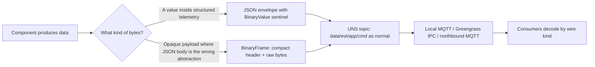

**Binary values** are for structured messages that still need JSON semantics: a Modbus
register block, OPC UA ByteString, CV thumbnail hash bytes, PLC diagnostic byte array,
or a telemetry sample whose value is binary.

**Binary frames** are for opaque payloads where the payload is the message: small images,
compressed records, protobuf/flatbuffer payloads, command artifacts, or binary app data.
They keep the UNS topic and EdgeCommons header semantics, but do not base64 inflate the
payload.

Non-goal: this is still not a video transport or full-frame media bus. Full-resolution
frames and large evidence artifacts remain file-backed and replicated by `file-replicator`.

---

## 1. Requirements

### R1 - Binary Values In JSON Telemetry

EdgeCommons MUST support a byte array as a value inside an otherwise normal JSON message.
The most important case is:

```jsonc
{
  "header": { "name": "SouthboundSignalUpdate", "version": "1.0" },
  "identity": { "...": "..." },
  "body": {
    "signal": { "id": "camera-1/roi-17/thumbnail" },
    "samples": [
      {
        "value": {
          "_edgecommonsBinary": {
            "encoding": "base64",
            "length": 5,
            "data": "AAEC/v8="
          }
        },
        "quality": "GOOD",
        "serverTs": "2026-07-06T18:00:00Z"
      }
    ]
  }
}
```

The JSON structure, topic, header, identity, tags, and data facade semantics stay intact.
Only one value is a typed byte-array value.

### R2 - Opaque Binary Messages

EdgeCommons MUST also support a true opaque binary payload on MQTT and Greengrass IPC:

```text
MQTT topic:  ecv1/gw-01/camera/main/data/frame-preview
MQTT bytes:  [EdgeCommons binary prelude][compact header][payload bytes...]
```

The payload is not JSON and is not base64 encoded. The fixed compact header carries the
same logical header information as the JSON message header:

- `name`
- `version`
- `timestamp`
- `uuid`
- `correlation_id`
- optional `reply_to`

To fit the UNS scheme, the binary frame also carries compact optional metadata for:

- `identity`
- `tags`
- payload `content_type`
- payload length and checksums

### R3 - UNS Compatibility

Both forms MUST ride normal UNS topics:

- `data/{channel}` for telemetry and processed data
- `evt/{severity}/{type}` for events that may include binary values in context
- `app/{channel}` for application-specific binary values or binary frames
- `cmd/{verb}` and `edgecommons/reply-*` for request/reply, including binary frame replies

Reserved classes (`state`, `cfg`, `metric`, `log`) remain JSON-only for v1 unless a later
design explicitly opens a binary form.

### R4 - Consumer Compatibility

Existing JSON-only consumers MUST continue to work for ordinary JSON messages. New binary
capabilities should be opt-in at the API level:

- JSON handlers keep receiving JSON messages.
- Binary-aware handlers can receive binary frames.
- Components that do not understand binary frames can route, drop, or dead-letter by policy.

### R5 - Four-Language Parity

Java is canonical. Python, Rust, and TypeScript MUST expose the same observable behavior:

- same sentinel shape for JSON binary values;
- same binary frame bytes for a given canonical header/payload;
- same validation errors;
- same interop behavior over local MQTT and Greengrass IPC.

---

## 2. Vocabulary

| Term | Meaning |
|---|---|
| **JSON envelope** | The current `{header, identity?, tags?, body}` message serialized as JSON. |
| **BinaryValue** | A byte array encoded as a sentinel JSON object and allowed anywhere a JSON value is allowed. |
| **BinaryFrame** | A compact binary wire message with an EdgeCommons header block plus opaque payload bytes. |
| **Wire kind** | The transport payload classification: JSON envelope, BinaryFrame, or raw/foreign bytes. |
| **Payload** | For BinaryFrame, the opaque bytes after the EdgeCommons binary header. For JSON envelopes, `body`. |

---

## 3. Capability 1 - Binary Values Inside JSON

### 3.1 Canonical Wire Shape

Reuse the existing marker name, but change the semantic scope from "top-level binary body"
to "binary value sentinel".

```json
{
  "_edgecommonsBinary": {
    "encoding": "base64",
    "length": 5,
    "data": "AAEC/v8="
  }
}
```

Rules:

1. The sentinel is recognized only when the value is a JSON object with exactly one key:
   `_edgecommonsBinary`.
2. `encoding` MUST be `"base64"` in v1.
3. `length` MUST be a non-negative integer and MUST match the decoded byte length.
4. Decoded bytes MUST NOT exceed `MAX_BINARY_VALUE_BYTES`.
5. `data` MUST be strict base64.
6. The sentinel MAY appear anywhere inside `body`, `tags`, or `raw` JSON, but producers
   SHOULD use it primarily inside `body`.

This preserves the current degenerate case:

```json
{ "body": { "_edgecommonsBinary": { "...": "..." } } }
```

but that is no longer the main use case. It is just a JSON message whose whole `body`
happens to be a binary value.

### 3.2 Telemetry Example

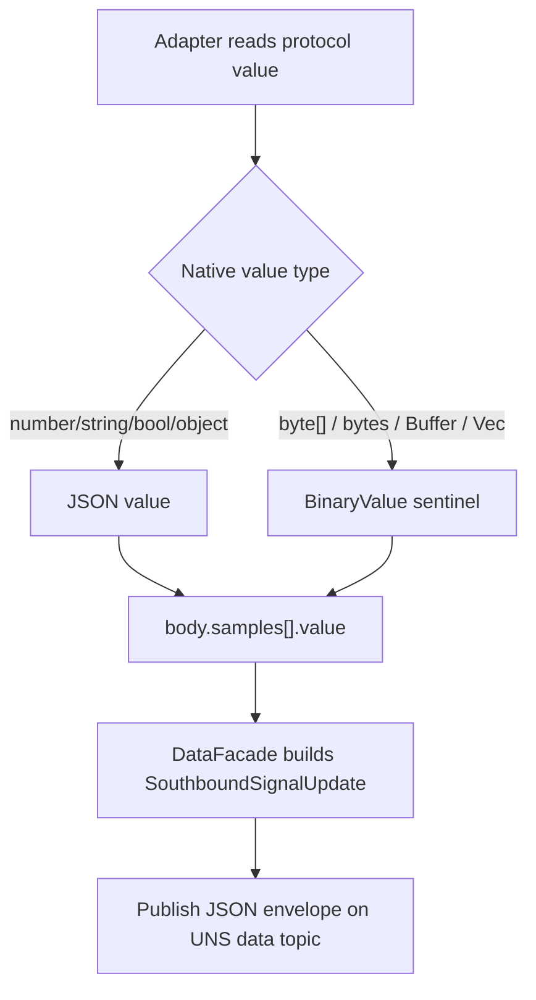

Example body:

```jsonc
{
  "signal": {
    "id": "camera-1/thumbnail",
    "name": "Thumbnail bytes"
  },
  "samples": [
    {
      "value": {
        "_edgecommonsBinary": {
          "encoding": "base64",
          "length": 1024,
          "data": "<base64>"
        }
      },
      "quality": "GOOD",
      "qualityRaw": "unspecified",
      "serverTs": "2026-07-06T18:00:00Z"
    }
  ]
}
```

### 3.3 API Surface

Add a small public binary value type/helper in all four languages.

| Language | Construct | Detect/decode |
|---|---|---|
| Java | `BinaryValue.of(byte[])` | `BinaryValue.is(JsonElement)`, `BinaryValue.decode(JsonElement)` |
| Python | `BinaryValue(bytes)` or `binary_value(bytes)` | `is_binary_value(value)`, `decode_binary_value(value)` |
| Rust | `BinaryValue::new(Vec<u8>)` or `binary_value(bytes)` returning `serde_json::Value` | `BinaryValue::decode(&Value)` |
| TypeScript | `BinaryValue.from(Buffer | Uint8Array)` | `BinaryValue.is(value)`, `BinaryValue.decode(value)` |

Data facade integration:

| Surface | Behavior |
|---|---|
| `Sample.value(byte[])` / `bytes` / `Buffer` / `Vec<u8>` | Encodes as BinaryValue sentinel. |
| `SignalUpdate.samples[]` | Allows binary values exactly as scalar JSON values are allowed. |
| `DataFacade.publish(...)` | Leaves the JSON body shape unchanged and serializes BinaryValue sentinels recursively. |
| `Message.getBody()` | Still returns the JSON-compatible body. Callers decode binary values explicitly. |

This is intentionally **not** a global automatic recursive conversion on inbound messages.
Consumers should opt in at the path they care about:

```java
JsonElement value = sample.get("value");
if (BinaryValue.is(value)) {
    byte[] bytes = BinaryValue.decode(value);
}
```

### 3.4 Encoding Algorithm

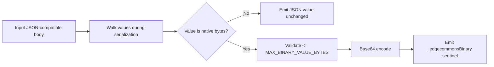

Pseudo-code:

```text
encodeJsonValue(value):
  if value is byte[]:
    if len(value) > MAX_BINARY_VALUE_BYTES: error
    return {
      "_edgecommonsBinary": {
        "encoding": "base64",
        "length": len(value),
        "data": base64(value)
      }
    }
  if value is array:
    return value.map(encodeJsonValue)
  if value is object:
    return mapValues(value, encodeJsonValue)
  return value
```

### 3.5 Decoding Algorithm

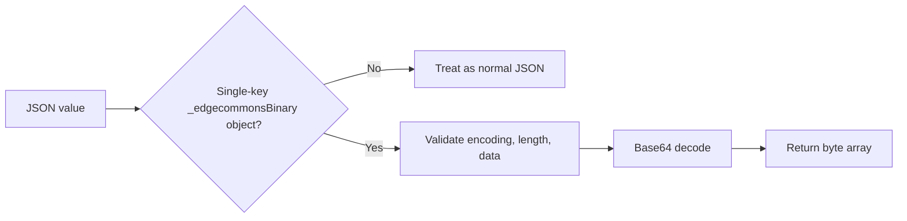

Errors are structural, not lossy:

- unsupported encoding;
- missing or non-integer length;
- decoded length mismatch;
- invalid base64;
- decoded bytes exceed the limit.

### 3.6 Size Limit

The existing `64 KiB` decoded limit should remain the default for **JSON BinaryValue** because
base64 inflates the message and still flows through JSON parsers. The constant should be renamed
from `MAX_BINARY_BODY_BYTES` to:

```text
MAX_BINARY_VALUE_BYTES = 64 * 1024
```

Keep the old constant as a deprecated alias for one release if compatibility matters.

---

## 4. Capability 2 - Opaque BinaryFrame

### 4.1 Why This Is Separate

BinaryValue solves "bytes inside a structured JSON document." It does not solve:

- base64 expansion for payloads where the payload is already opaque;
- unnecessary JSON parse/serialize cost;
- Greengrass `BinaryMessage` payloads;
- command artifacts or binary replies;
- small image/ROI/thumbnail payloads where envelope metadata matters but JSON body does not.

BinaryFrame is the separate answer.

### 4.2 BinaryFrame Logical Model

```text
BinaryMessage
  header:
    name
    version
    timestamp
    uuid
    correlation_id
    reply_to?
  identity?
  tags?
  payload:
    content_type
    bytes
```

The UNS topic still carries the routing class and channel. The binary header carries the same
message identity/provenance information the JSON envelope carries.

### 4.3 Wire Layout

The v1 frame uses a fixed-size prelude followed by an ordered compact header block and then
the payload bytes.

```text
+----------------------+-------------------------+------------------+
| Fixed prelude         | Compact header block    | Opaque payload   |
| magic/version/lengths | header/identity/tags    | bytes            |
+----------------------+-------------------------+------------------+
```

Detailed layout:

```text
Prelude, little-endian, 40 bytes

offset  size  field
0       4     magic = "ECBM"
4       1     major = 1
5       1     minor = 0
6       2     flags
8       4     header_len
12      8     payload_len
20      4     header_crc32c
24      4     payload_crc32c
28      4     reserved
32      8     reserved

Header block, length = header_len

u16 name_len          bytes name_utf8
u16 version_len       bytes version_utf8
u16 timestamp_len     bytes timestamp_utf8
u16 uuid_len          bytes uuid_utf8
u16 correlation_len   bytes correlation_id_utf8
u16 reply_to_len      bytes reply_to_utf8, zero length means absent
u16 content_type_len  bytes content_type_utf8, zero length means application/octet-stream
u16 identity_len      bytes identity_canonical_json, zero length means absent
u16 tags_len          bytes tags_canonical_json, zero length means absent
u16 ext_count
repeat ext_count:
  u16 key_len         bytes key_utf8
  u32 value_len       bytes value

Payload block, length = payload_len
raw bytes
```

Why identity/tags are canonical JSON inside the compact header:

- it avoids inventing a second hierarchy/tag binary schema in v1;
- the data is small relative to the payload;
- `uns-bridge` can parse and rewrite `reply_to` and `tags._relay` without touching payload bytes;
- all four languages already have canonical identity/tag serializers.

This is a compact binary **wire frame**, not a fully schema-less blob. The payload is opaque;
the header is structured and validated.

### 4.4 Frame Diagram

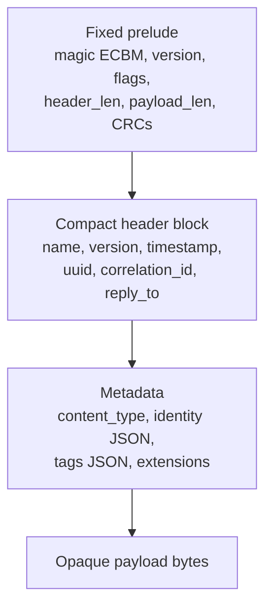

### 4.5 Encoding Algorithm

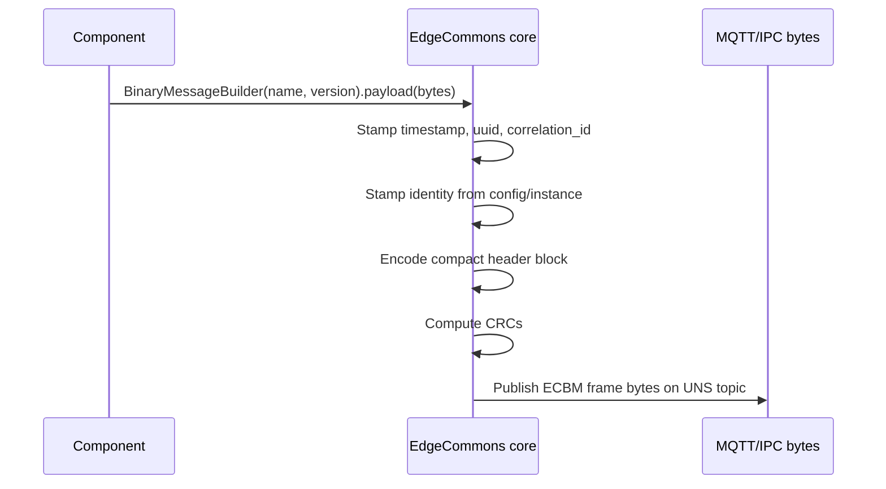

Pseudo-code:

```text
encodeBinaryFrame(msg):
  header = ordered fields:
    header.name
    header.version
    header.timestamp
    header.uuid
    header.correlation_id
    header.reply_to or ""
    content_type or "application/octet-stream"
    canonical_json(identity) or ""
    canonical_json(tags) or ""
    extensions

  prelude.magic = "ECBM"
  prelude.version = 1.0
  prelude.header_len = len(header)
  prelude.payload_len = len(payload)
  prelude.header_crc32c = crc32c(header)
  prelude.payload_crc32c = crc32c(payload)

  return prelude + header + payload
```

### 4.6 Decoding Algorithm

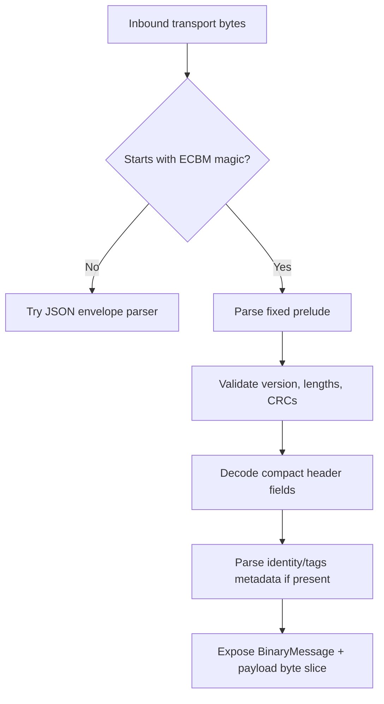

Malformed frames are rejected as binary-frame errors, not silently converted to raw JSON strings.
Unknown `major` versions are not decoded. Unknown extension keys are preserved and ignored.

### 4.7 BinaryFrame API Surface

Add a new public type, not an overload that hides wire-kind differences.

| Language | Builder | Message type | Publish | Subscribe |
|---|---|---|---|---|
| Java | `BinaryMessageBuilder.create(name, version)` | `BinaryMessage` | `publishBinary(topic, msg)` / `publishBinaryNorthbound(...)` | `subscribeBinary(filter, BinaryMessageHandler)` |
| Python | `BinaryMessageBuilder.create(name, version)` | `BinaryMessage` | `publish_binary(...)` / `publish_binary_northbound(...)` | `subscribe_binary(...)` |
| Rust | `BinaryMessageBuilder::new(name, version)` | `BinaryMessage` | `publish_binary(...)` / `publish_binary_northbound(...)` | `subscribe_binary(...)` |
| TypeScript | `BinaryMessageBuilder.create(name, version)` | `BinaryMessage` | `publishBinary(...)` / `publishBinaryNorthbound(...)` | `subscribeBinary(...)` |

Request/reply mirrors the JSON surface:

| JSON today | BinaryFrame addition |
|---|---|
| `request(topic, Message)` | `requestBinary(topic, BinaryMessage)` |
| `reply(request, Message)` | `replyBinary(request, BinaryMessage)` |
| `requestNorthbound(...)` | `requestBinaryNorthbound(...)` |
| `replyNorthbound(...)` | `replyBinaryNorthbound(...)` |

### 4.8 Handler Model

Do not force existing JSON handlers to accept binary frames.

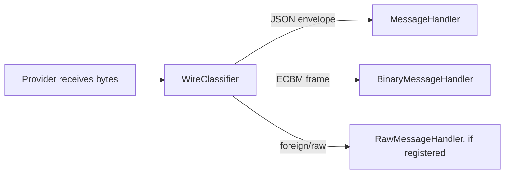

Recommended public handler options:

1. Existing `subscribe(filter, MessageHandler)` remains JSON-only.
2. New `subscribeBinary(filter, BinaryMessageHandler)` receives only valid BinaryFrames.
3. New `subscribeAny(filter, InboundMessageHandler)` receives a discriminated union:

```text
InboundMessage =
  JsonEnvelope(topic, Message)
  BinaryFrame(topic, BinaryMessage)
  Raw(topic, bytes)
```

`subscribeAny` is useful for infrastructure components such as `uns-bridge` and
`telemetry-processor`; application components usually choose JSON or binary explicitly.

---

## 5. UNS Integration

### 5.1 Topic Rules

Binary messaging does not add new UNS classes. It adds wire forms that ride existing classes.

| UNS class | BinaryValue in JSON | BinaryFrame | Notes |
|---|---:|---:|---|
| `data` | yes | yes | Main telemetry/data-plane use. |
| `evt` | yes | no for v1 | Events stay JSON so consoles can inspect severity/type/context. |
| `app` | yes | yes | Free-form app/component data. |
| `cmd` | yes | yes | Binary commands and binary replies are allowed. |
| `state` | no | no | Reserved platform status remains JSON. |
| `cfg` | no | no | Config remains JSON. |
| `metric` | no | no | Metrics remain JSON/EMF-compatible. |
| `log` | no for v1 | no for v1 | The shipped log publisher is structured (`edgecommons.log.v1`); opaque binary log frames remain out of scope. |

### 5.2 Header/Topic Consistency

The topic owns routing. The binary header owns message metadata. A BinaryFrame published on:

```text
ecv1/gw-01/camera/main/data/frame-preview
```

must still have:

- `identity.device == "gw-01"` when identity is present;
- `identity.component == "camera"`;
- `identity.instance == "main"`.

The publisher SHOULD stamp identity from the same instance-bound builder that minted the topic.
Consumers SHOULD treat the topic as routing-authoritative and the header identity as provenance.
This matches the JSON envelope rule.

### 5.3 Binary Values In `data()`

`data()` should make binary values boring:

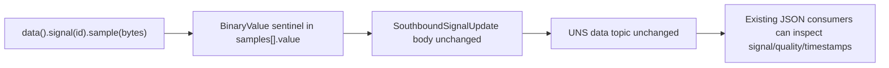

The data facade should accept byte arrays where it accepts any sample value, encode them as
BinaryValue sentinels, and leave `quality`, `serverTs`, `signal.id`, channel sanitization, and
stream routing unchanged.

### 5.4 BinaryFrame Topic Guidance

Use BinaryFrame when the payload is not a telemetry scalar value but the primary content:

| Example | Recommended topic |
|---|---|
| ROI thumbnail bytes | `ecv1/{device}/camera/{instance}/data/roi-thumbnail` |
| Compressed feature vector | `ecv1/{device}/vision/{instance}/data/features` |
| App-level protobuf | `ecv1/{device}/my-app/{instance}/app/protobuf/events` |
| Binary command artifact | `ecv1/{device}/controller/main/cmd/upload-profile` |
| Binary command reply | `edgecommons/reply-<uuid>` |

Large full-resolution frames still use files plus references.

---

## 6. Consumer Integration

### 6.1 Telemetry Processor

Current behavior: `telemetry-processor` receives `Message`, transforms JSON `body`, and routes
to local/northbound/stream. It is payload-agnostic for JSON bodies, but stages such as filter,
aggregate, project, and script assume JSON values.

#### BinaryValue Handling

BinaryValue is JSON-compatible, so it can flow through the existing pipeline.

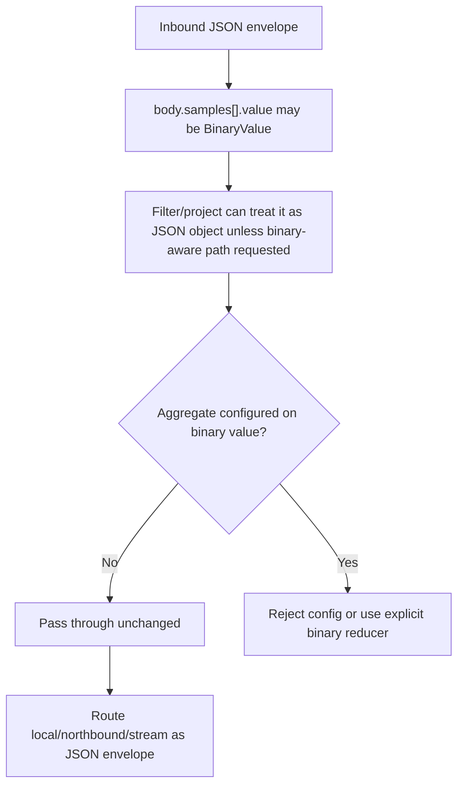

Required processor changes:

1. Add binary-aware JSON path helpers:
   - `isBinaryValue(path)`;
   - `binaryLength(path)`;
   - `binarySha256(path)`;
   - `binaryBase64(path)` for scripts that explicitly request it.
2. Filtering can compare binary length/hash, not raw bytes by default.
3. Aggregation MUST reject binary sample values unless a reducer explicitly supports them.
4. Project and script stages preserve BinaryValue sentinels unless the script replaces them.
5. Stream output remains the serialized JSON envelope.

Recommended defaults:

- pass through binary values;
- do not aggregate binary values by accident;
- expose length/hash as cheap metadata for filtering.

#### BinaryFrame Handling

BinaryFrame is not a JSON `Message`. The processor needs a route policy.

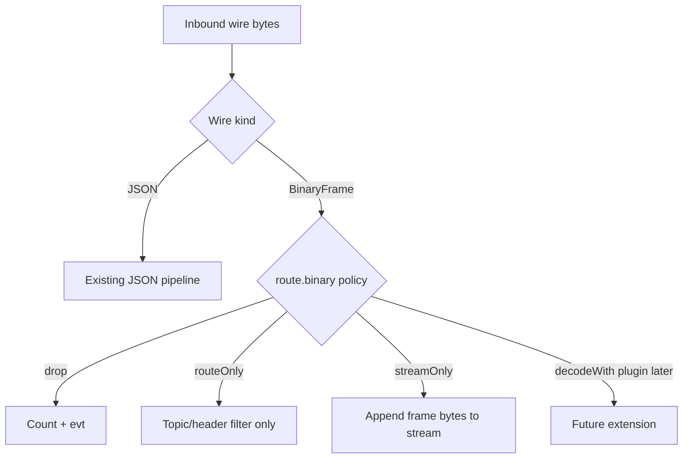

Proposed route config:

```jsonc
{
  "routes": [
    {
      "id": "binary-previews",
      "subscribe": "ecv1/+/camera/+/data/roi-thumbnail",
      "binary": {
        "policy": "routeOnly",
        "allowContentTypes": ["image/jpeg", "application/octet-stream"],
        "maxPayloadBytes": 65536
      },
      "publish": { "target": "stream:vision" }
    }
  ]
}
```

Processor behavior:

- `routeOnly`: match by topic and binary header fields, then forward the same BinaryFrame bytes.
- `streamOnly`: append the BinaryFrame bytes to a stream with headers describing topic,
  wire kind, content type, identity, and header name/version.
- JSON-only stages are skipped for BinaryFrame.
- A binary frame sent to a JSON-only route is dropped with a counted warning and an `evt`.

### 6.2 uns-bridge

Current behavior: the bridge relays raw bytes byte-verbatim when it can, and parses JSON
envelopes only when it must append hop tags or rewrite `reply_to`.

Binary messaging should preserve that posture.

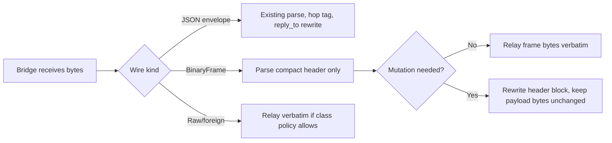

Required bridge behavior:

1. BinaryValue inside JSON needs no special bridge work. It is just JSON and existing
   envelope hop-stamping applies.
2. BinaryFrame uplink with no header mutation can relay byte-verbatim.
3. BinaryFrame downlink request/reply needs compact-header parsing so `reply_to` can be
   rewritten without touching payload bytes.
4. Hop protection should use `tags._relay` in the frame header's tags metadata. If tags are
   absent, the bridge can add a tags JSON block while re-emitting the header.
5. CRCs must be recomputed only for the header when header metadata changes. Payload CRC stays
   the same if payload bytes are untouched.
6. Unknown future BinaryFrame major versions should relay only when no mutation is needed; if
   reply rewriting is required, drop with a counted `MalformedEnvelope`-style reason.

This makes BinaryFrame a first-class envelope from the bridge's perspective, but keeps the
payload opaque.

### 6.3 Streaming

Streaming already stores bytes. The missing piece is metadata clarity.

#### BinaryValue in JSON

For JSON envelopes with BinaryValue:

- stream payload stays the serialized JSON envelope;
- partition key defaults remain `body.signal.id`;
- Parquet/AVRO sinks should treat BinaryValue fields as binary columns only when schema inference
  or explicit mapping says so;
- raw file mode stores the JSON envelope unchanged.

#### BinaryFrame

For BinaryFrame:

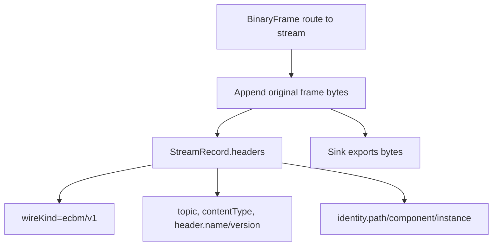

Add or standardize `StreamRecord.headers` for binary frame records:

| Header | Meaning |
|---|---|
| `edgecommons.wireKind` | `json-envelope` or `binary-frame-v1` |
| `edgecommons.topic` | UNS topic the record came from |
| `edgecommons.header.name` | BinaryFrame header name |
| `edgecommons.header.version` | BinaryFrame header version |
| `edgecommons.identity.path` | Identity path if present |
| `edgecommons.identity.component` | Component token if present |
| `edgecommons.identity.instance` | Instance token if present |
| `content-type` | Payload content type |

The stream service should not decode the payload by default. It should preserve bytes and make
metadata available to sinks.

---

## 7. Core Implementation Plan

### 7.1 Message Model Changes

Add:

```text
BinaryValue
BinaryMessage
BinaryMessageBuilder
InboundMessage / WireMessage
WireCodec
```

Keep:

```text
Message
MessageBuilder
MessageHandler
```

Refactor current binary-body helpers:

| Current | Proposed |
|---|---|
| `MAX_BINARY_BODY_BYTES` | `MAX_BINARY_VALUE_BYTES` aliasing old name temporarily |
| `isBinaryBody()` | deprecated top-level convenience |
| `getBinaryBody()` | deprecated top-level convenience |
| top-level-only encode | recursive BinaryValue encode |

### 7.2 Provider/Service Boundary

Providers already move bytes. The service layer should classify bytes before dispatch:

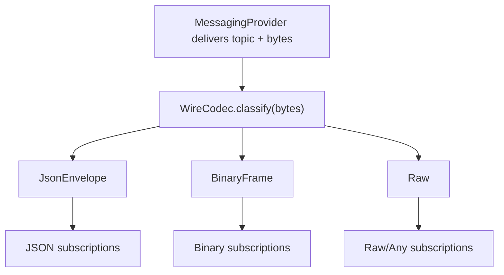

Implementation rule:

- provider layer stays byte-oriented;
- service layer owns JSON/BinaryFrame classification;
- message builders own serialization;
- UNS guard checks still key on topic class and publish method.

### 7.3 Content Type

BinaryFrame SHOULD carry `content_type`.

Defaults:

- absent or empty means `application/octet-stream`;
- common image payloads use `image/jpeg`, `image/png`, or `image/webp`;
- protobuf uses `application/x-protobuf`;
- compressed generic payloads use `application/octet-stream` plus extension headers such as
  `content-encoding=zstd`.

### 7.4 Limits

Suggested defaults:

| Limit | Default | Applies to |
|---|---:|---|
| `MAX_BINARY_VALUE_BYTES` | 64 KiB | BinaryValue inside JSON |
| `MAX_BINARY_FRAME_HEADER_BYTES` | 16 KiB | BinaryFrame compact header |
| `MAX_BINARY_FRAME_PAYLOAD_BYTES` | config default 1 MiB | BinaryFrame payload |

The frame payload limit should be configurable per component or per messaging config. It must
default to a conservative value because MQTT brokers and Greengrass IPC both have payload limits
that deployments may set lower than the library default.

### 7.5 Security and Robustness

1. Validate lengths before allocation.
2. Reject frames whose declared lengths exceed configured limits.
3. Validate CRCs before exposing payload bytes.
4. Treat `content_type` as metadata, not trust.
5. Never log payload bytes.
6. Metrics should count:
   - binary values encoded/decoded;
   - binary frame decode failures;
   - binary frames dropped due to policy/size;
   - bridge header rewrites;
   - stream appends by wire kind.

---

## 8. Cross-Language API Sketches

### 8.1 Java

```java
byte[] thumbnail = readThumbnail();

// Capability 1: bytes as a telemetry value
gg.instance("cam1")
  .data()
  .signal("camera-1/thumbnail")
  .addSample(BinaryValue.of(thumbnail))
  .publish();

// Capability 2: opaque binary frame
BinaryMessage frame = BinaryMessageBuilder.create("FramePreview", "1.0")
  .withConfig(config)
  .withInstance("cam1")
  .withContentType("image/jpeg")
  .withPayload(thumbnail)
  .build();

messaging.publishBinary(
  gg.instance("cam1").uns().topic(UnsClass.DATA, "frame-preview"),
  frame);
```

### 8.2 Python

```python
thumbnail = read_thumbnail()

# Capability 1
gg.instance("cam1").data().signal("camera-1/thumbnail") \
    .add_sample(BinaryValue(thumbnail)) \
    .publish()

# Capability 2
frame = BinaryMessageBuilder.create("FramePreview", "1.0") \
    .with_config(config) \
    .with_instance("cam1") \
    .with_content_type("image/jpeg") \
    .with_payload(thumbnail) \
    .build()

messaging.publish_binary(
    gg.instance("cam1").uns().topic(UnsClass.DATA, "frame-preview"),
    frame)
```

### 8.3 Rust

```rust
let thumbnail: Vec<u8> = read_thumbnail();

// Capability 1
gg.instance("cam1")?
    .data()
    .signal("camera-1/thumbnail")?
    .add_sample(BinaryValue::new(thumbnail.clone())?)
    .publish()
    .await?;

// Capability 2
let frame = BinaryMessageBuilder::new("FramePreview", "1.0")
    .from_config(&config)
    .instance("cam1")
    .content_type("image/jpeg")
    .payload(thumbnail)
    .build()?;

messaging
    .publish_binary(
        &gg.instance("cam1")?.uns().topic(UnsClass::Data, "frame-preview")?,
        &frame,
    )
    .await?;
```

### 8.4 TypeScript

```typescript
const thumbnail = await readThumbnail();

// Capability 1
await gg.instance("cam1")
  .data()
  .signal("camera-1/thumbnail")
  .addSample(BinaryValue.from(thumbnail))
  .publish();

// Capability 2
const frame = BinaryMessageBuilder.create("FramePreview", "1.0")
  .withConfig(config)
  .withInstance("cam1")
  .withContentType("image/jpeg")
  .withPayload(thumbnail)
  .build();

await messaging.publishBinary(
  gg.instance("cam1").uns().topic(UnsClass.Data, "frame-preview"),
  frame,
);
```

---

## 9. Validation Plan

### 9.1 Unit Tests

All four languages:

- BinaryValue encodes recursively inside arrays/objects.
- BinaryValue decodes from nested paths.
- malformed sentinels fail identically.
- oversized BinaryValue fails before publish.
- BinaryFrame encode/decode roundtrip preserves:
  - header fields;
  - identity;
  - tags;
  - content type;
  - exact payload bytes.
- CRC/length/version failures are rejected.

### 9.2 Test Vectors

Add:

```text
binary-test-vectors/
  values.json
  frames.json
```

`values.json` pins sentinel encoding at nested paths.

`frames.json` pins exact frame bytes for a canonical header and payload. Because this is a
binary format, the vector should include:

- field inputs;
- payload hex;
- frame hex;
- parsed output.

### 9.3 Local MQTT Interop

Extend `test-infra/interop`:

| Test | Producers | Consumers | Assertion |
|---|---|---|---|
| nested BinaryValue | Java/Python/Rust/TS | Java/Python/Rust/TS | consumer decodes `body.samples[0].value` bytes exactly |
| BinaryFrame publish | Java/Python/Rust/TS | Java/Python/Rust/TS | consumer header fields and payload bytes exact |
| BinaryFrame request/reply | Java/Python/Rust/TS | Java/Python/Rust/TS | reply header/correlation and payload exact |
| mixed subscribers | any | JSON-only + binary-only | each handler receives only its declared wire kind |

### 9.4 Greengrass IPC Interop

Required before completion because both capabilities are reachable through Greengrass IPC:

- deploy four language skeletons to `lab-5950x`;
- each language publishes nested BinaryValue telemetry over IPC;
- each language publishes BinaryFrame over IPC;
- each language consumes from every other language;
- exact bytes are asserted;
- request/reply with BinaryFrame is asserted.

### 9.5 Consumer Regression

`telemetry-processor`:

- BinaryValue pass-through route.
- BinaryValue filter by length/hash.
- aggregate rejects binary value by default.
- BinaryFrame route-only to stream.
- BinaryFrame sent to JSON-only route is counted and dropped.

`uns-bridge`:

- BinaryValue JSON envelope relays with existing hop behavior.
- BinaryFrame relays byte-verbatim when no mutation is needed.
- BinaryFrame downlink request rewrites `reply_to` and preserves payload bytes.
- BinaryFrame reply back-haul preserves correlation and payload bytes.
- malformed/unknown frames are counted.

Streaming:

- JSON envelope with BinaryValue appends unchanged.
- BinaryFrame appends frame bytes and metadata headers.
- file sink raw mode preserves bytes.

---

## 10. Migration From Current Implementation

### Phase 0 - Rename The Existing Concept

Document the current behavior as:

```text
legacy top-level binary body marker
```

Do not call it "Binary Messaging" in reference docs.

### Phase 1 - BinaryValue

1. Generalize the marker encoder to walk JSON structures.
2. Add BinaryValue helpers in all four languages.
3. Update `data()` sample builders to accept bytes.
4. Add vectors and interop for nested binary values.
5. Deprecate `isBinaryBody()` / `getBinaryBody()` in favor of BinaryValue path helpers, while
   preserving them as conveniences when the whole body is a BinaryValue.

### Phase 2 - BinaryFrame Codec

1. Add BinaryFrame model and codec in Java canonical.
2. Add vectors with exact frame bytes.
3. Mirror Python/Rust/TS.
4. Add `publishBinary`, `subscribeBinary`, `subscribeAny`, `requestBinary`, and `replyBinary`.
5. Update local MQTT interop.

### Phase 3 - Consumers

1. Update `telemetry-processor` route policy for BinaryFrame.
2. Update `uns-bridge` to parse and rewrite BinaryFrame headers.
3. Update streaming metadata headers.
4. Add component/skeleton examples.

### Phase 4 - Greengrass Validation

Deploy and run the four-language IPC matrix on `lab-5950x`. Do not call the feature complete
until this is green.

---

## 11. Open Decisions

| ID | Decision | Recommendation |
|---|---|---|
| B-M1 | Keep `_edgecommonsBinary` marker name or introduce a cleaner `$edgecommons` marker? | Keep `_edgecommonsBinary` for v1, but define it as a single-key BinaryValue sentinel allowed anywhere. |
| B-M2 | JSON BinaryValue limit | Keep 64 KiB default. |
| B-M3 | BinaryFrame payload default limit | Start at 1 MiB configurable; require docs to tune per broker/IPC deployment. |
| B-M4 | BinaryFrame identity/tags encoding | Use canonical JSON inside compact header for v1. |
| B-M5 | Existing JSON handlers receiving BinaryFrame | Do not deliver BinaryFrame to JSON handlers. Add binary/any handlers. |
| B-M6 | BinaryFrame on reserved classes | Disallow for v1. |
| B-M7 | Top-level current binary body helper | Preserve as deprecated convenience; redefine as whole-body BinaryValue. |

---

## 12. Success Criteria

The design is implemented only when all of these are true:

1. A telemetry sample can carry a byte array in `body.samples[].value` without changing the
   `SouthboundSignalUpdate` shape.
2. A BinaryFrame can publish opaque bytes over local MQTT and Greengrass IPC with compact
   EdgeCommons header metadata.
3. Java, Python, Rust, and TypeScript can all produce and consume both forms.
4. `telemetry-processor` can pass through BinaryValue JSON and route BinaryFrame without pretending
   it has a JSON body.
5. `uns-bridge` can relay BinaryFrame payload bytes unchanged and rewrite request/reply headers
   when required.
6. Streaming preserves both JSON envelopes with BinaryValue and BinaryFrame records with metadata.
7. Local MQTT interop and deployed Greengrass IPC interop assert exact byte preservation across all
   ordered producer/consumer language pairs.
