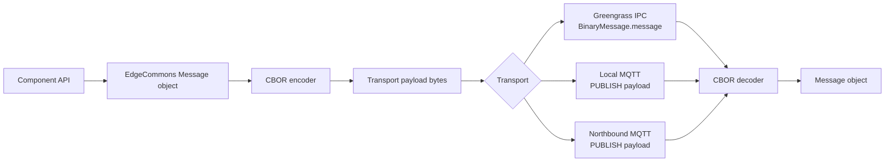
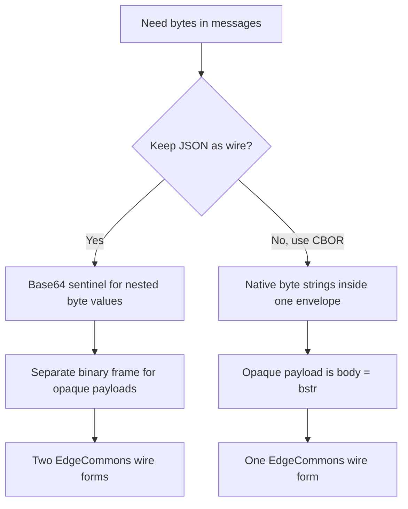
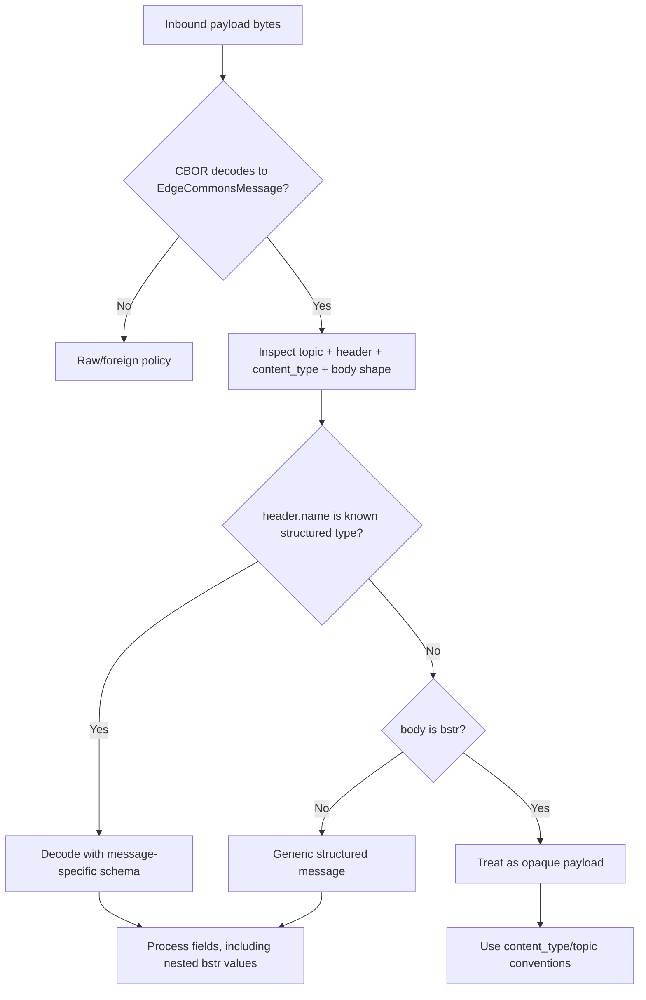
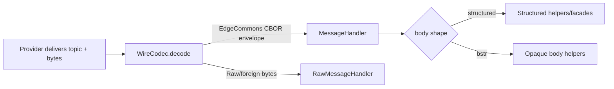
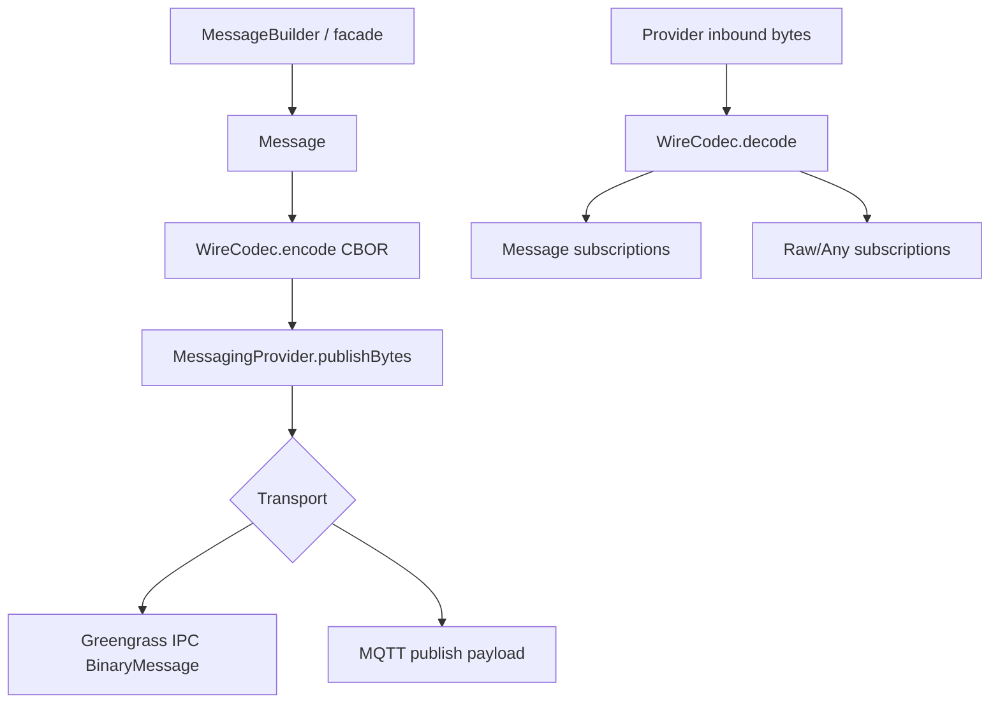
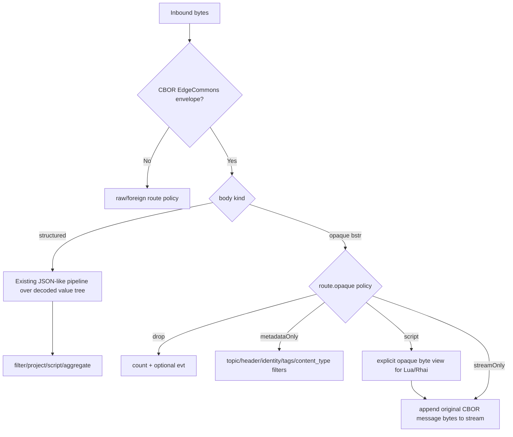
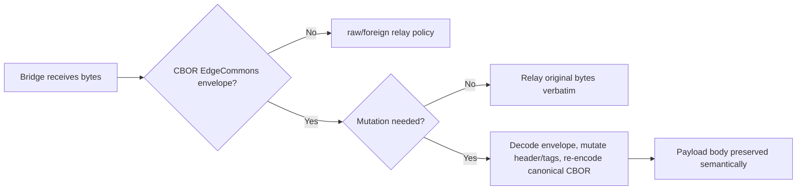
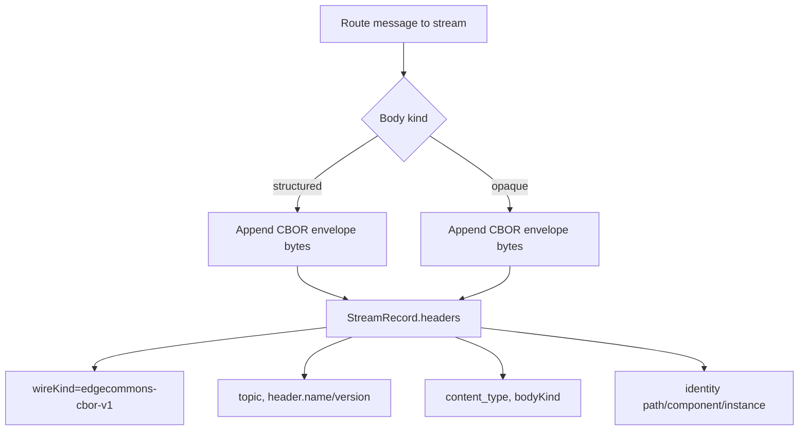
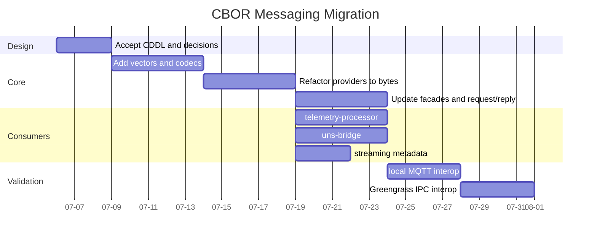
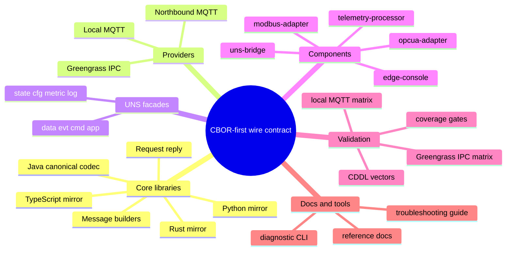

# EdgeCommons CBOR Messaging - Design Proposal

> **Status:** PROPOSED. This document is a design correction and expansion, not an
> implementation claim.
>
> This proposal supersedes the narrower
> [`DESIGN-binary-messaging.md`](DESIGN-binary-messaging.md) direction if accepted.
> Instead of keeping JSON envelopes and adding two binary escape hatches
> (`BinaryValue` and `BinaryFrame`), it proposes a single rule:
>
> **All EdgeCommons messages are binary transport payloads encoded as CBOR.**
>
> The EdgeCommons envelope remains `{header, identity?, tags?, body}`, but it is
> serialized as CBOR on local MQTT, northbound MQTT, and Greengrass IPC. Because
> CBOR has a native byte-string type, structured telemetry can carry byte values
> directly, and opaque payloads can be represented as `body = bstr` without a
> second custom frame format.

This proposal is intentionally high blast radius. It touches the core wire
contract, all four language libraries, request/reply, UNS class facades, the
reference components, `telemetry-processor`, `uns-bridge`, streaming, docs,
interop, and deployed Greengrass regression.

---

## Source Grounding

The proposal is grounded in the current implementation seams:

- The current public message model is a JSON envelope named `Message` in all four
  languages. The wire shape is logically `{header, identity?, tags?, body}`.
- Greengrass local IPC already transports bytes through the Greengrass SDK
  `BinaryMessage` carrier, but today the bytes are UTF-8 JSON text.
- MQTT providers already move payload bytes; the JSON assumption lives at the
  message serialization/classification layer, not in MQTT itself.
- The existing binary-body implementation is top-level-body oriented and uses a
  JSON marker (`_edgecommonsBinary`) instead of a native byte value.
- The `data()` facade already owns the normal `SouthboundSignalUpdate` body and
  is the right place to make byte-valued telemetry samples normal.
- `telemetry-processor` processes decoded JSON `Message` bodies today, while
  `uns-bridge` can relay raw bytes byte-verbatim when it does not need to mutate
  an envelope. Both need explicit CBOR-aware behavior.

The important design difference from `DESIGN-binary-messaging.md`:

| Concern | Previous binary proposal | This CBOR proposal |
|---|---|---|
| Structured bytes | JSON sentinel object | Native CBOR `bstr` anywhere in the body |
| Opaque payload | Separate `BinaryFrame` prelude/header/payload format | Same CBOR envelope with `body = bstr` |
| JSON compatibility | JSON remains the primary wire format | JSON wire format is retired for EdgeCommons messages |
| Consumer classification | JSON envelope vs BinaryFrame vs raw | CBOR EdgeCommons envelope vs raw/foreign; then structured vs opaque body |
| Greengrass IPC | JSON text bytes or custom binary frame bytes | Always CBOR envelope bytes |

---

## 0. Executive Summary

EdgeCommons should use one canonical binary envelope for all framework-owned
messages:



CBOR gives the library stronger semantics without inventing two wire formats:

- The envelope is still structured and self-describing.
- Header timestamps can become fixed-width numeric values.
- Byte arrays are byte arrays, not base64 strings in sentinel objects.
- Opaque payloads are just `body` byte strings plus metadata.
- Greengrass IPC and MQTT use the same bytes.
- Test vectors can pin exact canonical CBOR bytes across Java, Python, Rust,
  and TypeScript.

The price is explicit and large: every EdgeCommons consumer that currently
expects JSON text on the bus must move to the CBOR decoder or sit behind a
compatibility bridge. That includes first-party components and any external
debugging tooling that reads MQTT payloads directly.

---

## 1. Requirements

### R1 - One EdgeCommons Wire Encoding

All framework-owned EdgeCommons messages MUST be encoded as CBOR bytes.

This applies to:

- Greengrass local IPC pub/sub;
- local MQTT pub/sub;
- northbound MQTT pub/sub;
- request/reply topics;
- library-owned UNS classes (`state`, `cfg`, `metric`, `log`);
- app-usable UNS classes (`data`, `evt`, `cmd`, `app`).

JSON text is no longer an EdgeCommons wire format once this design ships. JSON
may remain a human-facing diagnostic format, file export format, or
compatibility bridge output, but not the primary bus contract.

### R2 - Preserve The Logical Envelope

The logical message model remains:

```text
EdgeCommonsMessage
  header
  identity?
  tags?
  content_type?
  body
```

The change is serialization, not a removal of the EdgeCommons envelope. Existing
subsystems still rely on:

- `header.name` and `header.version` for message type and schema version;
- `header.correlation_id` and `header.reply_to` for request/reply;
- `identity` for provenance;
- `tags` for metadata and bridge hop protection;
- `body` for subsystem-specific content.

### R3 - Native Bytes In Structured Bodies

Structured messages MUST be able to contain byte arrays wherever a body schema
allows an arbitrary value. The main motivating case is telemetry:

```text
body.samples[0].value = h'000102FEFF'
```

There is no `_edgecommonsBinary` marker and no base64 inflation. The byte value
is a native CBOR byte string.

### R4 - Opaque Payloads Without A Separate Frame

Opaque payloads MUST use the same envelope:

```text
body = h'FFD8FFE000104A464946...'  ; JPEG bytes, for example
content_type = "image/jpeg"
header.name = "FramePreview"
```

An opaque payload is not a foreign raw MQTT message. It is still an EdgeCommons
message: it has a header, optional identity, optional tags, and request/reply
metadata. Only the body is opaque to the framework.

### R5 - Consumer Decode Signals

Consumers MUST have stable, documented signals for choosing how to interpret a
decoded message. The strongest signals are:

| Signal | Structured telemetry | Opaque binary payload | Recommendation |
|---|---|---|---|
| `header.name` | `SouthboundSignalUpdate`, `Telemetry` | `FramePreview`, `BinaryData`, `ProtobufEvent` | Strong signal |
| `content_type` | Usually absent or generic | `image/jpeg`, `application/x-protobuf` | Very useful |
| Topic | `data/...` | `data/roi-thumbnail`, `app/protobuf/...` | Good convention |
| Presence of samples / TQV fields | Yes | No | Runtime check |

### R6 - Four-Language Parity

Java remains canonical. Python, Rust, and TypeScript MUST expose the same
observable behavior:

- same CDDL contract;
- same canonical CBOR bytes for fixed test-vector inputs;
- same timestamp units and integer width;
- same validation errors;
- same request/reply behavior;
- same interop behavior over local MQTT and Greengrass IPC.

---

## 2. Vocabulary

| Term | Meaning |
|---|---|
| **Logical envelope** | The in-memory EdgeCommons message model: `{header, identity?, tags?, body}` plus optional body metadata. |
| **CBOR envelope** | The logical envelope serialized as CBOR bytes. This is the primary EdgeCommons wire format. |
| **Structured body** | A body whose schema is known to the message type, such as `SouthboundSignalUpdate`. It may contain byte strings inside nested values. |
| **Opaque body** | A body that is itself a CBOR byte string (`bstr`). The framework preserves it but does not parse the payload bytes. |
| **Raw/foreign payload** | Bytes on a topic that are not an EdgeCommons CBOR envelope. These are outside the normal EdgeCommons message contract. |
| **Decode signal** | A field or convention used by consumers to decide how to interpret the decoded body. |
| **Canonical CBOR** | The deterministic CBOR profile used for library-created messages and test vectors. |

---

## 3. Proposed Wire Contract

### 3.1 Canonical Envelope

The wire payload is a CBOR map with text-string keys. Text keys are recommended
for v1 because they preserve debuggability and make the CDDL readable. A later
grammar major version may introduce integer labels only if payload size data
proves the need.

```cddl
EdgeCommonsMessage = {
  header: Header,
  ? identity: Identity,
  ? tags: { * tstr => any },
  ? content_type: tstr,
  ? content_encoding: tstr,
  ? schema: BodySchema,
  body: Body,
}

Body = StructuredBody / OpaqueBody
StructuredBody = StructuredMap / StructuredArray / tstr / int / uint / float / bool / nil
StructuredMap = { * any => any }
StructuredArray = [ * any ]
OpaqueBody = bstr

Header = {
  name: tstr,
  version: tstr,
  timestamp: uint64,       ; milliseconds since Unix epoch
  uuid: tstr,
  ? correlation_id: tstr,
  ? reply_to: tstr,
}

Identity = {
  hier: [ + HierEntry ],
  path: tstr,
  component: tstr,
  instance: tstr,
  * tstr => any,
}

HierEntry = {
  level: tstr,
  value: tstr,
}

BodySchema = {
  ? name: tstr,
  ? version: tstr,
  ? content_type: tstr,
  ? hash: tstr,
}

uint64 = uint .size 8
```

Notes:

1. `body` is semantically either structured or opaque. CBOR itself cannot encode
   business intent, so consumers use the decode signals in Section 6.
2. `content_type` describes the `body`. It is optional for structured messages
   but strongly recommended for opaque bodies. If `body` is a byte string and
   `content_type` is absent, consumers MUST treat it as
   `application/octet-stream`.
3. `content_encoding` is for encodings applied to the body bytes, such as
   `zstd` or `gzip`. It is metadata, not a security boundary.
4. `tags` remain metadata. Producers SHOULD keep tags small and avoid using
   them as a large binary data channel even though CBOR can encode bytes there.
5. `identity.hier` is the ordered enterprise hierarchy. `identity.path` is the
   `/`-joined hierarchy values for newly produced messages. `component` and
   `instance` identify the publishing component and are not part of
   `identity.path`. The device is the deepest hierarchy entry, not a separate
   wire field.
6. `header.timestamp` is a breaking change from the current RFC3339-style string
   timestamp. The wire value is a 64-bit unsigned millisecond epoch timestamp.

### 3.2 Structured Telemetry Profile

The normal southbound telemetry body remains a structured document. The key
correction is that sample values can be native CBOR byte strings.

```cddl
SouthboundSignalUpdate = {
  signal: Signal,
  samples: [ + Sample ],
  * tstr => any,
}

Signal = {
  id: tstr,
  ? name: tstr,
  * tstr => any,
}

Sample = {
  value: any,              ; may be a CBOR bstr
  ? quality: tstr,
  ? qualityRaw: any,
  ? sourceTs: tstr / uint64,
  ? serverTs: tstr / uint64,
  * tstr => any,
}
```

Sample timestamp semantics:

1. `header.timestamp` is the EdgeCommons message publish/creation time.
2. `sample.sourceTs` is the original source timestamp for the reading. OPC UA
   maps this from the `DataValue` source timestamp. Modbus normally has no
   native device timestamp, so this field remains absent unless the device
   payload itself carries one.
3. `sample.serverTs` is the protocol-server or adapter observation time. For
   OPC UA this maps from the `DataValue` server timestamp. For Modbus this is
   the poll/read time.
4. `sourceTs` is never synthesized. `serverTs` may be defaulted by the facade
   when the publisher omits it.
5. If a timestamp is encoded as a CBOR integer, the value is milliseconds since
   Unix epoch. If encoded as text, it is ISO-8601 UTC.

Example, shown as diagnostic notation rather than JSON:

```cbor-diag
{
  "header": {
    "name": "SouthboundSignalUpdate",
    "version": "1.0",
    "timestamp": 1783360800000,
    "uuid": "018fe1dd-7dc7-7b0f-a80f-5d5d6d0f1155"
  },
  "identity": {
    "hier": [
      { "level": "site", "value": "plant-a" },
      { "level": "line", "value": "line-2" },
      { "level": "device", "value": "gw-01" }
    ],
    "path": "plant-a/line-2/gw-01",
    "component": "camera",
    "instance": "cam1"
  },
  "tags": {
    "retention": "short",
    "priority": 5
  },
  "body": {
    "signal": {
      "id": "camera-1/roi-17/thumbnail"
    },
    "samples": [
      {
        "value": h'000102FEFF',
        "quality": "GOOD",
        "sourceTs": 1783360799900,
        "serverTs": 1783360800000
      }
    ]
  }
}
```

The body shape is still `SouthboundSignalUpdate`. Existing business meaning is
not reduced. The only wire change is that bytes are real bytes.

### 3.3 Opaque Body Profile

Opaque payloads use the same envelope and set `body` to a CBOR byte string.

```cbor-diag
{
  "header": {
    "name": "FramePreview",
    "version": "1.0",
    "timestamp": 1783360800000,
    "uuid": "018fe1dd-7dc7-7b0f-a80f-5d5d6d0f1156"
  },
  "identity": {
    "hier": [
      { "level": "site", "value": "plant-a" },
      { "level": "line", "value": "line-2" },
      { "level": "device", "value": "gw-01" }
    ],
    "path": "plant-a/line-2/gw-01",
    "component": "camera",
    "instance": "cam1"
  },
  "tags": {
    "capture_mode": "preview"
  },
  "content_type": "image/jpeg",
  "body": h'FFD8FFE000104A464946...'
}
```

This replaces the separate `BinaryFrame` concept. The payload is opaque, but the
message is still an EdgeCommons message.

### 3.4 Transport Payloads

```text
MQTT topic:    ecv1/gw-01/camera/cam1/data/roi-thumbnail
MQTT payload:  a4 ...               ; canonical CBOR EdgeCommonsMessage map bytes

IPC topic:     ecv1/gw-01/camera/cam1/data/roi-thumbnail
IPC payload:   BinaryMessage.message = same CBOR EdgeCommonsMessage bytes
```

There is no EdgeCommons-specific prelude, magic number, CRC block, or secondary
binary header in v1. The UNS topic and the CBOR envelope shape define the
contract. If integrity metadata beyond transport/TLS guarantees is required, it
should be carried as explicit metadata such as `schema.hash`, `body_sha256`, or a
future signed-envelope profile.

---

## 4. Why CBOR Instead Of JSON Plus Binary Escape Hatches



CBOR is a better fit if EdgeCommons is willing to take the breaking change:

| Design pressure | JSON + sentinel/frame | CBOR envelope |
|---|---|---|
| Byte arrays inside telemetry | Requires marker object and base64 | Native `bstr` |
| Opaque payloads | Requires second frame format | Same envelope with `body = bstr` |
| Greengrass IPC | Still sends text bytes for JSON messages | Always binary bytes |
| Compactness | Base64 expansion and repeated JSON syntax | Binary encoding |
| Schema language | JSON schema plus custom binary rules | CDDL profile plus semantic body schemas |
| Consumer model | JSON handler, binary handler, raw handler | EdgeCommons CBOR handler, raw/foreign handler |
| Debuggability | Easy with raw text | Requires CBOR diagnostic tooling |

The tradeoff is not subtle: CBOR reduces conceptual wire-form complexity, but
increases migration cost and removes "open MQTT client can read the payload as
JSON" as a free debugging path.

---

## 5. UNS Integration

CBOR does not change the UNS topic grammar:

```text
ecv1 / {device} / {component} / {instance} / {class} [ / {channel...} ]
```

It changes the payload contract for every EdgeCommons-owned topic under that
grammar.

### 5.1 Class Matrix

| UNS class | CBOR structured body | CBOR opaque body | Notes |
|---|---:|---:|---|
| `state` | yes | no | Framework status remains structured and inspectable after decode. |
| `cfg` | yes | no | Config messages remain structured. |
| `metric` | yes | no | Metrics remain structured for sinks and aggregation. |
| `log` | yes | no for v1 | Log-tail publisher can revisit opaque chunks later. |
| `data` | yes | yes | Main class for telemetry values and opaque data-plane payloads. |
| `evt` | yes | no for v1 | Events stay structured so severity/type/context remain inspectable. |
| `cmd` | yes | yes | Binary command artifacts and binary replies are allowed. |
| `app` | yes | yes | Application-specific data. |

The reserved classes are no longer JSON-only; they are CBOR-structured-only.
That is an important difference from the previous binary proposal.

### 5.2 Topic And Header Consistency

The topic remains routing-authoritative. The envelope remains provenance and
message metadata.

For a publish on:

```text
ecv1/gw-01/camera/cam1/data/roi-thumbnail
```

the stamped identity SHOULD agree:

```text
identity.path           == "plant-a/line-2/gw-01"
identity.hier[-1].level == "device"
identity.hier[-1].value == "gw-01"
identity.component      == "camera"
identity.instance       == "cam1"
```

The topic carries the device token used for routing. The envelope identity can
carry the wider enterprise hierarchy as provenance. Consumers SHOULD route by
topic and treat envelope identity as provenance. This preserves the current UNS
rule.

### 5.3 Channel Guidance

| Example | Recommended topic | Body shape | Recommended metadata |
|---|---|---|---|
| Numeric telemetry sample | `ecv1/{device}/opcua/{instance}/data/{signal}` | structured `SouthboundSignalUpdate` | `header.name=SouthboundSignalUpdate` |
| Byte-valued telemetry sample | `ecv1/{device}/camera/{instance}/data/{signal}` | structured `SouthboundSignalUpdate`, sample `value=bstr` | `header.name=SouthboundSignalUpdate` |
| ROI thumbnail | `ecv1/{device}/camera/{instance}/data/roi-thumbnail` | opaque `body=bstr` | `content_type=image/jpeg`, `header.name=FramePreview` |
| Protobuf app event | `ecv1/{device}/vision/{instance}/app/protobuf/events` | opaque `body=bstr` | `content_type=application/x-protobuf`, `header.name=ProtobufEvent` |
| Binary command artifact | `ecv1/{device}/controller/main/cmd/upload-profile` | opaque `body=bstr` | `content_type=application/octet-stream`, command-specific `header.name` |
| Binary command reply | `edgecommons/reply-<uuid>` | opaque or structured | preserve `correlation_id` |

Large full-resolution media still belongs in files plus references, not on the
message bus.

---

## 6. Consumer Interpretation Model

After CBOR decode, the consumer has a normal `Message` object. It still needs to
decide what the body means.



Recommended decode order:

1. Validate that the payload is a CBOR map matching `EdgeCommonsMessage`.
2. Validate `header.name`, `header.version`, `header.timestamp`, and `header.uuid`.
3. Use the UNS topic class as the coarse routing signal.
4. Use `header.name` as the strongest semantic signal.
5. Use `content_type` when `body` is `bstr` or when the body carries an embedded
   encoded format.
6. Use body-shape checks such as `samples[]` only after the header and topic have
   been considered.

### 6.1 Handler Model

The public handler model should simplify compared with the previous binary
proposal.



Recommended public API:

| Surface | Behavior |
|---|---|
| `subscribe(filter, MessageHandler)` | Receives valid EdgeCommons CBOR messages, including opaque `body=bstr` messages. |
| `subscribeRaw(filter, RawMessageHandler)` | Receives non-EdgeCommons raw/foreign bytes when explicitly enabled. |
| `subscribeAny(filter, InboundMessageHandler)` | Receives a discriminated union for infrastructure components. |
| `Message.isOpaqueBody()` | True when `body` is a CBOR byte string. |
| `Message.getOpaqueBody()` | Returns body bytes only for opaque bodies. |
| `Message.contentType()` | Returns `content_type` or `application/octet-stream` for opaque bodies with no explicit type. |

There is no separate `BinaryMessage` public type in the recommended v1 API.
`Message` is the single decoded EdgeCommons envelope. Language-idiomatic body
types are still allowed:

| Language | Structured body | Nested bytes | Opaque body |
|---|---|---|---|
| Java | maps/POJOs/records or CBOR tree | `byte[]` | `byte[]` body |
| Python | `dict`/dataclass | `bytes` | `bytes` body |
| Rust | typed structs or `serde_cbor::Value`/equivalent | `Vec<u8>` | `Vec<u8>` body |
| TypeScript | objects/types | `Uint8Array`/`Buffer` | `Uint8Array`/`Buffer` body |

---

## 7. Core Implementation Design

### 7.1 WireCodec

Add a shared conceptual codec in all four languages:

```text
WireCodec
  encode(Message) -> bytes
  decode(bytes) -> InboundMessage
  toDiagnostic(Message) -> string
  fromDiagnostic(...) -> Message       ; testing/tooling only
```

`InboundMessage` should distinguish:

```text
InboundMessage =
  EdgeCommons(topic, Message)
  Raw(topic, bytes)
  Malformed(topic, bytes, reason)
```

For application subscriptions, malformed EdgeCommons messages should be counted
and dropped or surfaced through an error handler according to subscription
policy. Infrastructure components such as `uns-bridge` and `telemetry-processor`
need access to malformed/raw classification for dead-letter and metrics.

### 7.2 Deterministic Encoding

For library-created messages:

- encode maps with deterministic key order;
- use definite-length strings, arrays, maps, and byte strings;
- use the shortest valid integer representation;
- encode `header.timestamp` as unsigned milliseconds since epoch;
- avoid floats in framework-owned schemas unless the schema explicitly allows
  them;
- reject NaN and infinity in framework-owned schemas unless a later schema
  explicitly defines them.

Parsers MAY accept valid non-deterministic CBOR as long as it matches the
envelope and schema. Producers MUST emit deterministic CBOR. Test vectors MUST
pin exact bytes.

### 7.3 Message Model Changes

Replace:

```text
Message.toString() -> JSON wire string
Message.dumps()    -> JSON wire string
Message.toJSON()   -> JSON wire string
```

with:

```text
Message.toBytes()       -> CBOR wire bytes
Message.fromBytes(...)  -> decoded Message
Message.toDiagnostic()  -> human-readable diagnostic representation
Message.toJsonDebug()   -> optional lossy/debug JSON, not wire
```

Compatibility aliases must be handled carefully. A method named `toJSON()` that
still exists for JavaScript ecosystem reasons must be documented as diagnostic,
not wire-authoritative.

Deprecated current helpers:

| Current helper | CBOR replacement |
|---|---|
| `_edgecommonsBinary` marker | Native CBOR `bstr` |
| `MAX_BINARY_BODY_BYTES` | `MAX_OPAQUE_BODY_BYTES` and per-schema nested-byte limits |
| `isBinaryBody()` | `isOpaqueBody()` |
| `getBinaryBody()` | `getOpaqueBody()` |
| JSON raw fallback string | `Raw(topic, bytes)` classification |

### 7.4 Provider Boundary

Providers should be byte-oriented. The service layer owns CBOR encode/decode.



Required boundary changes:

- provider publish paths accept bytes, not JSON strings;
- provider subscribe paths deliver bytes to the service layer;
- JSON parsing is removed from provider subscription handlers;
- request/reply correlation is applied to decoded CBOR messages;
- raw/foreign handling is explicit, not "invalid JSON becomes raw string."

### 7.5 Request/Reply

Request/reply remains envelope-based:

```cddl
Header = {
  name: tstr,
  version: tstr,
  timestamp: uint64,
  uuid: tstr,
  ? correlation_id: tstr,
  ? reply_to: tstr,
}
```

Rules:

1. `request()` stamps `correlation_id` and `reply_to` before CBOR encoding.
2. `reply()` copies the request `correlation_id`.
3. Replies may be structured or opaque.
4. A reply topic carries a CBOR `EdgeCommonsMessage`, never a naked payload
   byte string.
5. Timeout cleanup semantics remain unchanged.

### 7.6 Limits

Suggested defaults:

| Limit | Default | Applies to |
|---|---:|---|
| `MAX_MESSAGE_BYTES` | deployment/config dependent | Entire encoded CBOR payload before publish. |
| `MAX_STRUCTURED_BODY_BYTES` | 256 KiB | Decoded structured body after CBOR parse. |
| `MAX_NESTED_BYTE_VALUE_BYTES` | 64 KiB | Byte strings inside structured bodies. |
| `MAX_OPAQUE_BODY_BYTES` | 1 MiB | `body=bstr` opaque messages. |
| `MAX_TAGS_BYTES` | 16 KiB | Encoded `tags` map. |

The actual defaults must be validated against MQTT broker settings and
Greengrass IPC payload behavior. The library must validate before allocation
where possible and before publish always.

### 7.7 Security And Robustness

1. Validate declared/decoded sizes before building large in-memory objects.
2. Reject duplicate map keys in framework-owned maps.
3. Reject unknown required fields and malformed required field types.
4. Treat `content_type` as metadata, not trust.
5. Never log opaque body bytes or nested byte-string values.
6. Add metrics for:
   - CBOR decode failures;
   - malformed EdgeCommons envelopes;
   - raw/foreign payloads;
   - opaque body publishes/receives;
   - oversized message rejections;
   - bridge rewrites;
   - stream appends by content type and body kind.

---

## 8. API Sketches

These are illustrative. The final per-language API must follow existing local
style while preserving behavior.

### 8.1 Java

```java
byte[] thumbnail = readThumbnail();

// Structured telemetry with native bytes in the sample value.
gg.instance("cam1")
  .data()
  .signal("camera-1/thumbnail")
  .addSample(thumbnail)
  .publish();

// Opaque body in the same Message model.
Message frame = MessageBuilder.create("FramePreview", "1.0")
  .withConfig(config)
  .withInstance("cam1")
  .withContentType("image/jpeg")
  .withBody(thumbnail)
  .build();

messaging.publish(
  gg.instance("cam1").uns().topic(UnsClass.DATA, "roi-thumbnail"),
  frame);
```

### 8.2 Python

```python
thumbnail = read_thumbnail()

gg.instance("cam1").data().signal("camera-1/thumbnail") \
    .add_sample(thumbnail) \
    .publish()

frame = MessageBuilder.create("FramePreview", "1.0") \
    .with_config(config) \
    .with_instance("cam1") \
    .with_content_type("image/jpeg") \
    .with_body(thumbnail) \
    .build()

messaging.publish(
    gg.instance("cam1").uns().topic(UnsClass.DATA, "roi-thumbnail"),
    frame)
```

### 8.3 Rust

```rust
let thumbnail: Vec<u8> = read_thumbnail();

gg.instance("cam1")?
    .data()
    .signal("camera-1/thumbnail")?
    .add_sample(thumbnail.clone())
    .publish()
    .await?;

let frame = MessageBuilder::new("FramePreview", "1.0")
    .from_config(&config)
    .instance("cam1")
    .content_type("image/jpeg")
    .body(thumbnail)
    .build()?;

messaging
    .publish(
        &gg.instance("cam1")?.uns().topic(UnsClass::Data, "roi-thumbnail")?,
        &frame,
    )
    .await?;
```

### 8.4 TypeScript

```typescript
const thumbnail = await readThumbnail();

await gg.instance("cam1")
  .data()
  .signal("camera-1/thumbnail")
  .addSample(thumbnail)
  .publish();

const frame = MessageBuilder.create("FramePreview", "1.0")
  .withConfig(config)
  .withInstance("cam1")
  .withContentType("image/jpeg")
  .withBody(thumbnail)
  .build();

await messaging.publish(
  gg.instance("cam1").uns().topic(UnsClass.Data, "roi-thumbnail"),
  frame,
);
```

---

## 9. Consumer Integration

### 9.1 Telemetry Processor

The processor should decode CBOR envelopes first, then apply route behavior by
body kind.



Structured body changes:

1. The internal value model must support CBOR byte strings.
2. Scripts need binary-aware helpers:
   - `isBytes(path)`;
   - `byteLength(path)`;
   - `byteSha256(path)`;
   - `byteBase64(path)` when explicitly requested.
3. Filtering can compare byte length/hash, not raw bytes by default.
4. Aggregation MUST reject byte-valued sample fields unless a reducer explicitly
   supports them.
5. Project/script stages preserve byte values unless the script replaces them.

Opaque body route config:

```jsonc
{
  "routes": [
    {
      "id": "binary-previews",
      "subscribe": "ecv1/+/camera/+/data/roi-thumbnail",
      "opaque": {
        "policy": "script",
        "allowContentTypes": ["image/jpeg", "application/octet-stream"],
        "maxBodyBytes": 65536,
        "scriptBodyAccess": true
      },
      "filter": {
        "script": {
          "engine": "lua",
          "inline": "return topic:match('/roi%-thumbnail$') and opaque.len < 65536"
        }
      },
      "publish": { "target": "stream:vision" }
    }
  ]
}
```

Behavior:

- `metadataOnly`: match topic, header fields, identity, tags, content type,
  body length, and body hash; forward the same CBOR envelope bytes.
- `script`: expose an explicit read-only opaque view to Lua/Rhai, such as
  `opaque.len`, `opaque.sha256`, `opaque.contentType`, and bounded byte access.
  A script may parse an app-specific structure when the route has opted in based
  on topic/content type/schema. The default script view MUST NOT log or stringify
  raw body bytes.
- `streamOnly`: append original CBOR envelope bytes to a stream with metadata
  headers.
- Structured telemetry stages that assume `samples[]`, such as sample-value
  projection or aggregation, are skipped for opaque bodies unless an earlier
  explicit decode/script stage emits a structured body.
- An opaque body sent to a structured-only route is dropped with a counted
  warning and an optional `evt`.

### 9.2 uns-bridge

The bridge becomes CBOR-envelope-aware instead of JSON-envelope-aware.



Required bridge behavior:

1. CBOR messages with no mutation relay byte-verbatim.
2. Downlink request/reply paths decode only enough to rewrite `reply_to`, copy
   correlation metadata, and update hop tags.
3. Hop protection uses `tags._relay` in the CBOR tags map.
4. Opaque `body=bstr` payload bytes are never decoded or logged.
5. When header/tags change, the bridge re-encodes the whole CBOR envelope
   canonically. The body byte string must remain byte-identical.
6. Raw/foreign payloads may relay only on topics and routes that explicitly
   allow them.

### 9.3 Streaming

Streaming already stores bytes. CBOR clarifies what bytes and metadata mean.



Recommended `StreamRecord.headers`:

| Header | Meaning |
|---|---|
| `edgecommons.wireKind` | `edgecommons-cbor-v1` |
| `edgecommons.topic` | UNS topic the record came from |
| `edgecommons.header.name` | Message header name |
| `edgecommons.header.version` | Message header version |
| `edgecommons.bodyKind` | `structured` or `opaque` |
| `edgecommons.identity.path` | Identity path if present |
| `edgecommons.identity.component` | Component token if present |
| `edgecommons.identity.instance` | Instance token if present |
| `content-type` | Body content type when present or inferred |

The stream service should not decode opaque body payloads by default. It should
preserve the original CBOR envelope bytes and expose metadata to sinks.

### 9.4 Reference Components

Reference adapters and components must be updated at the publish/subscribe
boundaries:

- `opcua-adapter`: OPC UA `ByteString` and byte arrays map to CBOR byte strings
  in structured telemetry sample values.
- `modbus-adapter`: register blocks or raw diagnostic bytes can publish as
  byte-valued samples when configured.
- `telemetry-processor`: decodes CBOR and preserves byte values.
- `uns-bridge`: relays or mutates CBOR envelopes.
- `edge-console`: needs CBOR decode support before it can inspect payloads.
- `file-replicator`: should continue to move large artifacts by file reference;
  CBOR messaging is not a file-transfer replacement.

---

## 10. Migration And Compatibility

This is a breaking wire-contract change. Treat it as a pre-1.0 hard cut unless
the project explicitly decides to build a bridge period.

### 10.1 Migration Phases



Phase detail:

1. **Phase 0 - Decision and vectors**
   - Accept or reject the CBOR-first pivot.
   - Finalize CDDL and deterministic CBOR profile.
   - Add `cbor-test-vectors/` with fixed canonical messages.

2. **Phase 1 - Core codecs**
   - Add CBOR encode/decode in Java canonical.
   - Mirror Python, Rust, and TypeScript.
   - Keep decoded `Message` semantics aligned.
   - Add diagnostic JSON/CBOR tooling for tests and humans.

3. **Phase 2 - Provider byte boundary**
   - Refactor providers to publish and subscribe bytes.
   - Remove JSON parsing from transport handlers.
   - Keep request/reply timeout and cleanup behavior.

4. **Phase 3 - Facades and subsystem publishers**
   - Update `data()`, `events()`, `app()`, `commands()`.
   - Update reserved publishers: `state`, `cfg`, `metric`, `log`.
   - Update config push and command inbox paths.

5. **Phase 4 - Consumers**
   - Update `telemetry-processor`.
   - Update `uns-bridge`.
   - Update streaming metadata.
   - Update edge-console and reference components.

6. **Phase 5 - Interop and deployed validation**
   - Run local MQTT interop with all four languages as producers and consumers.
   - Run deployed Greengrass IPC interop on `lab-5950x`.
   - Assert exact byte preservation for nested byte values and opaque bodies.

### 10.2 Compatibility Bridge Option

If a transition period is required, build it explicitly. Do not make the core
library silently dual-format by default.

Acceptable compatibility tools:

- `edgecommons cbor-decode` CLI command for inspecting payload files;
- MQTT bridge component that subscribes CBOR and republishes diagnostic JSON on
  a clearly separate topic root;
- edge-console CBOR decode support;
- one-shot migration docs for external consumers.

Avoid:

- publishing every message twice by default;
- auto-detecting JSON and CBOR indefinitely inside normal app subscriptions;
- calling diagnostic JSON output "the wire format";
- shipping partial CBOR support in only one language.

---

## 11. Blast Radius



Concrete affected areas:

| Area | Required change |
|---|---|
| Message model | Add CBOR byte serialization and diagnostic rendering. |
| Header | Change timestamp wire type from string to uint64 ms epoch if accepted. |
| Providers | Move JSON encode/decode out; publish/subscribe bytes. |
| Request/reply | Encode requests and replies as CBOR envelopes. |
| Config push | CBOR envelope on `cfg` topics. |
| Heartbeat/state | CBOR structured body on `state` topics. |
| Metrics | CBOR structured body on `metric` topics; sinks decode before export. |
| Data facade | Byte sample values become native byte strings. |
| Data timestamps | Preserve `sourceTs`/`serverTs` sample semantics. |
| Events/app/cmd facades | Opaque body support where allowed. |
| Interop harness | Replace JSON body assertions with CBOR decode and exact byte assertions. |
| Docs website | Messaging reference must stop describing JSON as the wire contract. |
| External MQTT debugging | Requires CBOR diagnostic tooling. |

---

## 12. Validation Plan

### 12.1 Unit Tests

All four languages:

- encode/decode canonical envelope;
- reject malformed envelope maps;
- reject missing or wrong-typed required header fields;
- reject duplicate keys in framework-owned maps;
- preserve nested byte strings inside structured bodies;
- preserve distinct message, source, and server timestamp semantics;
- preserve opaque `body=bstr` bytes exactly;
- preserve request/reply correlation and reply topic;
- enforce size limits;
- render diagnostic output without logging raw body bytes by default.

### 12.2 Test Vectors

Add:

```text
cbor-test-vectors/
  envelope.cddl
  messages.json
  messages.cbor.hex
  failures.json
```

Vector contents:

- structured telemetry with numeric sample;
- structured telemetry with nested byte-valued sample;
- structured telemetry with distinct message, source, and server timestamps;
- opaque JPEG-like body with `content_type`;
- command request with `reply_to`;
- command reply with copied `correlation_id`;
- reserved-class `state` message;
- malformed cases for each required validation error.

Each vector should include:

- diagnostic input;
- expected canonical CBOR hex;
- parsed output model;
- expected error code for failure cases.

### 12.3 Local MQTT Interop

Extend `test-infra/interop`:

| Test | Producers | Consumers | Assertion |
|---|---|---|---|
| structured CBOR telemetry | Java/Python/Rust/TS | Java/Python/Rust/TS | body fields, header fields, and sample timestamps decode identically |
| nested byte sample | Java/Python/Rust/TS | Java/Python/Rust/TS | `body.samples[0].value` bytes exact |
| opaque body publish | Java/Python/Rust/TS | Java/Python/Rust/TS | `content_type`, header fields, and body bytes exact |
| opaque request/reply | Java/Python/Rust/TS | Java/Python/Rust/TS | correlation/reply metadata and body bytes exact |
| raw/foreign policy | any | any | raw bytes are not delivered as EdgeCommons messages |

### 12.4 Greengrass IPC Interop

Required before completion:

- deploy four language skeletons to `lab-5950x`;
- each language publishes structured CBOR telemetry over IPC;
- each language publishes nested byte-valued samples over IPC;
- each language publishes opaque `body=bstr` messages over IPC;
- each language consumes from every other language;
- request/reply with opaque and structured bodies is asserted;
- exact bytes are asserted for byte-valued samples and opaque bodies.

### 12.5 Consumer Regression

`telemetry-processor`:

- structured CBOR pass-through;
- byte-valued sample pass-through;
- byte length/hash filtering;
- aggregation rejects byte-valued samples by default;
- opaque metadata filters, byte length/hash predicates, explicit Lua/Rhai
  opaque-script filters, and stream-only behavior;
- structured-only route drops opaque body with counted warning.

`uns-bridge`:

- CBOR envelope relays byte-verbatim when no mutation is needed;
- request/reply rewrite preserves opaque body bytes;
- hop tags are added in CBOR `tags`;
- malformed CBOR is counted;
- raw/foreign payload relay requires explicit policy.

Streaming:

- structured CBOR envelope appends unchanged;
- opaque CBOR envelope appends unchanged;
- metadata headers include `edgecommons.wireKind`, `bodyKind`, topic,
  content type, header name/version, and identity fields.

---

## 13. Open Decisions

| ID | Decision | Recommendation |
|---|---|---|
| C-M1 | Replace JSON wire format entirely or support dual-format transition? | Replace entirely for EdgeCommons-owned messages; use explicit bridges/tools for transition. |
| C-M2 | CBOR map keys | Use text-string keys for v1; keep integer labels for a future grammar major only if needed. |
| C-M3 | Deterministic CBOR | Require deterministic encoding for producers and vectors; parsers may accept valid non-deterministic CBOR. |
| C-M4 | Header timestamp type | Use uint64 milliseconds since epoch, as proposed. |
| C-M5 | `content_type` placement | Top-level optional field describing `body`; default opaque body to `application/octet-stream`. |
| C-M6 | Separate `BinaryMessage` type | Do not add one in v1; `Message` with `body=bstr` is the opaque-payload model. |
| C-M7 | Opaque bodies on reserved classes | Disallow in v1; reserved classes are CBOR structured only. |
| C-M8 | Raw/foreign payloads | Keep explicit raw/any subscriptions and bridge policies; do not pass raw bytes to normal `MessageHandler`. |
| C-M9 | CBOR library choices | Decide per language during implementation after API verification; pin behavior with vectors, not library-specific defaults. |
| C-M10 | Diagnostic JSON | Provide tooling, but document it as diagnostic and possibly lossy for byte values. |
| C-M11 | CDDL ownership | Store canonical CDDL under a test-vector directory and generate/validate docs from it where practical. |
| C-M12 | Schema evolution | Keep `header.name` + `header.version`; consider optional `schema` metadata for opaque and externally encoded bodies. |

---

## 14. Success Criteria

The design is implemented only when all of these are true:

1. Every EdgeCommons framework-owned message on local MQTT, northbound MQTT, and
   Greengrass IPC is a CBOR-encoded EdgeCommons envelope.
2. A telemetry sample can carry native byte-string data in
   `body.samples[].value` without changing the `SouthboundSignalUpdate` shape.
3. A telemetry sample can carry source and server timestamps distinctly:
   message publish time in `header.timestamp`, source/device reading time in
   `sample.sourceTs`, and protocol-server/adapter observation time in
   `sample.serverTs`.
4. An opaque payload can be sent as `body=bstr` with `content_type` and normal
   EdgeCommons header/request/reply metadata.
5. Java, Python, Rust, and TypeScript can all produce and consume the canonical
   CBOR vectors.
6. `telemetry-processor` can process structured CBOR bodies and route opaque
   bodies without pretending they are structured JSON.
7. `uns-bridge` can relay unmodified CBOR envelopes byte-verbatim and rewrite
   request/reply metadata while preserving body bytes.
8. Streaming preserves original CBOR envelope bytes and emits metadata headers
   describing topic, body kind, content type, header, and identity.
9. Local MQTT interop and deployed Greengrass IPC interop assert exact byte
   preservation across all ordered producer/consumer language pairs.
10. Reference docs and diagnostic tooling no longer describe JSON as the
   EdgeCommons wire format.
