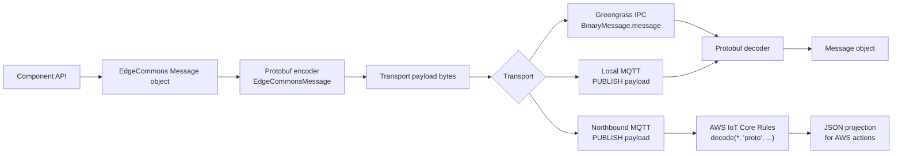
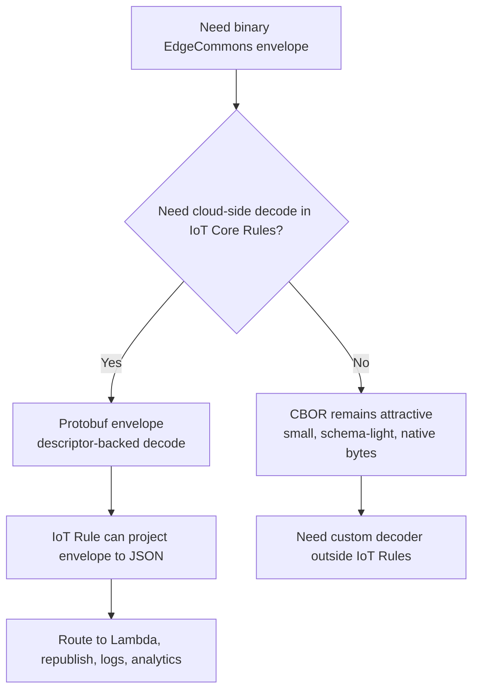
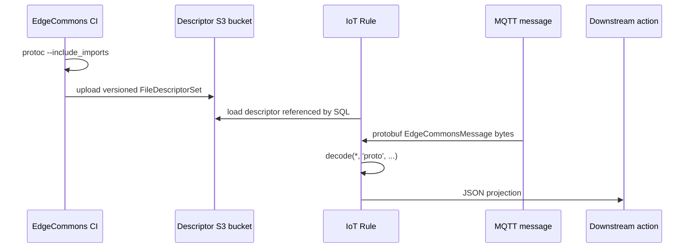
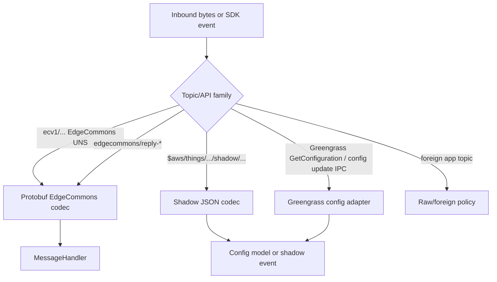
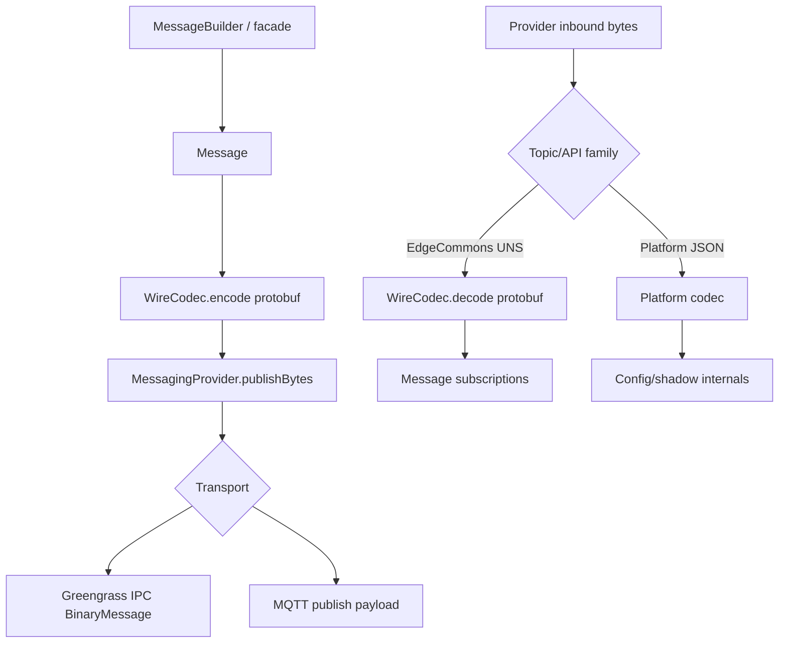
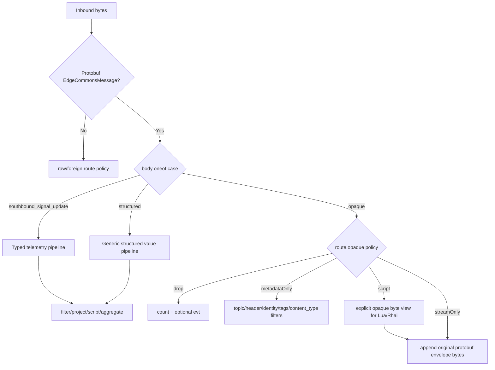
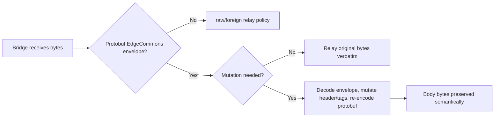
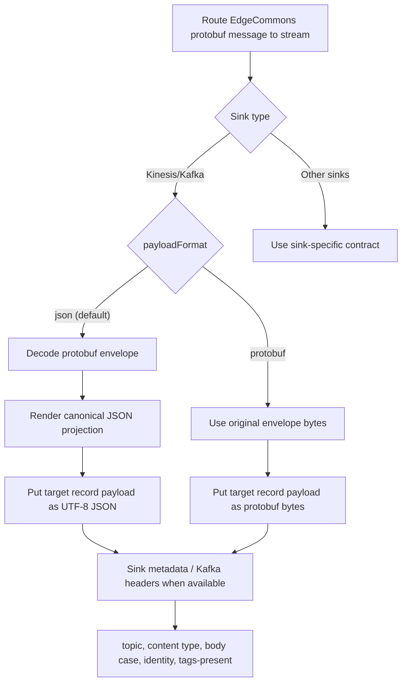
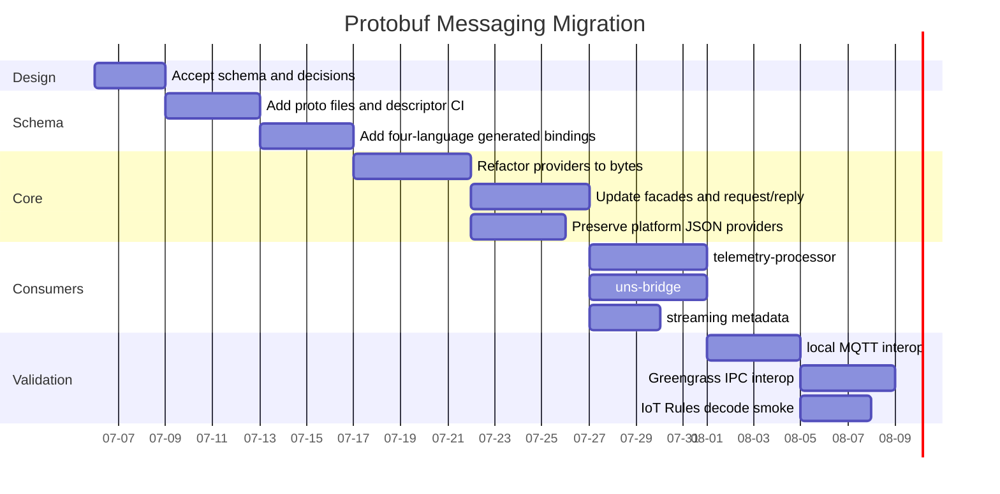
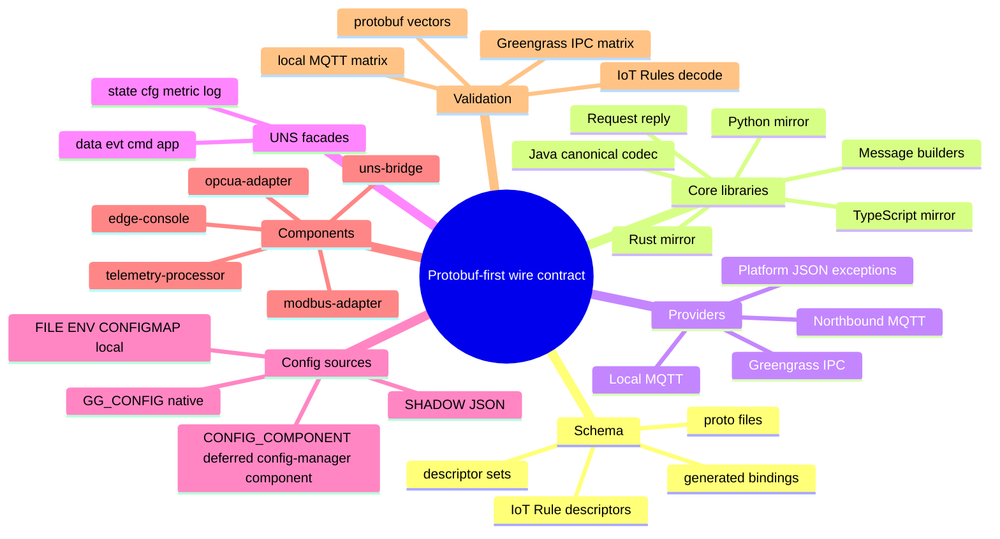

# EdgeCommons Protobuf Messaging - Design Proposal

> **Status:** PROPOSED. This document is a design alternative, not an
> implementation claim.
>
> This proposal is the protobuf counterpart to
> [`DESIGN-cbor-messaging.md`](DESIGN-cbor-messaging.md). It keeps the same
> core idea - all EdgeCommons messages are binary transport payloads with native
> byte support - but replaces CBOR with Protocol Buffers because AWS IoT Core
> Rules can decode protobuf payloads to JSON with the `decode(..., 'proto', ...)`
> SQL function.
>
> The important boundary: **EdgeCommons UNS/application messages use protobuf.**
> Native Greengrass and AWS platform control-plane messages that are specified as
> JSON or SDK-native data, such as deployment configuration and Device Shadow
> documents, remain JSON/native at that boundary and are adapted into the
> EdgeCommons config model.

This proposal is intentionally high blast radius. It touches the core wire
contract, all four language libraries, generated schema artifacts, request/reply,
UNS class facades, the reference components, `telemetry-processor`,
`uns-bridge`, streaming, diagnostics, local interop, and deployed Greengrass IPC
interop.

---

## Source Grounding

This proposal is grounded in three facts:

1. The current EdgeCommons message model is a JSON envelope named `Message` in
   Java, Python, Rust, and TypeScript. Its logical shape is already stable:
   `{header, identity?, tags?, body}`.
2. Greengrass local IPC and MQTT both carry payload bytes. The current JSON
   assumption lives in EdgeCommons serialization/classification, not in the
   transport substrate.
3. AWS IoT Core Rules support protobuf decoding with the SQL
   `decode(value, 'proto', bucket, descriptor, proto_file, message_type)`
   function. The official docs also impose design-relevant limits: descriptor
   files live in S3, decoded protobuf is emitted as JSON, substitution templates
   do not support protobuf decoding, a SQL expression can call protobuf decode
   at most twice, and inbound/outbound rule payloads are limited to 128 KiB.
   See [AWS IoT Core Rules protobuf decoding](https://docs.aws.amazon.com/iot/latest/developerguide/binary-payloads.html).

The important design difference from the CBOR proposal:

| Concern | CBOR proposal | Protobuf proposal |
|---|---|---|
| Binary wire encoding | Schema-light CBOR map | Schema-first protobuf message |
| Native bytes | CBOR `bstr` anywhere | `bytes` fields and a recursive `EcValue.bytes_value` |
| Cloud decode | No native IoT Core decode path | IoT Core Rules can decode with descriptor files |
| Schema ownership | CDDL plus semantic schemas | `.proto` files are the canonical schema |
| Body extensibility | Any CBOR value | Typed standard bodies, dynamic `EcValue`, or opaque `bytes` |
| Debuggability | CBOR diagnostic tooling | Protobuf descriptor-aware tooling and IoT Rules decode |
| Platform JSON messages | Explicit exception | Explicit exception |

---

## 0. Executive Summary

EdgeCommons should use one canonical protobuf envelope for framework-owned
messages:



The proposal keeps the "CBOR-like" semantics:

- the envelope is binary on the wire;
- structured telemetry can contain native byte values;
- opaque payloads are supported as `body.opaque`;
- Greengrass IPC and MQTT use the same EdgeCommons payload bytes;
- request/reply remains envelope-based;
- four-language test vectors pin exact bytes.

The design changes the implementation philosophy: protobuf is schema-first.
There is no true universal `any` that behaves exactly like CBOR across every
language and cloud service. To get both flexibility and cloud decode, the
protobuf contract uses three body lanes:

1. **standard typed bodies** for EdgeCommons-owned messages such as
   `SouthboundSignalUpdate`, state, config, metrics, events, and commands;
2. **dynamic structured bodies** via an `EcValue` tree for generic structured
   messages and config documents;
3. **opaque bodies** via `bytes` plus `content_type` for payloads such as JPEG,
   protobuf app data, compressed records, or command artifacts.

---

## 1. Requirements

### R1 - One EdgeCommons Wire Encoding

All framework-owned EdgeCommons UNS messages MUST be protobuf-encoded binary
payloads.

This applies to:

- Greengrass local IPC pub/sub for EdgeCommons topics;
- local MQTT pub/sub for EdgeCommons topics;
- northbound MQTT pub/sub for EdgeCommons topics;
- request/reply topics;
- library-owned UNS classes (`state`, `cfg`, `metric`, `log`);
- app-usable UNS classes (`data`, `evt`, `cmd`, `app`).

### R2 - Preserve The Logical Envelope

The logical message model remains:

```text
EdgeCommonsMessage
  header
  identity?
  tags?
  content_type?
  schema?
  body
```

The public concept of a message does not split into unrelated types. Protobuf is
the wire encoding of the same envelope.

`tags` is a first-class envelope field, not part of the body. It carries
bounded metadata such as provenance annotations, routing hints, business
classification, and bridge hop-protection markers. Codecs and bridges MUST
preserve it whenever they preserve the message envelope.

### R3 - Native Bytes In Structured Bodies

Structured messages MUST be able to contain byte arrays where the body schema
allows a data value. For generic structured bodies, the recursive `EcValue`
union includes `bytes_value`. For typed standard bodies, message definitions
use `bytes` fields where bytes are meaningful.

The motivating case remains:

```text
SouthboundSignalUpdate.samples[0].value = bytes 00 01 02 FE FF
```

There is no `_edgecommonsBinary` JSON marker and no base64 expansion on the
EdgeCommons wire.

### R4 - Opaque Payloads Without A Separate Frame

Opaque payloads MUST use the same envelope:

```text
header.name = "FramePreview"
content_type = "image/jpeg"
body.opaque = <jpeg bytes>
```

An opaque payload is still an EdgeCommons message. It has a header, optional
identity, optional tags, request/reply metadata, and normal UNS routing. Only the
body bytes are opaque to the framework.

### R5 - IoT Core Rule Decode

The protobuf envelope SHOULD be decodable by AWS IoT Core Rules with a published
descriptor file. That implies:

- stable package and message names;
- descriptor generation in CI;
- descriptor publication/versioning for deployments that use IoT Rules decode;
- awareness of the 128 KiB rule payload ceiling for routes that use AWS IoT
  Core Rules decode;
- a rule-friendly standard body model for common messages.

This does not mean every opaque payload becomes semantically transparent to IoT
Core. If `body.opaque` contains JPEG or an app-specific protobuf payload, IoT
Core can decode the EdgeCommons envelope and see metadata plus base64-projected
bytes, but not the opaque format unless a separate rule or action decodes it.

### R6 - Platform JSON Boundaries Stay Native

Native Greengrass and AWS control-plane messages that are JSON by contract MUST
remain JSON/native at the platform boundary:

- `GG_CONFIG`: Greengrass `GetConfiguration` and configuration-update IPC
  events are SDK/native configuration data, not EdgeCommons UNS messages.
  Greengrass `GetConfiguration` has an optional `componentName` parameter, so
  fetching configuration from another deployed component belongs in this native
  provider path.
- `SHADOW`: AWS IoT Device Shadow get/update/delta/accepted/rejected payloads
  are JSON documents on `$aws/things/.../shadow/...` topics and through shadow
  IPC APIs.
- `CONFIG_COMPONENT` / `COMPONENT_CONFIG`: this is reserved for the dedicated
  EdgeCommons configuration-management component, which has not yet been
  re-written/ported. It is not the Greengrass built-in cross-component
  configuration API. Leave it out of the protobuf migration for now; the config
  management component port should define its protobuf contract when that work
  resumes.

### R7 - Four-Language Parity

Java remains canonical. Python, Rust, and TypeScript MUST expose the same
observable behavior:

- same `.proto` schema;
- same generated or hand-wrapped public API shape;
- same canonical serialization for fixed test-vector inputs;
- same validation errors;
- same request/reply behavior;
- same interop behavior over local MQTT and Greengrass IPC.

---

## 2. Vocabulary

| Term | Meaning |
|---|---|
| **EdgeCommons protobuf envelope** | The top-level `edgecommons.v1.EdgeCommonsMessage` protobuf message carried on EdgeCommons UNS topics. |
| **Tags** | Optional top-level envelope metadata (`map<string, EcValue>`) preserved across codecs, bridges, streaming, and interop. Tags are not body content. |
| **Standard typed body** | A body message owned by EdgeCommons, such as `SouthboundSignalUpdate`, `StateUpdate`, `MetricUpdate`, or `ConfigUpdate`. |
| **Dynamic structured body** | A recursive `EcValue` tree used for JSON-like structured data and config documents. It includes native bytes. |
| **Opaque body** | A `bytes` body whose semantics are described by `content_type`, `schema`, topic, and `header.name`. |
| **Platform JSON message** | A native Greengrass or AWS payload that is JSON by platform contract, such as Device Shadow documents. |
| **Diagnostic JSON** | A human/cloud projection produced from protobuf. It is not the EdgeCommons wire format. |
| **Descriptor set** | The compiled protobuf schema artifact (`FileDescriptorSet`) used by IoT Core Rules and tooling. |

---

## 3. Canonical Protobuf Schema

### 3.1 Package And File Layout

Canonical schema should live under a single source directory:

```text
proto/edgecommons/v1/
  message.proto
  value.proto
  telemetry.proto
  state.proto
  config.proto
  metrics.proto
  command.proto
```

CI should generate language bindings and descriptor files from these inputs.
Generated code may be checked in only if the language ecosystem makes that the
least surprising developer experience; the `.proto` files remain canonical.

### 3.2 Envelope

```proto
syntax = "proto3";

package edgecommons.v1;

message EdgeCommonsMessage {
  Header header = 1;
  optional Identity identity = 2;
  map<string, EcValue> tags = 3;

  // Describes the body payload. For opaque bodies, absent means
  // application/octet-stream.
  string content_type = 4;
  string content_encoding = 5;
  BodySchema schema = 6;

  oneof body {
    SouthboundSignalUpdate southbound_signal_update = 20;
    StateUpdate state_update = 21;
    ConfigUpdate config_update = 22;
    MetricUpdate metric_update = 23;
    EventMessage event = 24;
    CommandMessage command = 25;
    EcValue structured = 30;
    bytes opaque = 31;
  }
}

message Header {
  string name = 1;
  string version = 2;
  uint64 timestamp_ms = 3;
  string uuid = 4;
  optional string correlation_id = 5;
  optional string reply_to = 6;
}

message Identity {
  repeated HierEntry hier = 1;
  string path = 2;
  string component = 3;
  string instance = 4;
}

message HierEntry {
  string level = 1;
  string value = 2;
}

message BodySchema {
  string name = 1;
  string version = 2;
  string content_type = 3;
  string descriptor_ref = 4;
  string hash = 5;
}
```

Design notes:

1. `header.timestamp_ms` is a breaking change from the current string timestamp.
   It is a `uint64` millisecond epoch timestamp.
2. `tags` deliberately remains in the envelope as a sibling of `header`,
   `identity`, and `body`. It MUST round-trip through every language binding,
   local MQTT, Greengrass IPC, northbound MQTT, bridges, and streaming sinks.
3. `tags` values use `EcValue` so existing metadata can carry strings,
   numbers, booleans, and small byte values without falling back to JSON marker
   conventions. Producers SHOULD keep tags small and MUST NOT use tags as a
   large binary payload channel.
4. `identity.hier` is the ordered enterprise hierarchy. `identity.path` is the
   `/`-joined hierarchy values for newly produced messages. `component` and
   `instance` identify the publishing component and are not part of
   `identity.path`. The device is the deepest hierarchy entry, not a separate
   wire field.
5. `content_type` describes the selected body. Opaque bodies default to
   `application/octet-stream`.
6. Standard body fields make IoT Core decoded JSON practical. A fully generic
   `EcValue` body is flexible, but its JSON projection is less pleasant for SQL
   rules.
7. App-specific protobuf payloads can use `body.opaque` with
   `content_type=application/x-protobuf` and `schema.descriptor_ref` in v1.
   Public message builders MUST expose setters for opaque `content_type` and
   optional `schema` metadata. Only registered first-party typed body extension
   fields are deferred.

### 3.3 Recursive Value Type

Protobuf does not have a CBOR-like `any` that includes native bytes and maps
cleanly across languages, so EdgeCommons owns a small recursive value type.

```proto
message EcValue {
  oneof kind {
    NullValue null_value = 1;
    bool bool_value = 2;
    int64 int_value = 3;
    uint64 uint_value = 4;
    double double_value = 5;
    string string_value = 6;
    bytes bytes_value = 7;
    EcList list_value = 8;
    EcMap map_value = 9;
  }
}

message EcList {
  repeated EcValue values = 1;
}

message EcMap {
  map<string, EcValue> fields = 1;
}

enum NullValue {
  NULL_VALUE_UNSPECIFIED = 0;
}
```

Rules:

1. `EcValue.bytes_value` is the structured-body equivalent of CBOR `bstr`.
2. Framework-owned schemas SHOULD prefer typed messages over generic `EcValue`
   when the body shape is known.
3. Config documents can be represented losslessly enough for the current JSON
   config schema with `EcMap`, `EcList`, scalar values, and `null_value`.
4. Producers MUST reject NaN and infinity in framework-owned schemas unless a
   later schema explicitly allows them.

### 3.4 Structured Telemetry Body

```proto
message SouthboundSignalUpdate {
  Signal signal = 1;
  repeated Sample samples = 2;
  map<string, EcValue> extra = 100;
}

message Signal {
  string id = 1;
  string name = 2;
  map<string, EcValue> extra = 100;
}

message Sample {
  EcValue value = 1;
  string quality = 2;
  EcValue quality_raw = 3;
  optional string source_ts = 4;
  optional uint64 source_ts_ms = 5;
  optional string server_ts = 6;
  optional uint64 server_ts_ms = 7;
  map<string, EcValue> extra = 100;
}
```

Sample timestamp semantics:

1. `header.timestamp_ms` is the EdgeCommons message publish/creation time.
2. `sample.source_ts` / `sample.source_ts_ms` is the original source timestamp
   for the reading. OPC UA maps this from the `DataValue` source timestamp.
   Modbus normally has no native device timestamp, so this field remains absent
   unless the device payload itself carries one.
3. `sample.server_ts` / `sample.server_ts_ms` is the protocol-server or adapter
   observation time. For OPC UA this maps from the `DataValue` server timestamp.
   For Modbus this is the poll/read time.
4. `source_ts` is never synthesized. `server_ts` may be defaulted by the facade
   when the publisher omits it.
5. If both string and millisecond forms are present, they MUST represent the
   same instant. The millisecond form is preferred for binary consumers; the
   string form preserves current diagnostic/reference readability.

Example in diagnostic form:

```text
EdgeCommonsMessage {
  header {
    name: "SouthboundSignalUpdate"
    version: "1.0"
    timestamp_ms: 1783360800000
    uuid: "018fe1dd-7dc7-7b0f-a80f-5d5d6d0f1155"
  }
  identity {
    hier { level: "site" value: "plant-a" }
    hier { level: "line" value: "line-2" }
    hier { level: "device" value: "gw-01" }
    path: "plant-a/line-2/gw-01"
    component: "camera"
    instance: "cam1"
  }
  tags {
    key: "retention"
    value { string_value: "short" }
  }
  tags {
    key: "priority"
    value { uint_value: 5 }
  }
  southbound_signal_update {
    signal { id: "camera-1/roi-17/thumbnail" }
    samples {
      value { bytes_value: "\000\001\002\376\377" }
      quality: "GOOD"
      source_ts: "2026-07-06T17:59:59.900Z"
      source_ts_ms: 1783360799900
      server_ts: "2026-07-06T18:00:00.000Z"
      server_ts_ms: 1783360800000
    }
  }
}
```

### 3.5 Opaque Body

```text
EdgeCommonsMessage {
  header {
    name: "FramePreview"
    version: "1.0"
    timestamp_ms: 1783360800000
    uuid: "018fe1dd-7dc7-7b0f-a80f-5d5d6d0f1156"
  }
  identity {
    hier { level: "site" value: "plant-a" }
    hier { level: "line" value: "line-2" }
    hier { level: "device" value: "gw-01" }
    path: "plant-a/line-2/gw-01"
    component: "camera"
    instance: "cam1"
  }
  tags {
    key: "capture_mode"
    value { string_value: "preview" }
  }
  content_type: "image/jpeg"
  opaque: "\377\330\377\340..."
}
```

Opaque body rules:

1. Public message builders in Java, Python, Rust, and TypeScript MUST expose an
   opaque-body path that allows the caller to set `content_type`.
2. `content_type` SHOULD be set by producers. App-specific protobuf payloads
   SHOULD use `application/x-protobuf` and SHOULD set `schema.descriptor_ref`
   when a descriptor is available.
3. If `content_type` is absent, consumers treat the body as
   `application/octet-stream`.
4. Opaque payload bytes are never logged.
5. Opaque payloads are still subject to message size limits and UNS class
   policy.

---

## 4. Why Protobuf Instead Of CBOR



Protobuf is a better fit if the northbound control/data plane should remain
inspectable and routable inside IoT Core Rules.

| Design pressure | CBOR | Protobuf |
|---|---|---|
| Native bytes | Excellent | Good |
| Arbitrary values | Excellent | Requires `EcValue` |
| Standard schema evolution | External CDDL conventions | Built in with field numbers and compatibility rules |
| IoT Core Rules decode | No native path | Supported with descriptor file |
| Strong generated APIs | Library-specific | Mature in all four languages |
| Human debugging | Needs CBOR tooling | Needs descriptor-aware tooling |
| Payload size | Compact | Compact, but wrappers can add overhead |
| Dynamic app payloads | Easy as any value | Use `opaque` or registered typed body |

The protobuf tax is schema discipline. You get IoT Core integration because the
payload has a schema. The design should lean into that rather than pretending
protobuf is just CBOR with a different encoder.

---

## 5. AWS IoT Core Rule Integration

### 5.1 Rule Decode Path

For northbound topics that land in AWS IoT Core, a rule can decode the
EdgeCommons envelope:

```sql
SELECT VALUE decode(
  *,
  'proto',
  'edgecommons-descriptors-bucket',
  'edgecommons/v1/edgecommons-1.0.0.desc',
  'edgecommons/v1/message.proto',
  'EdgeCommonsMessage'
) FROM 'ecv1/+/+/+/data/#'
```

Decoded output is JSON according to protobuf JSON mapping. For bytes, that JSON
projection is base64 text. That is fine for cloud actions, but it is not the
EdgeCommons wire format.

The EdgeCommons schema package is still `edgecommons.v1`; the AWS IoT Rules
`decode` function accepts the short message type name here.

### 5.2 Descriptor Lifecycle



Rules:

1. Descriptor object keys are versioned and immutable.
2. Rules reference a specific descriptor object key.
3. Updating a descriptor uses a new object key and a rule update, because AWS
   docs warn that descriptor updates can take time to reflect.
4. The descriptor set must include imports and remain under the documented size
   limit.

### 5.3 Rule Limits And Design Consequences

| AWS IoT Core Rules behavior | Design consequence |
|---|---|
| Protobuf decode requires descriptor files in S3 | CI must publish descriptor artifacts. |
| Payloads through the rule are limited to 128 KiB inbound/outbound | Only AWS IoT Core Rules decode routes must stay below 128 KiB. Other northbound brokers use their own broker profile and payload limits. |
| Protobuf decode is not available in substitution templates | Do not rely on decoded protobuf fields in substitution-template-only paths. |
| A SQL expression can call protobuf decode at most twice | Decode the EdgeCommons envelope once; avoid nested app-protobuf decode in the same SQL path. |
| Decoded result is JSON | Bytes appear as base64 in the rule output projection. |

For messages larger than the AWS IoT Core Rules decode path supports, choose a
different route: stream/file replication, an opaque object reference, or a
northbound broker profile that explicitly supports the required payload size and
protobuf decode behavior.

---

## 6. UNS Integration

Protobuf does not change the UNS topic grammar:

```text
ecv1 / {device} / {component} / {instance} / {class} [ / {channel...} ]
```

It changes the payload contract for EdgeCommons-owned topics under that grammar.

### 6.1 Class Matrix

| UNS class | Protobuf structured body | Protobuf opaque body | Notes |
|---|---:|---:|---|
| `state` | yes | no | Framework status remains typed and inspectable after decode. |
| `cfg` | yes | no | Effective config and config events remain structured. |
| `metric` | yes | no | Metrics remain typed for sinks and rules. |
| `log` | yes | no for v1 | Log-tail publisher can revisit opaque chunks later. |
| `data` | yes | yes | Main class for telemetry values and opaque data-plane payloads. |
| `evt` | yes | no for v1 | Events stay structured for severity/type/context inspection. |
| `cmd` | yes | yes | Binary command artifacts and binary replies are allowed. |
| `app` | yes | yes | Application-specific payloads. |

Reserved classes are not JSON. They are protobuf structured only.

### 6.2 Topic And Envelope Consistency

The topic remains routing-authoritative. The envelope remains provenance and
message metadata.

For a publish on:

```text
ecv1/gw-01/camera/cam1/data/roi-thumbnail
```

the stamped identity SHOULD agree:

```text
identity.path           == "plant-a/line-2/gw-01"
identity.hier[-1].level == "device"
identity.hier[-1].value == "gw-01"
identity.component      == "camera"
identity.instance       == "cam1"
```

The topic carries the device token used for routing. The envelope identity can
carry the wider enterprise hierarchy as provenance. Consumers SHOULD route by
topic and treat envelope identity as provenance.

### 6.3 Consumer Decode Signals

Consumers still need stable signals for interpreting a decoded message:

| Signal | Structured telemetry | Opaque binary payload | Recommendation |
|---|---|---|---|
| `header.name` | `SouthboundSignalUpdate`, `Telemetry` | `FramePreview`, `BinaryData`, `ProtobufEvent` | Strong signal |
| Protobuf `oneof body` case | `southbound_signal_update`, `structured` | `opaque` | Strongest runtime signal |
| `content_type` | Usually absent or generic | `image/jpeg`, `application/x-protobuf` | Very useful |
| `tags` | Provenance, routing hints, bridge markers | Provenance, routing hints, bridge markers | Useful secondary metadata; not the body decoder |
| Topic | `data/...` | `data/roi-thumbnail`, `app/protobuf/...` | Good convention |
| Presence of samples / TQV fields | Yes | No | Secondary runtime check |

Decode order:

1. Decode `edgecommons.v1.EdgeCommonsMessage`.
2. Validate `header`.
3. Use UNS class for coarse routing.
4. Use protobuf `oneof body` case.
5. Use `header.name` and `header.version`.
6. Use `content_type` for opaque bodies.
7. Use `tags` only as secondary envelope metadata or hop-protection state.

---

## 7. Platform JSON Boundary

The biggest correctness trap is confusing "EdgeCommons messages" with every
message a Greengrass component ever handles. Protobuf is the EdgeCommons UNS
wire contract. It is not a replacement for AWS-owned JSON protocols.



### 7.1 GG_CONFIG

`GG_CONFIG` uses Greengrass deployment configuration APIs:

- `GetConfiguration`;
- configuration update subscriptions/events;
- SDK/native configuration maps.

Rules:

1. Do not encode Greengrass deployment config requests or responses as
   EdgeCommons protobuf messages.
2. The config provider reads platform-native data and converts it into the
   internal EdgeCommons config model.
3. If the effective config is later published on an EdgeCommons `cfg` topic,
   that publish uses protobuf because it is now an EdgeCommons message.
4. Tests must prove that protobuf message migration does not break
   `GG_CONFIG` startup or hot reload.

### 7.2 SHADOW

`SHADOW` uses AWS IoT Device Shadow documents. Shadow payloads are JSON:

- `GetThingShadow` response payloads;
- `UpdateThingShadow` request payloads;
- `$aws/things/{thing}/shadow/name/{shadow}/update/delta`;
- accepted/rejected responses.

Rules:

1. Shadow config provider reads and writes JSON shadow documents exactly as the
   AWS service expects.
2. Shadow delta subscriptions are not delivered to normal EdgeCommons
   `MessageHandler` subscriptions.
3. The provider extracts `state.desired.ComponentConfig` or the agreed config
   field and converts it to the internal config model.
4. Reported-state writes remain JSON.
5. If a shadow-derived config change causes an EdgeCommons `cfg` message, that
   `cfg` message is protobuf.

### 7.3 Cross-Component Greengrass Config And CONFIG_COMPONENT

There are two mechanisms that are easy to conflate:

1. **Greengrass-native cross-component config fetch.** The built-in
   `GetConfiguration` IPC operation accepts an optional component name. This is
   the right mechanism for "fetch configuration from a different deployed
   component." It is platform-native and stays outside the EdgeCommons protobuf
   wire contract.
2. **EdgeCommons `CONFIG_COMPONENT` source.** This name is reserved for the
   dedicated EdgeCommons configuration-management component. The current repo
   still contains the client-side custom config-manager rendezvous over
   EdgeCommons UNS command topics:
   `ecv1/{device}/config/main/cmd/get-configuration` for bootstrap fetch and
   `ecv1/{device}/{component}/main/cmd/set-config` for push. The server-side
   configuration-management component has not yet been re-written/ported.

Recommended protobuf-design direction:

1. Prefer the Greengrass-native `GG_CONFIG [componentName] [keyPath]` mechanism
   for cross-component deployed configuration.
2. Leave `CONFIG_COMPONENT` unchanged in this protobuf messaging proposal.
3. Do not silently fold `CONFIG_COMPONENT` into `GG_CONFIG`; they solve
   different problems.
4. When the dedicated configuration-management component is ported, define its
   protobuf command/reply contract explicitly and validate it as part of that
   component's design.
5. In all cases, the configuration document remains governed by the canonical
   JSON schema. The transport may represent it as native Greengrass config data,
   shadow JSON, local JSON, or protobuf `EcValue` only when it is deliberately
   carried inside an EdgeCommons message.

### 7.4 FILE, ENV, CONFIGMAP

These are local config sources, not bus protocols:

- `FILE` remains JSON file parsing.
- `ENV` remains environment-sourced JSON/config parsing.
- `CONFIGMAP` remains Kubernetes mounted-file JSON/config parsing.

They are unaffected except that any subsequent EdgeCommons config messages use
protobuf.

---

## 8. Core Implementation Design

### 8.1 WireCodec

Add a protobuf codec in all four languages:

```text
WireCodec
  encode(Message) -> bytes
  decode(bytes) -> InboundMessage
  toDiagnosticJson(Message) -> string
  fromDiagnosticJson(...) -> Message       ; tests/tools only
```

`InboundMessage` should distinguish:

```text
InboundMessage =
  EdgeCommons(topic, Message)
  Raw(topic, bytes)
  Malformed(topic, bytes, reason)
  PlatformJson(topic, JsonValue)           ; internal platform handlers only
```

Normal app subscriptions receive only `EdgeCommons` messages. Config providers
and platform adapters own `PlatformJson`.

### 8.2 Provider Boundary

Providers should be byte-oriented. The service layer owns protobuf encode/decode.



Required boundary changes:

- provider publish paths accept bytes, not JSON strings;
- provider subscribe paths deliver bytes to the service layer;
- JSON parsing is removed from EdgeCommons UNS subscription handlers;
- platform JSON parsing remains in config/shadow providers;
- request/reply correlation is applied to decoded protobuf messages.

### 8.3 Message Model Changes

Replace wire-authoritative JSON methods:

```text
Message.toString()
Message.dumps()
Message.toJSON()
```

with:

```text
Message.toBytes()             -> protobuf wire bytes
Message.fromBytes(...)        -> decoded Message
Message.toDiagnosticJson()    -> descriptor-aware diagnostic JSON
Message.fromDiagnosticJson()  -> tests/tools only
```

Deprecated current helpers:

| Current helper | Protobuf replacement |
|---|---|
| `_edgecommonsBinary` marker | `bytes_value` or `body.opaque` |
| `MAX_BINARY_BODY_BYTES` | `MAX_OPAQUE_BODY_BYTES` and per-schema nested-byte limits |
| `isBinaryBody()` | `isOpaqueBody()` |
| `getBinaryBody()` | `getOpaqueBody()` |
| Invalid JSON becomes raw string | Raw/malformed classification with original bytes |

### 8.4 Request/Reply

Request/reply remains envelope-based:

```proto
message Header {
  string name = 1;
  string version = 2;
  uint64 timestamp_ms = 3;
  string uuid = 4;
  optional string correlation_id = 5;
  optional string reply_to = 6;
}
```

Rules:

1. `request()` stamps `correlation_id` and `reply_to` before protobuf encoding.
2. `reply()` copies the request `correlation_id`.
3. Replies may be standard typed, dynamic structured, or opaque.
4. A reply topic carries an `EdgeCommonsMessage`, never a naked protobuf app
   payload.
5. Timeout cleanup semantics remain unchanged.

### 8.5 Schema Evolution Rules

Protobuf compatibility rules become part of the public contract:

1. Never reuse field numbers.
2. Reserve removed field numbers and names.
3. Add optional fields for additive changes.
4. Keep `header.name` and `header.version` as business schema signals even when
   protobuf field numbers evolve.
5. A field-number incompatible change requires a new protobuf package or message
   major, not just a `header.version` bump.
6. Standard body messages need explicit compatibility notes before release.

### 8.6 Limits

Suggested defaults:

| Limit | Default | Applies to |
|---|---:|---|
| `MAX_MESSAGE_BYTES` | deployment/config dependent | Entire encoded protobuf payload before publish. |
| `MAX_NORTHBOUND_BROKER_MESSAGE_BYTES` | broker-profile dependent | Entire encoded protobuf payload before publish to the configured northbound broker. |
| `MAX_IOT_CORE_RULE_DECODE_MESSAGE_BYTES` | 128 KiB | Messages routed specifically to AWS IoT Core Rules protobuf decode. |
| `MAX_NESTED_BYTES_VALUE_BYTES` | 64 KiB | `EcValue.bytes_value` inside structured bodies. |
| `MAX_OPAQUE_BODY_BYTES` | 1 MiB | `body.opaque` messages on local/IPC. |
| `MAX_TAGS_BYTES` | 16 KiB | Encoded `tags` map. |

The AWS IoT Core rule-decode limit is not the northbound limit. Local IPC/MQTT
and other northbound brokers may support larger payloads. Broker profiles must
state their effective maximum payload and decode capability; the 128 KiB limit
applies only to messages intentionally routed through AWS IoT Core Rules
protobuf decode.

---

## 9. Public API Sketches

The public API can look almost identical to the CBOR proposal. The difference is
generated protobuf-backed internals.

### 9.1 Java

```java
byte[] thumbnail = readThumbnail();

gg.instance("cam1")
  .data()
  .signal("camera-1/thumbnail")
  .addSample(thumbnail)
  .publish();

Message frame = MessageBuilder.create("FramePreview", "1.0")
  .withConfig(config)
  .withInstance("cam1")
  .withContentType("image/jpeg")
  .withOpaqueBody(thumbnail)
  .build();

messaging.publish(
  gg.instance("cam1").uns().topic(UnsClass.DATA, "roi-thumbnail"),
  frame);
```

### 9.2 Python

```python
thumbnail = read_thumbnail()

gg.instance("cam1").data().signal("camera-1/thumbnail") \
    .add_sample(thumbnail) \
    .publish()

frame = MessageBuilder.create("FramePreview", "1.0") \
    .with_config(config) \
    .with_instance("cam1") \
    .with_content_type("image/jpeg") \
    .with_opaque_body(thumbnail) \
    .build()

messaging.publish(
    gg.instance("cam1").uns().topic(UnsClass.DATA, "roi-thumbnail"),
    frame)
```

### 9.3 Rust

```rust
let thumbnail: Vec<u8> = read_thumbnail();

gg.instance("cam1")?
    .data()
    .signal("camera-1/thumbnail")?
    .add_sample(thumbnail.clone())
    .publish()
    .await?;

let frame = MessageBuilder::new("FramePreview", "1.0")
    .from_config(&config)
    .instance("cam1")
    .content_type("image/jpeg")
    .opaque_body(thumbnail)
    .build()?;

messaging
    .publish(
        &gg.instance("cam1")?.uns().topic(UnsClass::Data, "roi-thumbnail")?,
        &frame,
    )
    .await?;
```

### 9.4 TypeScript

```typescript
const thumbnail = await readThumbnail();

await gg.instance("cam1")
  .data()
  .signal("camera-1/thumbnail")
  .addSample(thumbnail)
  .publish();

const frame = MessageBuilder.create("FramePreview", "1.0")
  .withConfig(config)
  .withInstance("cam1")
  .withContentType("image/jpeg")
  .withOpaqueBody(thumbnail)
  .build();

await messaging.publish(
  gg.instance("cam1").uns().topic(UnsClass.Data, "roi-thumbnail"),
  frame,
);
```

---

## 10. Consumer Integration

### 10.1 Telemetry Processor

The processor should decode protobuf envelopes first, then branch by body case.



Structured body changes:

1. Internal value model must support `bytes`.
2. Scripts need helpers:
   - `isBytes(path)`;
   - `byteLength(path)`;
   - `byteSha256(path)`;
   - `byteBase64(path)` when explicitly requested.
3. Aggregation MUST reject byte-valued sample fields unless a reducer supports
   them.
4. Project/script stages preserve byte values unless scripts replace them.

Opaque route config:

```jsonc
{
  "routes": [
    {
      "id": "binary-previews",
      "subscribe": "ecv1/+/camera/+/data/roi-thumbnail",
      "opaque": {
        "policy": "script",
        "allowContentTypes": ["image/jpeg", "application/octet-stream"],
        "maxBodyBytes": 65536,
        "scriptBodyAccess": true
      },
      "filter": {
        "script": {
          "engine": "lua",
          "inline": "return topic:match('/roi%-thumbnail$') and opaque.len < 65536"
        }
      },
      "publish": { "target": "stream:vision" }
    }
  ]
}
```

Opaque behavior:

- `metadataOnly`: match topic, header fields, identity, tags, content type,
  body length, and body hash; forward the original protobuf envelope bytes.
- `script`: expose an explicit read-only opaque view to Lua/Rhai, such as
  `opaque.len`, `opaque.sha256`, `opaque.contentType`, and bounded byte access.
  A script may parse an app-specific structure when the route has opted in based
  on topic/content type/schema. The default script view MUST NOT log or stringify
  raw body bytes.
- `streamOnly`: append original protobuf envelope bytes to a stream with
  metadata headers.
- Structured telemetry stages that assume `samples[]`, such as sample-value
  projection or aggregation, are skipped for opaque bodies unless an earlier
  explicit decode/script stage emits a structured body.
- An opaque body sent to a structured-only route is dropped with a counted
  warning and an optional `evt`.

### 10.2 uns-bridge

The bridge becomes protobuf-envelope-aware.



Required behavior:

1. Protobuf messages with no mutation relay byte-verbatim.
2. Downlink request/reply paths decode to rewrite `reply_to`, copy correlation
   metadata, and update hop tags.
3. Hop protection uses `tags._relay`.
4. Opaque body bytes are never decoded or logged.
5. When header/tags change, the bridge re-encodes the protobuf envelope. If the
   original body was opaque, the body bytes must remain byte-identical.
6. Raw/foreign payloads relay only on routes that explicitly allow them.

### 10.3 Streaming

Streaming export is a sink-level projection decision. Components and internal
routes still produce EdgeCommons protobuf envelopes; Kinesis and Kafka sinks
choose what payload format they put to the target.

Kinesis and Kafka sinks MUST support:

| `payloadFormat` | Meaning |
|---|---|
| `json` | Default. Decode the EdgeCommons protobuf envelope and write a canonical JSON projection as the target record payload. |
| `protobuf` | Write the original EdgeCommons protobuf envelope bytes as the target record payload. |

`payloadFormat` is valid on `kinesis` and `kafka` sinks. If omitted, the value
is `json`. This default keeps existing analytics, archival, and stream consumers
working without requiring every Kinesis/Kafka consumer to load EdgeCommons
protobuf descriptors. Protobuf mode is explicit for consumers and brokers that
can decode or preserve protobuf natively.

The conversion belongs in the sink implementation, not in producers. A producer
publishes one protobuf `EdgeCommonsMessage`; each configured stream sink decides
whether to export JSON or protobuf.

Example:

```json
{
  "streaming": {
    "streams": [
      {
        "name": "telemetry-json",
        "sink": {
          "type": "kinesis",
          "streamName": "edge-telemetry",
          "region": "us-east-1",
          "payloadFormat": "json"
        }
      },
      {
        "name": "telemetry-protobuf",
        "sink": {
          "type": "kafka",
          "bootstrapServers": "broker-1:9092",
          "topic": "edge.telemetry.protobuf",
          "payloadFormat": "protobuf"
        }
      }
    ]
  }
}
```

If `payloadFormat` is omitted from either sink, the sink behaves as if
`"payloadFormat": "json"` was configured.



Canonical JSON projection rules:

1. Preserve the EdgeCommons envelope shape: `header`, `identity`, `tags`, and
   `body`. The projection also includes `content_type`, `content_encoding`,
   `schema`, and `body_case` when present or inferable.
2. Use protobuf field names (`timestamp_ms`, `body_case`, `source_ts_ms`) rather
   than language-specific casing.
3. Put only the selected payload in `body`: typed bodies render as JSON objects,
   `structured` bodies render as deterministic `EcValue` JSON, and `opaque`
   bodies render as base64 strings.
4. Render all protobuf `bytes` fields as base64 strings, including
   `EcValue.bytes_value` and opaque `body`.
5. Do not log raw opaque bytes during conversion; diagnostics may include byte
   length and hash.
6. Treat conversion failures as sink failures so the stream engine can retry or
   dead-letter according to the stream policy.

Recommended stream metadata, and Kafka headers where the target supports native
record headers:

| Header | Meaning |
|---|---|
| `edgecommons.wireKind` | `edgecommons-protobuf-v1` |
| `edgecommons.sink.payloadFormat` | `json` or `protobuf` |
| `edgecommons.originalWireKind` | `edgecommons-protobuf-v1` when the exported payload is a JSON projection |
| `edgecommons.topic` | UNS topic the record came from |
| `edgecommons.header.name` | Message header name |
| `edgecommons.header.version` | Message header version |
| `edgecommons.bodyCase` | Protobuf `oneof body` case |
| `edgecommons.identity.path` | Identity path if present |
| `edgecommons.identity.component` | Component token if present |
| `edgecommons.identity.instance` | Instance token if present |
| `edgecommons.tags.present` | `true` when the envelope has tags. Sink-specific routes may project selected tag keys into additional headers. |
| `content-type` | Body content type when present or inferred |

Kafka SHOULD emit the metadata as Kafka record headers. Kinesis has no native
per-record headers; in JSON mode the projection carries this metadata in the
payload, and in protobuf mode the protobuf envelope itself is the metadata
carrier. Kinesis protobuf mode therefore requires downstream consumers to decode
the EdgeCommons envelope.

### 10.4 Reference Components

Reference component impacts:

- `opcua-adapter`: OPC UA `ByteString` maps to `EcValue.bytes_value` in
  telemetry samples.
- `modbus-adapter`: register blocks or raw diagnostic bytes can publish as
  byte-valued samples when configured.
- `telemetry-processor`: decodes protobuf envelopes and preserves bytes.
- `uns-bridge`: relays or mutates protobuf envelopes.
- `edge-console`: needs protobuf descriptor-aware decode support.
- `file-replicator`: remains the answer for large artifacts; protobuf messaging
  is not a file-transfer replacement.

---

## 11. Migration And Compatibility

This is a breaking wire-contract change. Treat it as a pre-1.0 hard cut unless
the project explicitly chooses a bridge period.



Migration phases:

1. **Phase 0 - Decision and schema**
   - Accept or reject the protobuf-first pivot.
   - Finalize `.proto` ownership, package names, and compatibility rules.
   - Add descriptor-generation CI.

2. **Phase 1 - Core codecs**
   - Add Java canonical protobuf encode/decode.
   - Mirror Python, Rust, and TypeScript.
   - Add diagnostic JSON tooling.

3. **Phase 2 - Provider byte boundary**
   - Refactor EdgeCommons provider paths to publish/subscribe bytes.
   - Remove JSON parsing from EdgeCommons UNS handlers.
   - Preserve JSON/native handling inside Greengrass config and shadow providers.

4. **Phase 3 - Facades and subsystem publishers**
   - Update `data()`, `events()`, `app()`, and `commands()`.
   - Update `state`, `cfg`, `metric`, and `log` publishers.
   - Leave `CONFIG_COMPONENT` out of scope until the dedicated
     configuration-management component is re-written/ported.

5. **Phase 4 - Consumers**
   - Update `telemetry-processor`, `uns-bridge`, streaming, edge-console, and
     reference adapters.

6. **Phase 5 - Validation**
   - Run local MQTT interop.
   - Run deployed Greengrass IPC interop on `lab-5950x`.
   - Run an AWS IoT Core Rules protobuf-decode smoke for a northbound message
     that stays within documented rule limits.

### Compatibility Bridge Option

Acceptable transition tools:

- `edgecommons proto-decode` CLI command;
- protobuf-to-diagnostic-JSON bridge on a separate topic root;
- edge-console descriptor-aware decode;
- migration docs for external MQTT consumers;
- explicit JSON compatibility component for a time-boxed period.

Avoid:

- publishing every message twice by default;
- silently accepting JSON and protobuf indefinitely in normal subscriptions;
- calling diagnostic JSON the wire format;
- shipping only one language with protobuf while the others remain JSON.

---

## 12. Blast Radius



Concrete affected areas:

| Area | Required change |
|---|---|
| Message model | Add protobuf serialization and generated schema wrappers. |
| Header | Change timestamp wire type to `uint64 timestamp_ms` if accepted. |
| Providers | Move EdgeCommons JSON encode/decode out; publish/subscribe bytes. |
| Platform config | Preserve native JSON/SDK handling for `GG_CONFIG` and `SHADOW`. |
| CONFIG_COMPONENT | Leave unchanged for now; its protobuf contract belongs with the future dedicated configuration-management component port. |
| Request/reply | Encode requests and replies as protobuf envelopes. |
| Message builders | Add v1 opaque-body builder APIs with `content_type` and optional `schema` metadata setters. |
| Data facade | Byte sample values become `EcValue.bytes_value`. |
| Metrics/state/cfg | Become typed protobuf bodies. |
| Interop harness | Replace JSON assertions with protobuf decode and exact byte assertions. |
| Streaming sinks | Add Kinesis/Kafka `payloadFormat` with `json` default and `protobuf` opt-in. JSON mode converts protobuf envelopes in the sink before export. |
| Docs website | Stop describing JSON as the EdgeCommons wire format. |
| AWS deployment | Publish descriptor sets for IoT Rules decode. |
| Data timestamps | Preserve `source_ts`/`server_ts` sample semantics and their millisecond forms. |

---

## 13. Validation Plan

### 13.1 Unit Tests

All four languages:

- encode/decode canonical envelope;
- reject malformed protobuf payloads;
- reject missing required logical fields, even when proto3 supplies defaults;
- preserve `tags`, including scalar `EcValue` values and bridge hop markers;
- preserve nested `bytes_value` in structured bodies;
- preserve `source_ts`/`source_ts_ms` and `server_ts`/`server_ts_ms` semantics;
- preserve opaque `content_type` and `schema` metadata;
- preserve opaque body bytes exactly;
- preserve request/reply correlation and reply topic;
- enforce size limits;
- render diagnostic JSON without logging raw body bytes;
- default Kinesis/Kafka stream sinks to JSON payload export;
- convert protobuf envelopes to canonical JSON for Kinesis/Kafka JSON mode;
- preserve original protobuf envelope bytes for Kinesis/Kafka protobuf mode;
- keep `GG_CONFIG`, including cross-component `componentName` reads, and
  `SHADOW` JSON/native flows working.

### 13.2 Test Vectors

Add:

```text
protobuf-test-vectors/
  edgecommons/v1/*.proto
  edgecommons-v1.desc
  messages.json
  messages.pb.hex
  failures.json
```

Vector contents:

- structured telemetry with numeric sample;
- structured telemetry with nested byte-valued sample;
- structured telemetry with distinct message, source, and server timestamps;
- opaque JPEG-like body with `content_type`;
- envelope with `tags`, including a `_relay` hop-protection tag;
- Kinesis/Kafka JSON projection for a protobuf envelope, including base64
  nested bytes and opaque bytes;
- Kinesis/Kafka protobuf payload preserving the original envelope bytes;
- command request with `reply_to`;
- command reply with copied `correlation_id`;
- reserved-class `state` message;
- malformed cases for each required validation error.

### 13.3 Local MQTT Interop

Extend `test-infra/interop`:

| Test | Producers | Consumers | Assertion |
|---|---|---|---|
| structured protobuf telemetry | Java/Python/Rust/TS | Java/Python/Rust/TS | typed body, header fields, tags, and sample timestamps decode identically |
| nested byte sample | Java/Python/Rust/TS | Java/Python/Rust/TS | sample bytes exact |
| opaque body publish | Java/Python/Rust/TS | Java/Python/Rust/TS | content type, header, and body bytes exact |
| tagged envelope round-trip | Java/Python/Rust/TS | Java/Python/Rust/TS | scalar tags and `_relay` hop tags are preserved or updated as specified |
| Greengrass cross-component config | Java/Python/Rust/TS | Nucleus IPC | `GG_CONFIG [componentName]` fetches the expected config without protobuf decoding |
| opaque request/reply | Java/Python/Rust/TS | Java/Python/Rust/TS | correlation/reply metadata and body bytes exact |
| raw/foreign policy | any | any | raw bytes are not delivered as EdgeCommons messages |

### 13.4 Greengrass IPC Interop

Required before completion:

- deploy four language skeletons to `lab-5950x`;
- each language publishes structured protobuf telemetry over IPC;
- each language publishes nested byte-valued samples over IPC;
- each language publishes opaque body messages over IPC;
- each language consumes from every other language;
- request/reply with opaque and structured bodies is asserted;
- `GG_CONFIG` startup, hot reload, and cross-component `componentName` reads
  still work;
- `SHADOW` config source still handles JSON shadow documents;
- `CONFIG_COMPONENT` is left unchanged unless the dedicated configuration
  management component is included in the scope of the migration.

### 13.5 AWS IoT Core Rule Decode Smoke

Run at least one northbound validation where:

1. CI-generated `edgecommons-v1.desc` is uploaded to S3.
2. An IoT Rule decodes `edgecommons.v1.EdgeCommonsMessage`.
3. A protobuf telemetry message is published northbound.
4. The decoded JSON projection reaches a downstream action.
5. The test asserts decoded header, identity, tags, topic, sample value, and
   source/server sample timestamps.
6. A byte-valued sample is verified as base64 in the JSON projection.

This validates the reason to choose protobuf over CBOR.

### 13.6 Consumer Regression

`telemetry-processor`:

- typed telemetry pass-through;
- byte-valued sample pass-through;
- byte length/hash filtering;
- aggregation rejects byte-valued samples by default;
- opaque metadata filters, byte length/hash predicates, explicit Lua/Rhai
  opaque-script filters, and stream-only behavior.

`uns-bridge`:

- protobuf envelope relays byte-verbatim when no mutation is needed;
- request/reply rewrite preserves opaque body bytes;
- hop tags are added in protobuf `tags`;
- malformed protobuf is counted;
- raw/foreign payload relay requires explicit policy.

Streaming:

- Kinesis/Kafka sinks default `payloadFormat` to `json`;
- Kinesis/Kafka JSON mode converts protobuf envelopes to the canonical JSON
  projection before putting records to the target;
- Kinesis/Kafka protobuf mode appends the original protobuf envelope bytes
  unchanged;
- opaque protobuf envelopes become JSON with base64 opaque bytes in JSON mode
  and unchanged protobuf envelope bytes in protobuf mode;
- Kafka metadata headers include `edgecommons.wireKind`,
  `edgecommons.sink.payloadFormat`, `bodyCase`, topic, content type, header
  name/version, identity fields, and tag presence where available;
- Kinesis JSON mode carries equivalent metadata in the JSON payload because
  Kinesis records do not have native headers.

Config sources:

- `GG_CONFIG` reads native deployment configuration;
- `SHADOW` reads/writes JSON shadow documents;
- cross-component Greengrass config fetch uses native `GG_CONFIG
  [componentName]`; `CONFIG_COMPONENT` remains deferred for the future dedicated
  configuration-management component port;
- `FILE`, `ENV`, and `CONFIGMAP` remain local JSON/config parsers.

---

## 14. Open Decisions

| ID | Decision | Recommendation |
|---|---|---|
| P-M1 | Replace JSON wire format entirely or support a bridge period? | Replace for EdgeCommons UNS messages; use explicit bridges/tools for transition. |
| P-M2 | Top-level message package | Use `edgecommons.v1` and reserve package-major bumps for field-number incompatible changes. |
| P-M3 | Body model | Use typed standard bodies plus `EcValue structured` plus `bytes opaque`. |
| P-M4 | Header timestamp | Use `uint64 timestamp_ms`. |
| P-M5 | `content_type` placement | Top-level optional field describing the selected body; default opaque to `application/octet-stream`. |
| P-M6 | App-specific protobuf bodies | Support them in v1 as `body.opaque` with builder-settable `content_type` and optional `schema.descriptor_ref`; defer only registered first-party typed body extension fields. |
| P-M7 | Platform JSON handling | Keep `GG_CONFIG` and `SHADOW` native JSON/SDK; only EdgeCommons UNS messages become protobuf. |
| P-M8 | CONFIG_COMPONENT future | Leave it unchanged for now; define its protobuf command/reply contract when the dedicated configuration-management component is re-written/ported. |
| P-M9 | Descriptor publication | Generate descriptor set in CI and publish immutable versioned S3 keys for IoT Rules users. |
| P-M10 | Protobuf implementation libraries | Decide per language during implementation after API verification; vectors define behavior. |
| P-M11 | Diagnostic JSON | Provide tooling, but document it as projection/debug output, not wire. |
| P-M12 | IoT Core Rule decode size limit | Treat 128 KiB as the maximum only for messages routed through AWS IoT Core Rules protobuf decode. Other northbound broker profiles, such as EMQX, use their own payload limits and decode capabilities. |
| P-M13 | Kinesis/Kafka sink payload format | Add sink-level `payloadFormat`; default to `json` with sink-side protobuf-to-JSON conversion, and use `protobuf` only when the downstream path can consume EdgeCommons protobuf envelopes. |

---

## 15. Success Criteria

The design is implemented only when all of these are true:

1. Every EdgeCommons framework-owned UNS message on local MQTT, northbound MQTT,
   and Greengrass IPC is a protobuf-encoded `EdgeCommonsMessage`.
2. A telemetry sample can carry native byte data without changing the
   `SouthboundSignalUpdate` meaning.
3. A telemetry sample can carry source and server timestamps distinctly:
   message publish time in `header.timestamp_ms`, source/device reading time in
   `sample.source_ts_ms`, and protocol-server/adapter observation time in
   `sample.server_ts_ms`.
4. An opaque payload can be sent as `body.opaque` with `content_type` and normal
   EdgeCommons header/request/reply metadata.
5. Public message builders in all four languages expose opaque-body APIs that
   set `content_type` and optional schema metadata.
6. The `tags` map is preserved across encode/decode, bridge relay/rewrite,
   local MQTT, Greengrass IPC, and streaming metadata where configured.
7. Java, Python, Rust, and TypeScript can all produce and consume the canonical
   protobuf vectors.
8. `GG_CONFIG` and `SHADOW` continue to process native JSON/SDK platform
   messages correctly.
9. Cross-component Greengrass configuration uses the native `GG_CONFIG
   [componentName]` path, while `CONFIG_COMPONENT` remains deferred until the
   dedicated configuration-management component is re-written/ported.
10. `telemetry-processor` can process typed protobuf bodies and route opaque
   bodies without pretending they are JSON.
11. `uns-bridge` can relay unmodified protobuf envelopes byte-verbatim and
   rewrite request/reply metadata while preserving body bytes.
12. Kinesis and Kafka streaming sinks support sink-level `payloadFormat`:
    `json` is the default and converts protobuf envelopes to canonical JSON
    before export, while `protobuf` preserves original envelope bytes. Kafka
    emits metadata headers where available; Kinesis JSON payloads carry
    equivalent metadata in the projection.
13. Local MQTT interop, deployed Greengrass IPC interop, and an IoT Core Rules
    protobuf-decode smoke are green.
