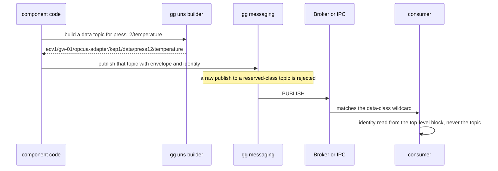
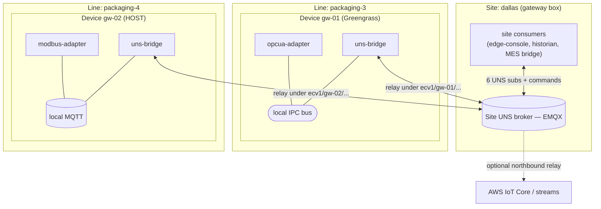

# ggcommons Unified Namespace (UNS) — messaging namespace, identity & site-bus realization (PROPOSED)

> **Status: PROPOSED — design for review. No code.** This document specifies a single **Unified
> Namespace** for how ggcommons components address one another on the bus: the topic grammar, the
> message classes, the identity model, the messaging API surface (`messaging()` / `uns()` / the platform
> facades), streaming enrichment, and the physical realization of a **site-wide UNS bus** across
> per-device brokers. Java is canonical; any build lands in all four libraries (Java / Python / Rust /
> TS) with identical semantics. It is a deliberate, **pre-1.0 breaking change** — there is no production
> installed base to preserve.
>
> **Companion docs:** [`DESIGN-channels.md`](DESIGN-channels.md) (the local/northbound/stream channel
> model this concretizes), [`DESIGN-core.md`](DESIGN-core.md) (platform/transport resolution & identity
> chain), [`../SHARED_CONFIG.md`](../SHARED_CONFIG.md) (how the hierarchy + shared identity are
> distributed), [`../TELEMETRY_STREAMING.md`](../TELEMETRY_STREAMING.md) (the streaming service enriched
> here). The **`edge-console`** component (`edgecommons/edge-console`) is the first consumer and drove
> this design; its own design doc depends on this one.

---

## 1. Problem & scope

Today every ggcommons subsystem and every component invents its **own topic scheme**:

- heartbeat → `ggcommons/{ThingName}/{ComponentName}/heartbeat`
- metric → `{ThingName}/{ComponentName}/metric` (note: no `ggcommons/` root — inconsistent with heartbeat)
- southbound data → `southbound/{site}/{ComponentName}/{InstanceId}/{signalId}`
- southbound control → `southbound/{ComponentName}/{InstanceId}/control/{status|subscriptions|signals}`
- config push → `ggcommons/{ThingName}/config/{ComponentName}/updated`
- file-replicator (proposed) → `{ThingName}/file-replicator/{cmd|evt|state}/…` (yet another scheme)

Any consumer that wants a **fleet-wide** view (a monitoring console, a site historian, an MES bridge)
must therefore special-case each component. Identity is worse than inconsistent — for heartbeat/metric
it exists **only in the topic path** (the body carries no component name), so consumers parse topics,
which is fragile.

This design replaces all of that with one namespace, so a consumer subscribes a **small, uniform set of
wildcards and needs zero per-component knowledge**, and every message is **self-identifying**.

**Grounded constraints this design must live within** (verified against source, 2026-07):
- The `MessagingService` exposes **no MQTT retain flag**, and Greengrass IPC has none — "last known
  value on connect" cannot rely on retain.
- Greengrass **local IPC pub/sub is per-Nucleus (per-device)**; two cores cannot see each other's bus.
- request/reply has **no framework timeout**; an abandoned request leaks its ephemeral reply
  subscription (trips the Greengrass shared-connection quota).
- `+`/`#` wildcards work on both transports.

### Non-goals
- Not a new transport (still MQTT / Greengrass IPC per [`DESIGN-core.md`](DESIGN-core.md)).
- Not a service registry (business components discover peers via `describe` + `broadcast`; platform
  service-discovery is left to Greengrass / Kubernetes).
- Not the shared-config engine — the hierarchy/identity **distribution** is [`SHARED_CONFIG.md`](../SHARED_CONFIG.md); this doc defines what the values *mean* and how they are stamped.

---

## 2. Decisions register (review these)

| # | Question | Options | Recommended |
|---|----------|---------|-------------|
| D1 | Topic depth vs hierarchy | encode hierarchy in topic · **device-only, hierarchy in the body** | ✅ device-only: `ecv1/{device}/{component}/{instance}/{class}` — constant depth regardless of hierarchy depth |
| D2 | Multi-site root in topic | always · **off by default, `topic.includeRoot` opt-in** | ✅ off (edge broker = one site); opt-in for a broker aggregating sites |
| D3 | Hierarchy shape | fixed `site→area→device` · **enterprise-configurable ordered levels** | ✅ configurable `hierarchy.levels` (arbitrary depth, freely named); the **last level is the node** |
| D4 | Identity placement | in `tags` · **top-level `identity` element** | ✅ top-level element; `tags` kept for business context (app/org/cost); `tags.thing` removed |
| D5 | Delimiter | dot (NATS/AMQP) · **`/` (MQTT-native)** | ✅ `/` throughout; `.` only literal-within-a-level (as the component name already is) |
| D6 | Heartbeat & announce as classes | separate classes · **fold into `state`** | ✅ fold: the `state` keepalive *is* the liveness beacon; announce = the first `state` |
| D7 | Developer bus access | facades only · **keep `messaging()` (arbitrary topics)** | ✅ keep it; add an explicit `uns()` builder; guard only reserved platform-class topics |
| D8 | Multi-device site aggregation | per-device console · console federates · **`uns-bridge` → site broker** | ✅ `uns-bridge` per device → one site UNS broker (envelope-aware); federation is a documented fallback |
| D9 | MQTT LWT / retain in the lib | neither · **LWT now, retain deferred** · add both now | ✅ **LWT only** (revised 2026-07-02): the one always-MQTT niche with no keepalive substitute is the `uns-bridge` UNREACHABLE signal (§9.3). Retain is MQTT-only + redundant with broadcast `republish-state` and the consumer's timestamped cache, and can't express staleness — so deferred (if ever needed, owned by the bridge). IPC no-ops. |
| D10 | `request()` timeout | in `get()` only · **internal deadline armed in `request()`** | ✅ internal deadline (cleanup must run even if `get()` is never called) + optional `request(…, timeout)` overload |
| D11 | Streaming hierarchy layout | blob column · **identity levels as columns + partitioning** | ✅ **confirmed** — hierarchy → first-class Parquet/AVRO columns; default partition-by `site`+`device` (`stream.partitionBy` override); `tags` as a map column; header subset `timestamp`+`name`+`version`; broker-sink partition key `device` |
| D12 | Reserved classes | none · **`state`/`metric`/`cfg`/`log` library-owned** | ✅ reserved (raw publish to them rejected) so no component can forge another's health/config |

---

## 3. The topic grammar

```text
ecv1 / {device} / {component} / {instance} / {class} [ / {channel...} ]
```

- Root `ecv1` is a **fused** literal (EdgeCommons namespace + grammar major version). Fusing it, and
  keeping the identity path to three tokens, holds the core classes within **AWS IoT Core's 7-slash
  topic limit**, so `state`, `cfg`, `metric/{name}`, `cmd/{verb}` transit to the cloud verbatim. Grammar
  bumps are `ecv1 → ecv2` (Sparkplug's `spBv1.0` precedent); *payload* versions stay in `header.version`.
- **The topic addresses the endpoint, not the hierarchy.** `{device}` is the physical node (reachability
  + bridge + command-ACL anchor — it replaces today's `thing`); `{component}`/`{instance}` are the
  ggcommons addressing suffix. The enterprise's logical hierarchy lives in the message `identity` (§5),
  **not** the topic — so topic depth is **constant regardless of hierarchy depth** (D1). This buys back
  depth budget for the data-plane signal path.
- `{class}` is one of the closed set in §4; consumers subscribe per class.
- **Optional root** (D2): a multi-site broker may set `topic.includeRoot: true` for `ecv1/{site}/{device}/…`.

Broker-side scoping is therefore **by device** (`ecv1/{device}/#`) — the unit that matters for bridge
ACLs, command routing, and reachability. Finer grouping (area/line/zone) is done by the consumer from
`identity`.

---

## 4. Message classes

Two of today's concepts are intentionally **not** classes (D6): **heartbeat** folds into `state` (the
keepalive *is* the liveness beacon; system stats move to `metric`), and **announce/discovery** folds into
`state` plus pull-on-demand `cmd` verbs.

| Class | What it carries | Direction | Publisher | Example tail |
|---|---|---|---|---|
| `state` | Lifecycle + health + keepalive — **the liveness beacon** | pub | library (`status()`) — **reserved** | `state` |
| `metric` | Operational metrics incl. built-in `sys` (cpu/mem/…) | pub | library (`metrics()`) — **reserved** | `metric/signals-ingested` |
| `cfg` | Effective-config snapshot (redacted), on change / on request | pub | library — **reserved** | `cfg` |
| `log` | Structured log records for remote tail (off by default) | pub | library — **reserved** | `log/error` |
| `data` | Telemetry data plane — `SouthboundSignalUpdate`, processed outputs | pub | `telemetry()` / app | `data/press12/temperature` |
| `evt` | Events and alarms (raise/clear) | pub | `events()` / app | `evt/critical/overtemp` |
| `cmd` | Commands — request/reply, built-in + component verbs | **req/reply (inbound)** | any (§7) | `cmd/reload-config` |
| `app` | Arbitrary application pub/sub between components | pub/sub | app (`messaging()`) | `app/order/received` |

The first four are **reserved platform classes** (D12) — library-owned, so a component cannot hand-forge
another's health or config. `cmd` is the only class whose identity path names the **recipient**;
everything else names the **publisher**.

**A consumer's complete subscription set** is six uniform wildcards, no per-component branches:

```text
ecv1/+/+/+/state        ecv1/+/+/+/cfg        ecv1/+/+/+/evt/#
ecv1/+/+/+/metric/#     ecv1/+/+/+/data/#     ecv1/+/+/+/log/#
```

---

## 5. Identity

### 5.1 Configurable hierarchy (D3)

A deployment declares its levels once — an ordered, freely-named list whose **deepest level is the
physical node** (nothing sits below it but software), so "last level = node" is an invariant, not a flag:

```jsonc
"hierarchy": { "levels": ["site", "factory", "zone", "device"] }   // last level = the node (the thing)
```

`["site","area","device"]`, `["region","plant","line","cell"]` — all valid. `component`/`instance` are
**not** part of this; they are the ggcommons addressing suffix.

### 5.2 Top-level `identity` element (D4)

Every envelope carries identity as a **top-level element** (sibling of `header`/`tags`/`body`, not buried
in `tags`), self-describing and order-safe:

```json
{
  "header":   { "name": "state", "version": "1.0", "uuid": "…", "correlation_id": null },
  "identity": {
    "hier": [
      { "level": "site",    "value": "dallas" },
      { "level": "factory", "value": "finishing" },
      { "level": "zone",    "value": "zone-3" },
      { "level": "device",  "value": "gw-01" }
    ],
    "path":      "dallas/finishing/zone-3/gw-01",
    "component": "opcua-adapter",
    "instance":  "kep1"
  },
  "tags": { "app": "line-ctl", "org": "ops-west" },
  "body": { "…class-specific…" }
}
```

- `hier` is the single source of truth; its **last entry is the device**. `path` is the precomputed join
  (consumers group/display without re-joining or needing the schema) — its trailing device value is
  inherent to a join, not a separate field. There is **no standalone `device` field on the wire**;
  consumers read the last `hier` entry, and the in-memory identity object exposes a computed `device`
  accessor. (This removes the earlier 3× duplication of the device value.)
- **`tags.thing` is removed** (redundant with the device level). `tags` survives for business context.

### 5.3 `instance` is per-message, not a config field

A component commonly serves **many** instances — its existing `component.instances[]` (e.g. an OPC UA
adapter with `kep1`, `plc-2`). The `{instance}` segment is resolved **per message**, from the instance the
message pertains to — via an instance-scoped facade handle (`gg.instance("kep1").telemetry().publish(…)`)
or the originating-instance context — never a single `identity.instance` value. Component-level messages
(the overall `state`) use the default token `main`.

### 5.4 Distribution via Shared/Layered Config

Identity is **not repeated per component**. The `hierarchy` schema and the shared location values
(`site`/`factory`/`zone` — everything above the device) live in the **shared-config base layer** and reach
every component via the `base ⊕ component` deep-merge of [`SHARED_CONFIG.md`](../SHARED_CONFIG.md):

```jsonc
// shared base (once per device/site)      // a component's own config: nothing identity-related
"hierarchy": { "levels": [ … ] },          //   device    = resolved thing name
"identity":  { "site":"dallas", … }        //   component = its own name; instance = per message
```

The UNS is the **concrete driver** for the multi-level hierarchy SHARED_CONFIG anticipated but deferred
(its §5.3 / D3 `[device, site, line, component]` layer chain): the model works today on the shipping
2-layer base (the device base carries the full location path); the N-layer `extends` chain is the later
refinement for defining site values once across devices. The location levels formerly illustrated under
`tags.site/shop/line` in SHARED_CONFIG now live in this `identity`/`hierarchy` block — SHARED_CONFIG §5.3
is reconciled to point here.

Location identity resolves **once** at startup (fail-fast if it doesn't cover `hierarchy.levels`); the
library stamps `identity` (with `path`) on every message; `instance` is stamped per message.

---

## 6. Every legacy scheme collapses onto this

| Legacy (today) | UNS (new) |
|---|---|
| `ggcommons/{Thing}/{Comp}/heartbeat` | `…/{comp}/{inst}/state` (keepalive) + `…/metric/sys` |
| `{Thing}/{Comp}/metric` (no root) | `…/{comp}/{inst}/metric/{name}` |
| `southbound/{site}/{Comp}/{Inst}/{signalId}` | `…/{comp}/{inst}/data/{signalPath}` |
| `southbound/{Comp}/{Inst}/control/status` | `…/{comp}/{inst}/cmd/sb/status` |
| `ggcommons/{Thing}/config/{Comp}/updated` | `…/{comp}/{inst}/cmd/set-config` + outbound `…/cfg` |
| file-replicator `{Thing}/file-replicator/cmd\|evt\|state/…` | the standard `cmd` / `evt` / `state` classes under its identity path |

file-replicator's `cmd | evt | state` intuition survives — it just stops inventing its own address.

---

## 7. The messaging model — `messaging()`, `uns()`, and the platform facades

### 7.1 `gg.messaging()` — the raw bus (unchanged surface + one hardening)

Takes a **literal topic**; no hidden construction. The full existing surface remains, **including the
IoT-Core variants**:

| Method | Notes |
|---|---|
| `publish(topic, msg)` | exactly what hits the wire — UNS-compliant **or** an external, non-UNS topic (for components that bridge a legacy MQTT system) |
| `subscribe(topicFilter, handler)` · `reply(request, response)` | **unchanged** from today |
| `request(topic, msg[, timeout])` | returns today's future/IoU; **hardened** per §7.4 |
| `publishToIoTCore` / `subscribeToIoTCore` / `requestFromIoTCore` / `replyToIoTCore` | **retained** — the local↔cloud split is orthogonal to the UNS; a `uns()`-built topic is IoT-Core-depth-safe by construction. *(Normalize the pre-existing casing wart `publishToIotCore` vs `subscribeToIoTCore` to one `IoTCore` spelling while here.)* |

### 7.2 `gg.uns()` — the explicit topic builder + validator

For a UNS-native topic, this converts a class + channel into a validated topic from *this* component's
identity — and it is where the **depth guard** lives, visibly, at build time:

```java
String t = gg.uns().topic("app", "order/received");   // → ecv1/gw-01/opcua-adapter/kep1/app/order/received
gg.messaging().publish(t, msg);
gg.uns().topicFor(targetIdentity, "cmd", "reload-config");   // address another component
gg.uns().filter("state", Scope.site());                      // build a wildcard subscription filter
gg.uns().validate(topic);                                    // char-set + ≤7-slash-to-IoT-Core check
```

There is **no hidden leaf-injection**: the developer sees and controls the topic; an over-deep channel
fails at build time, not as a dropped message at IoT Core.

### 7.3 Platform facades (reserved, mostly automatic)

Build their topics internally via `uns()`. Most components call *none* of these and are still fully
observable:

| Facade | Purpose | Typical developer use |
|---|---|---|
| *(automatic)* | heartbeat/`state`, identity, `describe`, `cfg`, `log`-tail | **nothing** — visible for free |
| `gg.status()` | health nuance | `update(DEGRADED, reason)`, `registerCheck(name, supplier)` |
| `gg.metrics()` | metrics (kept `MetricEmitter`; topic now UNS-minted) | `emit(measure)` |
| `gg.telemetry()` | signal/`data` plane | `publish(SouthboundSignalUpdate)` / `publish(path, value, meta?)` |
| `gg.events()` | operator alarms/events (`evt`) | `emit(sev, type, msg, data)`, `raiseAlarm/clearAlarm` |
| `gg.commands()` | **console-exposed** request/reply | `register(verb, schema, handler, {danger})` |
| `gg.discovery()` | capability manifest + panels | `describe(manifest)`, `registerPanel(id, asset)` |
| `gg.streams()` | durable telemetry egress (§8) | `publish(stream, record)` — auto-enriched |

`gg.commands()` is the **console-facing specialization** of request/reply: a handler registered here is
*also* advertised in `describe` with a JSON-Schema, danger tier, and RBAC. Peer-to-peer business RPC the
operator never sees just uses `messaging().request()` / `reply()`. Built-in verbs the library
auto-registers (lowercase-hyphenated; a `/`-namespace level for families):

`ping` · `describe` · `get-panel-asset` · `republish-state` / `republish-cfg` (late-join lever) ·
`get-configuration` / `reload-config` (+ `set-config` on CONFIG_COMPONENT) · `set-log-level`. Families add
a namespace level: the southbound-adapter kit registers `sb/status`, `sb/browse`, `sb/read`, `sb/write`,
`sb/subscribe-preview`; file-replicator registers `fr/…`.

### 7.4 Request/reply hardening (D10)

`request()` keeps returning today's future/IoU. It arms an **internal default deadline** (framework-owned
timer, default = a configurable max) — cleanup must run even if the caller never calls `get()` (`join()`,
`thenApply()`, or a dropped reference all bypass it). When the deadline fires it completes the future
exceptionally **and** unsubscribes the reply topic. Consequences: no-arg `get()` no longer blocks forever;
`get(timeout)` waits **less**, never more, than the deadline; a custom deadline is the optional
`request(topic, msg, timeout)` overload. `reply()` and `subscribe()` are untouched.

### 7.5 Enforcement (narrow, checkable, broker-backed)

1. **Reserved platform classes are library-owned:** `messaging().publish` rejects a raw publish to
   `ecv1/…/{state|metric|cfg|log}`. Everything else — arbitrary external topics, your own
   `data`/`evt`/`cmd`/`app` UNS topics — is open.
2. **The `uns()` builder validates** char-set + slash budget.
3. **The broker is the durable enforcement:** per-device ACLs scope each component (and its `uns-bridge`)
   to publish only under its own `ecv1/{device}/#` subtree.
4. **The config schema drops the drift knobs** (`metricEmission.targetConfig.topic`, heartbeat
   messaging-target topic override); top-level `additionalProperties:false` fails stale configs.



---

## 8. The UNS beyond the bus — durable streaming (D11)

The `data` class is the *live* path (pub/sub, rate-sampled). High-rate telemetry that must be durably
captured goes through the streaming service ([`TELEMETRY_STREAMING.md`](../TELEMETRY_STREAMING.md)) —
`gg.streams()` and telemetry-processor's `stream:<name>` target → Kinesis / Kafka / rolling **Parquet·AVRO**
files. A separate, batched, durable channel — carrying the **same UNS identity**, automatically.

- **Auto-enrichment:** the streaming facade stamps every record with the identity block + a header subset
  (event `timestamp`, message `name`/`version`) + `tags` — exactly as the bus facades stamp the envelope.
- **Columnar sinks → hierarchy becomes columns + partitions:** the Parquet/AVRO sink derives its identity
  **columns from `hierarchy.levels`** (a `site`, `factory`, `zone`, `device` column …) + `component`/
  `instance` + a `tags` map column (the existing envelope-tags-as-column precedent). Data is then
  self-describing and **hierarchy-queryable** (`WHERE site='dallas' AND device='gw-01'`) and
  **Hive-partitionable** (`…/site=dallas/factory=finishing/device=gw-01/…`) — the UNS tree in the
  lakehouse, with partition pruning for free. Default partition-by = `site` + `device`, configurable via
  `stream.partitionBy`.
- **Broker sinks (Kinesis/Kafka):** identity/header/tags in the payload; partition key defaults to
  `device` for shard locality/ordering.
- **Provenance:** a `stream:<name>` route keeps the **originating** identity (the device that produced the
  signal — what analytics keys on) plus a lightweight processing stamp.

---

## 9. Physical realization — the site UNS bus

The UNS above is a *logical* namespace. Making it a real **site-wide** bus across many devices is the
physical-topology problem, because each device has its **own** bus (a local broker on HOST; a device-local
Nucleus IPC bus on GREENGRASS — confirmed device-local, no cross-core visibility). There is no horizontal
bridging today.

### 9.1 The `uns-bridge` component (D8)

**One `uns-bridge` per device bus** subscribes the device's local traffic, republishes it onto a
**site-level UNS broker** under the device's namespace, and relays commands back down. It is
**envelope-aware** — unlike a dumb broker bridge it rewrites `reply_to` for commands (TTL'd correlation
map), stamps UNS identity, rate-caps the data plane, protects against loops (hop tag), and emits a
Last-Will "offline" for fast reachability detection. Any site-scoped consumer (a historian, an MES bridge,
the console) then connects to **one** bus.



Alternatives (documented, not primary): broker-native bridging (device→site, blind relay, MQTT only);
consumer-federated multi-connection (can't reach IPC; pushes N clocks into the consumer). The AWS
Greengrass **MQTT bridge component** (`aws.greengrass.clientdevices.mqtt.Bridge`, relays IPC ↔ local MQTT ↔
IoT Core) is the "no custom code on the device" path, but is a blind relay needing 2–3 chained components;
`uns-bridge` does it in one envelope-aware component.

### 9.2 Deployment defaults per platform

| Scenario | Site broker | Bridging |
|---|---|---|
| **HOST, multi-device site** | EMQX on the gateway box | `uns-bridge` on each device (local MQTT ↔ site MQTT) |
| **Greengrass, multi-device site** | EMQX on the gateway (GG-managed container) | `uns-bridge` per Nucleus (IPC ↔ site MQTT) |
| **Single device** | none | none — a consumer connects to the local bus directly |
| **Kubernetes** | the in-cluster broker *is* the aggregation point | none inside a cluster; one `uns-bridge` pod if the cluster is one line of a bigger site |

On **Kubernetes** the cluster already runs one shared broker, so aggregation is native (no bridge inside a
cluster); the hierarchy becomes logical labels via the Downward API. A bridge reappears only at cluster
boundaries.

### 9.3 Reachability & late-join (D9)

Because retain and consumer-side miss-detection don't exist, correctness rests on three layers, in
priority: (1) the periodic **keepalive** `state` (both transports); (2) a **broadcast re-announce**
(`ecv1/bcast/cmd/republish-state`) for an instant snapshot on a consumer's (re)connect, with jittered
replies; (3) the consumer's own **last-known-value cache** — each entry **timestamped**, so a late joiner
gets the value *and* its age (the application-layer "retained value" pattern; the console realizes this in
its FleetModel). MQTT **LWT** is added to the library (§7 / D9) as an *accelerator* — IPC no-ops it, so
behavior is identical minus latency. Its load-bearing use is the `uns-bridge` LWT on the **site broker** (an
always-MQTT hop), making a whole device detectable as **UNREACHABLE** (distinct from a component being
OFFLINE) far faster than keepalive-miss. **Broker retain is deferred**: MQTT-only (so it can never be what
IPC relies on), redundant with (2)+(3), and — unlike the timestamped cache — unable to express staleness
(a retained message sits stale until explicitly evicted). If ever wanted, its owner is the bridge, not each
component's provider.

```mermaid
sequenceDiagram
  participant Con as consumer
  participant SB as site broker
  participant C1 as component
  Con->>SB: subscribe the six UNS patterns
  Con->>SB: publish ecv1/bcast/cmd/republish-state
  SB->>C1: deliver broadcast
  Note over C1: wait a random 0 to 2s to avoid a stampede
  C1-->>Con: state
  Note over Con: cache hydrated; consumers snapshot from it
```

---

## 10. Migration is a hard cut

No production installed base → one release train, **no dual-publish compatibility mode** (the `tag →
signal` rename is the precedent). Every topic, both southbound adapters' publish paths, the processor's
filters, the config-push source, and the interop harness change together. Old configs fail validation with
a precise error — silent coexistence of old and new topics is the worst outcome.

---

## 11. Mandated changes (all four languages; Java canonical)

> **Mandate walk — approved 2026-07-02.** All of M1–M9, M11, M14, M15 accepted, with two refinements:
> **M7 → LWT only** (broker retain deferred; D9/§9.3), and **M9 accepted in full** including confirmed `sb/write`.
> M1/M2/M8 committed as P0 (site-wide from day one), sequenced at Phase 3. Console-side M10/M12/M13 are tracked in
> the edge-console design and remain parked with the console.

| # | Change | Priority |
|---|---|---|
| M1 | **`uns-bridge`** component (Rust; one per device bus) — envelope-aware relay, `reply_to` rewrite (TTL'd map), per-class uplink policy with visible drop counters, hop-tag loop protection, LWT reachability | P0 |
| M2 | **Site-broker deploy recipes** (EMQX; HOST Docker / GG container / K8s notes) | P0 |
| M3 | **The UNS grammar** — `ecv1/{device}/{component}/{instance}/{class}`, the message classes, `/`-delimited verbs | P0 |
| M4 | **Messaging model** — `messaging()` (arbitrary topics; `*ToIoTCore` retained; `request()` hardened) + `uns()` builder/validator + reserved facades; reserved-class guard | P0 |
| M5 | **`identity` + `hierarchy`** — configurable hierarchy schema (last = node); top-level `identity` (ordered `hier` + `path`; per-message `instance`); distributed via SHARED_CONFIG base layer; `tags.thing` removed | P0 |
| M6 | **Request/reply hardening** — internal default deadline + optional timeout overload + guaranteed reply-topic cleanup; `reply()`/`subscribe()` unchanged | P0 |
| M7 | **MQTT LWT** in `MessagingProvider` — the `uns-bridge` sets it on the site-broker connection → whole-device UNREACHABLE; HOST/K8s components may optionally set one; IPC no-ops. **Retain deferred** (redundant with broadcast `republish-state` + the consumer's timestamped cache; can't express staleness; if ever wanted, owned by the bridge). | P0 |
| M8 | **Named/secondary MessagingClient** (two connections in one process; the bridge needs it) | P0 |
| M9 | **Southbound command family** — `sb/browse` (paged), `sb/read` (ref-accepting), **confirmed `sb/write`** (with optional read-back), `sb/subscribe-preview` + adapter `writes.allow[]`; an adapter-contract change | P1 |
| M11 | **Heartbeat defaults + parity** — on / 5 s / local target in all four languages, reconciled into the `state` keepalive ([ggcommons#33](https://github.com/edgecommons/ggcommons/issues/33)) | P1 |
| M14 | **`uns-test-vectors/`** — cross-language byte-identical topic + well-formed top-level `identity` assertions in the interop harness, under the 90% coverage gate | P1 |
| M15 | **UNS in the streaming service** — auto-enrich records with identity + header + tags; Parquet/AVRO hierarchy columns + partitioning; broker-sink partition key = device; `stream:<name>` preserves originating identity | P1 |

*(M10/M12/M13 — panel schema, console config, k8s Ingress — are console-specific and live in the
`edge-console` design.)*

---

## 12. Parity & testing

- **`uns-test-vectors/`** (mirroring `vault-test-vectors/`): a JSON table of `(identity, class, channel) →
  exact topic` plus golden envelopes per class; all four suites consume it; the interop harness gains a
  UNS suite asserting cross-language byte-identical topics and `identity` == the resolved values.
- The `deep_merge` of SHARED_CONFIG is the identity-distribution conformance target (shared vectors there).
- 90% line-coverage gate applies to every new facade in all four languages (pure CI-testable surface).

## 13. Phasing

1. **Grammar + classes + top-level `identity` + `messaging()`/`uns()`** (Java-canonical first, mirrors
   before merge) + `uns-test-vectors`.
2. **Reserved-class guard, `request()` hardening, MQTT LWT (retain deferred), named MessagingClient.**
3. **`uns-bridge` + site-broker recipes** (the site-bus realization) + reachability/late-join.
4. **Streaming enrichment** (M15) + **southbound command family** (M9).
5. **Heartbeat-default parity** (M11) + docs/recipes/scaffold updates; retire the legacy schemes.

> The **`edge-console`** component consumes this design; see its design doc for the console-side FleetModel,
> WebSocket bridge, screens, dynamic panels, and console-specific mandates (M10/M12/M13).
