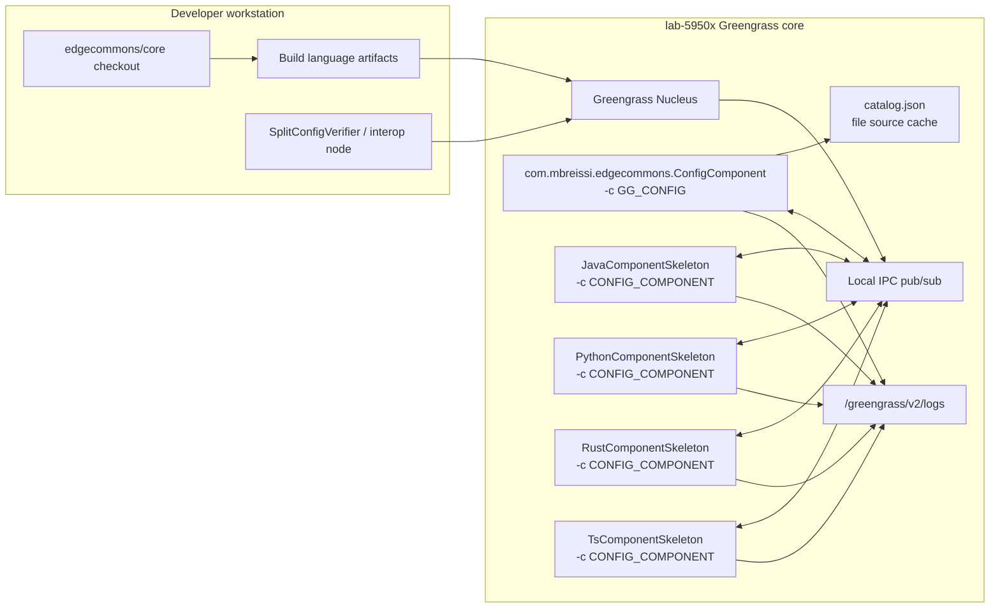
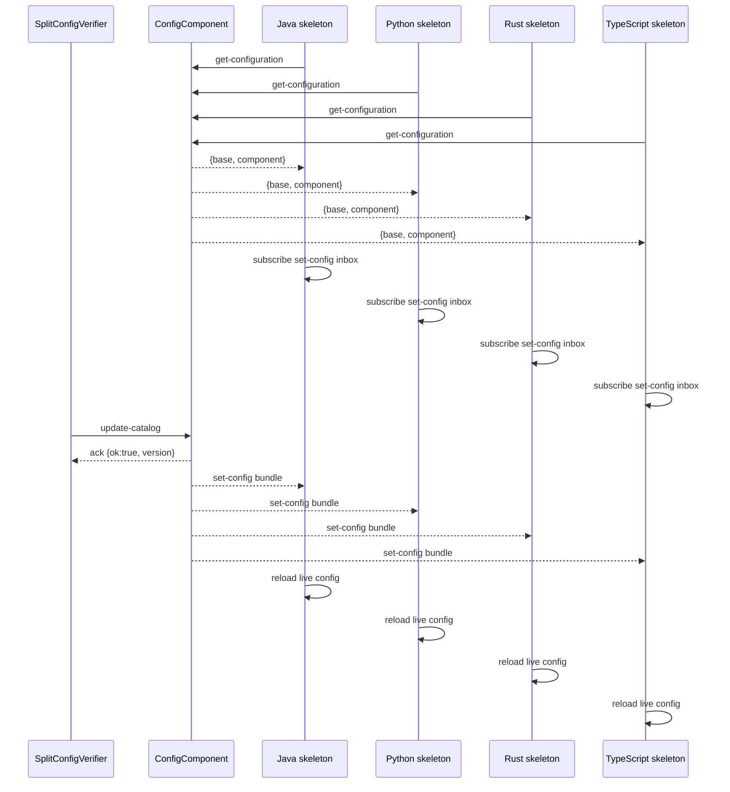
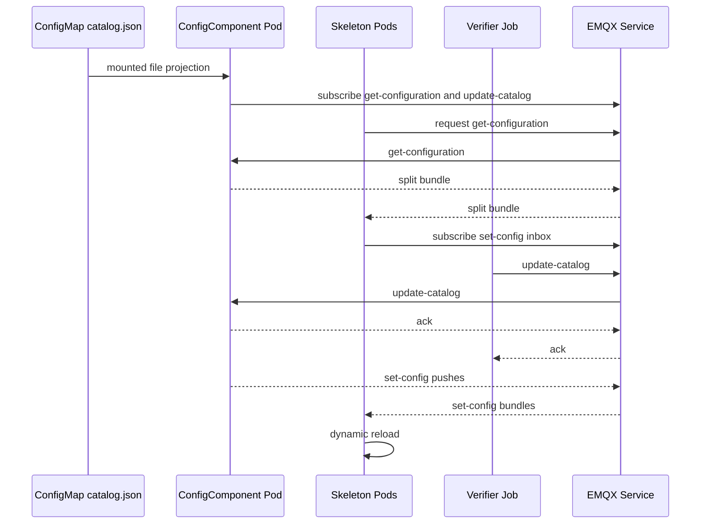

# Full Interop Runbook: Greengrass and Kubernetes

This runbook is the acceptance procedure for full EdgeCommons interoperability when a change affects
wire behavior, request/reply behavior, command topics, or split configuration. It is intentionally
stricter than a component smoke test: every skeleton component must run as a real deployed component,
must use the same transport and config path that production would use, and must emit evidence that the
changed behavior reached the component runtime.

The reader is expected to be an EdgeCommons maintainer with access to the repo, the language
toolchains, and either the `lab-5950x` Greengrass core or a Kubernetes cluster such as kind or lab k3s.

## Pass Criteria

A full run is passing only when all of the following are true:

1. Java, Python, Rust, and TypeScript skeletons are deployed and running.
2. Each skeleton uses the intended platform transport:
   - Greengrass: `GREENGRASS` + `IPC`.
   - Kubernetes: `KUBERNETES` + `MQTT`.
3. Each skeleton uses split config from `com.mbreissi.edgecommons.ConfigComponent` with
   `-c CONFIG_COMPONENT`.
4. The ConfigComponent bootstraps from a non-`CONFIG_COMPONENT` source:
   - Greengrass: `GG_CONFIG` with its own `ComponentConfig`.
   - Kubernetes: mounted ConfigMap file source.
5. A non-production `update-catalog` message is sent to the ConfigComponent.
6. The ConfigComponent acknowledges the update. For the message-update path the acknowledgement must
   identify volatile provenance (`source=message`, `interface=update-catalog`, `volatile=true`).
   The verifier must also observe `pushed_count: 4`, and the pushed bundles must contain the
   expected shared base plus distinct component layers.
7. Every skeleton logs that it received and dynamically reloaded the update.
8. The update is volatile: the catalog file or ConfigMap remains unchanged after the message update.
9. Request/reply and publish/subscribe are exercised through the skeletons or interop nodes, not only
   by checking that components are `RUNNING`.
10. Standard-schema component layers use schema-valid component tokens such as
    `java-component-skeleton`. Catalog lookup keys and request tokens may remain the component
    identity names such as `JavaComponentSkeleton`.

Do not report a run complete when only the ConfigComponent observed the push. A consumer can miss a
push if it has not yet subscribed to its `set-config` inbox. Kubernetes `Ready` and Greengrass
`RUNNING` are necessary startup signals, but they are not sufficient evidence that split-config
bootstrap and `set-config` subscriptions have completed.

## Greengrass Topology



### Greengrass Message Flow



## Greengrass Procedure

Run these commands from `core/` unless another directory is shown.

### 1. Build the host-side artifacts

```powershell
mvn -f libs/java/pom.xml -DskipTests install
mvn -f examples/java/pom.xml -DskipTests clean package

npm install

Push-Location libs/ts
npm run build
Pop-Location

Push-Location test-infra/interop/ts_node
npm run build
Pop-Location

Push-Location examples/ts
npm install
npm run build
Pop-Location

$jar = Get-ChildItem libs/java/target/edgecommons-*.jar |
  Where-Object { -not $_.Name.StartsWith('original-') -and -not $_.Name.EndsWith('-sources.jar') -and -not $_.Name.EndsWith('-javadoc.jar') } |
  Sort-Object LastWriteTime -Descending |
  Select-Object -First 1
javac -cp $jar.FullName -d test-infra/interop/java_node/out test-infra/interop/java_node/InteropNode.java
```

On Windows, use the directory-local `Push-Location` form above. Some Node installations resolve
`npm --prefix` through a broken roaming-profile npm shim.

JDK 25 can emit a close-time `AccessDeniedException` after compiling `InteropNode.java` even when
`javac` returns zero. Continue only if `test-infra/interop/java_node/out/InteropNode.class` exists
and the command exit code is zero; otherwise fix the compiler/JAR access issue before continuing.

Build the Linux Greengrass Rust binaries from WSL. `config-component` is the sibling repo
`../config-component`, not a directory under `core/`.

```powershell
wsl.exe bash -lc "cd /mnt/c/Users/breis/source/edgecommons/core/test-infra/interop/rust_node && CARGO_TARGET_DIR=/mnt/c/Users/breis/source/edgecommons/core/build/gg-rust-target cargo build --release --no-default-features --features greengrass"
wsl.exe bash -lc "cd /mnt/c/Users/breis/source/edgecommons/core/examples/rust && CARGO_TARGET_DIR=/mnt/c/Users/breis/source/edgecommons/core/build/gg-rust-skeleton-target cargo build --release --no-default-features --features greengrass"
wsl.exe bash -lc "cd /mnt/c/Users/breis/source/edgecommons/config-component && CARGO_TARGET_DIR=/mnt/c/Users/breis/source/edgecommons/core/build/gg-configcomponent-target cargo build --release --no-default-features --features greengrass"
```

Package the Greengrass IPC interop nodes:

```powershell
$ipcPackage = .\test-infra\interop\gg_ipc\package.ps1 `
  -RunId "full-interop-$(Get-Date -Format yyyyMMddHHmmss)" `
  -Langs "python,java,rust,ts"
```

Package the split-config ConfigComponent, four skeletons, catalogs, and one-shot verifier:

```powershell
$splitPackage = .\test-infra\interop\gg_split_config\package.ps1 `
  -RunId "split-config-$(Get-Date -Format yyyyMMddHHmmss)"
```

The package scripts print `RecipeDir`, `ArtifactDir`, `RunId`, and `Version`. Preserve those values.
For the skeleton/ConfigComponent deployment use `$splitPackage.Version`; for the binary matrix
deployment use `$ipcPackage.Version`.

The TypeScript skeleton package carries the compiled skeleton plus a local compiled
`@edgecommons/edgecommons` package; its Greengrass install lifecycle runs `npm install --omit=dev`
inside the unpacked artifact. Do not expect `examples/ts/node_modules` to exist in the workspace.

### 2. Stage recipes and artifacts on the Greengrass core

Use a run-specific remote directory.

```powershell
$remote = "/tmp/edgecommons-full-interop-$($splitPackage.RunId)"
$ggHost = "marc@192.168.1.229"

ssh $ggHost "/greengrass/v2/bin/greengrass-cli --help | head -5"
ssh $ggHost "sudo -n true"
ssh $ggHost "mkdir -p $remote/recipes $remote/artifacts /tmp/edgecommons-full-interop"
scp -r "$($ipcPackage.RecipeDir)" "$($ggHost):$remote/ipc-recipes"
scp -r "$($splitPackage.RecipeDir)" "$($ggHost):$remote/split-recipes"
scp -r "$($ipcPackage.ArtifactDir)" "$($ggHost):$remote/ipc-artifacts"
scp -r "$($splitPackage.ArtifactDir)" "$($ggHost):$remote/split-artifacts"
ssh $ggHost "cp $remote/ipc-recipes/* $remote/recipes/ && cp $remote/split-recipes/* $remote/recipes/ && cp -R $remote/ipc-artifacts/* $remote/artifacts/ && cp -R $remote/split-artifacts/* $remote/artifacts/"
scp "$($splitPackage.CatalogInitial)" "$($ggHost):/tmp/edgecommons-full-interop/catalog-initial.json"
scp "$($splitPackage.CatalogUpdate)" "$($ggHost):/tmp/edgecommons-full-interop/catalog-update-second-pass.json"
scp "$($splitPackage.ConfigComponentUpdate)" "$($ggHost):$remote/configcomponent-update.json"
```

If a combined staging block appears to hang from PowerShell, run the `scp` commands one at a time
and verify counts before continuing:

```powershell
ssh $ggHost "find $remote/recipes -maxdepth 1 -type f | wc -l && find $remote/artifacts -type f | wc -l"
```

The expected counts are 11 recipes and 11 artifact files for the full Greengrass split-config plus
IPC verifier package set.

The `sudo -n true` preflight must return immediately. If it hangs or reports that a password is
required, stop and fix the Greengrass operator session before continuing; deployment and log
collection steps use `sudo` and cannot be validated through a non-interactive runbook while sudo is
blocked.

The generated skeleton recipes run the components with:

```text
--platform GREENGRASS -c CONFIG_COMPONENT
```

The generated validation recipes must not set `RequiresPrivilege:true`. On a Greengrass core that
uses `runWithDefault.posixUser`, `ps` can still show a root-owned
`sudo -n -E -H -u ggc_user ... sh -c ...` launcher. That is the Nucleus dropping from root to the
component user, not the component payload running as root. The payload process (`java`, `python`,
`node`, `rust-component-skeleton`, or `config-component`) must run as `ggc_user`.

The ConfigComponent recipe must run with:

```text
--platform GREENGRASS -c GG_CONFIG
```

and its own deployment configuration must include `ComponentConfig`:

```json
{
  "ComponentConfig": {
    "component": {
      "token": "edgecommons-config-component",
      "global": {
        "configComponent": {
          "catalogSource": {
            "type": "file",
            "path": "/greengrass/v2/work/com.mbreissi.edgecommons.ConfigComponent/catalog.json",
            "watch": true
          },
          "pushOnCatalogReload": true,
          "allowVolatileCatalogUpdates": true
        }
      },
      "instances": []
    }
  }
}
```

Do not confuse this with the shared-layer `GG_CONFIG` provider used by ordinary components. A
component that reads a shared base from another Greengrass component uses the `SharedComponentConfig`
key; the ConfigComponent's own bootstrap remains its own `ComponentConfig`.

`allowVolatileCatalogUpdates:true` is for this validation run only.

### 3. Install the initial catalog

The generated initial catalog must have a shared `base` and one component layer for every skeleton:

```json
{
  "schemaVersion": 1,
  "version": "initial-full-interop",
  "provenance": { "source": "file", "uri": "greengrass-full-interop" },
  "base": {
    "logging": { "level": "INFO" },
    "heartbeat": { "enabled": true, "intervalSecs": 5, "destination": "local" },
    "tags": { "site": "interop-initial" }
  },
  "components": {
    "JavaComponentSkeleton": {
      "component": { "token": "java-component-skeleton", "global": { "publish_interval": 3 }, "instances": [] }
    },
    "PythonComponentSkeleton": {
      "component": { "token": "python-component-skeleton", "global": { "publish_interval": 3 }, "instances": [] }
    },
    "RustComponentSkeleton": {
      "component": { "token": "rust-component-skeleton", "global": { "publish_interval": 3 }, "instances": [] }
    },
    "TsComponentSkeleton": {
      "component": { "token": "ts-component-skeleton", "global": { "publish_interval": 3 }, "instances": [] }
    }
  }
}
```

Copy it into the ConfigComponent work directory before deployment:

```powershell
ssh $ggHost "sudo mkdir -p /greengrass/v2/work/com.mbreissi.edgecommons.ConfigComponent && sudo cp /tmp/edgecommons-full-interop/catalog-initial.json /greengrass/v2/work/com.mbreissi.edgecommons.ConfigComponent/catalog.json && sudo chmod 644 /greengrass/v2/work/com.mbreissi.edgecommons.ConfigComponent/catalog.json"
```

### 4. Deploy ConfigComponent and all skeletons

Deploy the ConfigComponent and the four skeletons in one local deployment. Use the run-specific
versions you staged.

```powershell
ssh $ggHost "sudo /greengrass/v2/bin/greengrass-cli deployment create --recipeDir $remote/recipes --artifactDir $remote/artifacts --update-config $remote/configcomponent-update.json --merge com.mbreissi.edgecommons.ConfigComponent=$($splitPackage.Version) --merge com.mbreissi.edgecommons.JavaComponentSkeleton=$($splitPackage.Version) --merge com.mbreissi.edgecommons.PythonComponentSkeleton=$($splitPackage.Version) --merge com.mbreissi.edgecommons.RustComponentSkeleton=$($splitPackage.Version) --merge com.mbreissi.edgecommons.TsComponentSkeleton=$($splitPackage.Version)"
```

Wait until all five components are running:

```powershell
ssh $ggHost "sudo /greengrass/v2/bin/greengrass-cli component list | grep -E 'ConfigComponent|Skeleton' -A5 -B1"
```

Required evidence:

- ConfigComponent is `RUNNING`.
- All four skeletons are `RUNNING`.
- ConfigComponent effective config shows `allowVolatileCatalogUpdates:true`.
- Each skeleton log shows `configSource=CONFIG_COMPONENT`.
- Each skeleton has completed initial split-config bootstrap before the update is sent. Greengrass
  `RUNNING` is not enough; use startup logs such as Java `Component initialization completed`,
  Python `EdgeCommons initialized successfully`, Rust `Rust Component Skeleton starting`, and
  TypeScript `TypeScript Component Skeleton starting`.
- The verifier or operator log shows all four `set-config` subscriptions are active before the
  `update-catalog` request is published.

### 5. Prove baseline request/reply and pub/sub

Deploy the packaged Greengrass IPC interop nodes if the change affects message wire behavior:

```powershell
ssh $ggHost "sudo /greengrass/v2/bin/greengrass-cli deployment create --recipeDir $remote/recipes --artifactDir $remote/artifacts --merge com.mbreissi.edgecommons.InteropBinaryPython=$($ipcPackage.Version) --merge com.mbreissi.edgecommons.InteropBinaryJava=$($ipcPackage.Version) --merge com.mbreissi.edgecommons.InteropBinaryRust=$($ipcPackage.Version) --merge com.mbreissi.edgecommons.InteropBinaryTs=$($ipcPackage.Version)"
```

Required evidence:

- Each interop component exits successfully or logs a completed matrix.
- Every ordered producer/consumer pair is covered for request/reply.
- Binary payload tests prove byte-for-byte body preservation when that behavior is in scope.

### 6. Send a second-pass catalog update

Do not send the update immediately after deployment. First confirm every skeleton has initialized and
subscribed. Then send a second-pass update with distinct values:

```json
{
  "schemaVersion": 1,
  "version": "second-pass-full-interop",
  "provenance": { "source": "message", "uri": "greengrass-full-interop-second-pass" },
  "base": {
    "logging": { "level": "INFO" },
    "heartbeat": { "enabled": true, "intervalSecs": 5, "destination": "local" },
    "tags": { "site": "interop-second-pass" }
  },
  "components": {
    "JavaComponentSkeleton": {
      "component": { "token": "java-component-skeleton", "global": { "publish_interval": 21 }, "instances": [] }
    },
    "PythonComponentSkeleton": {
      "component": { "token": "python-component-skeleton", "global": { "publish_interval": 23 }, "instances": [] }
    },
    "RustComponentSkeleton": {
      "component": { "token": "rust-component-skeleton", "global": { "publish_interval": 29 }, "instances": [] }
    },
    "TsComponentSkeleton": {
      "component": { "token": "ts-component-skeleton", "global": { "publish_interval": 31 }, "instances": [] }
    }
  }
}
```

The catalog map keys and the verifier request tokens are the component identity names
(`JavaComponentSkeleton`, `PythonComponentSkeleton`, `RustComponentSkeleton`,
`TsComponentSkeleton`). The embedded standard config under each component layer must use the
schema-valid kebab-case `component.token` values shown above. If those embedded tokens are CamelCase,
the skeletons will reject the effective config during schema validation.

Use `interop-rust-node gg-config-update-file` as the verifier:

```powershell
ssh $ggHost "sudo /greengrass/v2/bin/greengrass-cli deployment create --recipeDir $remote/recipes --artifactDir $remote/artifacts --merge com.mbreissi.edgecommons.SplitConfigVerifier=$($splitPackage.Version)"
```

The verifier must subscribe to all four `set-config` topics before it sends the request:

```text
ecv1/lab-5950x/JavaComponentSkeleton/main/cmd/set-config
ecv1/lab-5950x/PythonComponentSkeleton/main/cmd/set-config
ecv1/lab-5950x/RustComponentSkeleton/main/cmd/set-config
ecv1/lab-5950x/TsComponentSkeleton/main/cmd/set-config
```

### 7. Collect Greengrass evidence

Read the verifier result:

```powershell
ssh $ggHost "sudo cat /tmp/edgecommons_full_interop/update-result.json"
```

Required fields:

```json
{
  "ok": true,
  "ack_ok": true,
  "correlation_match": true,
  "expected_pushes": 4,
  "pushed_count": 4,
  "ack": {
    "provenance": {
      "source": "message",
      "interface": "update-catalog",
      "volatile": true
    }
  }
}
```

Read component logs:

```powershell
ssh $ggHost "sudo grep -R --line-number -e 'configSource=CONFIG_COMPONENT' -e 'configuration changed' -e 'Publish interval changed' -e 'set-config push received' -e 'updated publish interval' /greengrass/v2/logs/com.mbreissi.edgecommons.*Skeleton*.log"
```

Expected evidence:

| Component | Required log evidence |
| --- | --- |
| Java | `configSource=CONFIG_COMPONENT`; `Publish interval changed ... to 21000ms` |
| Python | `configSource=CONFIG_COMPONENT`; `set-config push received`; reload hooks fire |
| Rust | `configSource=CONFIG_COMPONENT`; `split-config shared layer applied`; `configuration reloaded`; `updated publish interval to 29s` |
| TypeScript | `configSource=CONFIG_COMPONENT`; `configuration changed; updated publish interval to 31s` |

Finally, prove volatility:

```powershell
ssh $ggHost "sudo grep -n 'interop-second-pass' /greengrass/v2/work/com.mbreissi.edgecommons.ConfigComponent/catalog.json || true"
```

The grep must produce no match. The message update must not persist to the catalog file.

### 8. Remove validation components

After evidence is captured, remove the validation-only local deployment roots. Do not leave the
ConfigComponent, skeletons, verifier, or binary interop nodes running on a shared Greengrass core.

Use separate `--remove` arguments. On Nucleus 2.17, a comma-separated `--remove` value can be
recorded as one literal component name and remove nothing.

```powershell
ssh $ggHost "sudo /greengrass/v2/bin/greengrass-cli deployment create --remove=com.mbreissi.edgecommons.ConfigComponent --remove=com.mbreissi.edgecommons.JavaComponentSkeleton --remove=com.mbreissi.edgecommons.PythonComponentSkeleton --remove=com.mbreissi.edgecommons.RustComponentSkeleton --remove=com.mbreissi.edgecommons.TsComponentSkeleton --remove=com.mbreissi.edgecommons.SplitConfigVerifier --remove=com.mbreissi.edgecommons.InteropBinaryPython --remove=com.mbreissi.edgecommons.InteropBinaryJava --remove=com.mbreissi.edgecommons.InteropBinaryRust --remove=com.mbreissi.edgecommons.InteropBinaryRustPeer --remove=com.mbreissi.edgecommons.InteropBinaryTs"
```

Verify that only baseline Greengrass services remain:

```powershell
ssh $ggHost "sudo /greengrass/v2/bin/greengrass-cli component list"
ssh $ggHost "ps -eo pid,ppid,user,stat,etime,cmd | grep -E 'com.mbreissi.edgecommons|InteropBinary|ConfigComponent|Skeleton' | grep -v grep || true"
```

## Kubernetes Topology


### Kubernetes Config and Update Flow



## Kubernetes Procedure

The checked-in `test-infra/k8s/smoke.sh` is the single-component CONFIGMAP smoke. It is still useful
for proving the Kubernetes platform profile, ConfigMap hot-reload, health, metrics, and the Helm
chart. It is not the full split-config acceptance gate.

Full Kubernetes split-config E2E is implemented by `test-infra/k8s/split-config/run.sh`. That harness
builds local images, loads them into kind, deploys EMQX, deploys the Rust ConfigComponent, deploys
the Java/Python/Rust/TypeScript skeletons with `-c CONFIG_COMPONENT`, runs a verifier Job, proves
message-based volatile catalog update fanout, and checks that no split-config pod restarted.

### 1. Create or select a cluster

Preflight the tools in the shell where the Kubernetes commands will run. For repeatable end-to-end
system tests, use the dedicated Kubernetes runner VM instead of the Greengrass device or a
pre-existing control-plane utility container.

```bash
kubectl version --client=true
helm version --short
docker version --format '{{.Client.Version}}'
kind version || true
```

For a dedicated Ubuntu VM runner, bootstrap those prerequisites with:

```bash
bash test-infra/k8s/setup-runner-vm.sh
```

For kind:

```bash
kind create cluster --name edgecommons --config test-infra/k8s/kind-config.yaml
kubectl config use-context kind-edgecommons
```

For lab k3s, select the lab kubecontext and skip `kind`.

### 2. Synchronize the code under test

The Kubernetes split-config harness can validate local in-progress code. It does not require a
GitHub push. The runner only needs the same local source state that is being validated.

Expected runner layout:

```text
~/source/edgecommons/core
~/source/edgecommons/config-component
```

If the VM clone already has the target commits, update it normally:

```bash
cd ~/source/edgecommons/core && git pull --ff-only
cd ~/source/edgecommons/config-component && git pull --ff-only
```

If the code is not pushed, copy the local source slices to the VM. At minimum, synchronize the
language libraries, skeleton examples, protobuf sources, split-config vectors, ConfigComponent, and
`test-infra/k8s/split-config/`. Do not report Kubernetes E2E blocked merely because GitHub does not
yet contain the exact worktree being tested.

From a WSL shell on the Windows workstation, `rsync` is the least error-prone option:

```bash
VM=edgecommons-k8s
ROOT=/mnt/c/Users/breis/source/edgecommons

rsync -az --delete "$ROOT/core/libs/java/" "$VM:~/source/edgecommons/core/libs/java/"
rsync -az --delete "$ROOT/core/libs/python/" "$VM:~/source/edgecommons/core/libs/python/"
rsync -az --delete "$ROOT/core/libs/rust/" "$VM:~/source/edgecommons/core/libs/rust/"
rsync -az --delete "$ROOT/core/libs/rust-streamlog/" "$VM:~/source/edgecommons/core/libs/rust-streamlog/"
rsync -az --delete "$ROOT/core/libs/ts/" "$VM:~/source/edgecommons/core/libs/ts/"
rsync -az --delete "$ROOT/core/examples/" "$VM:~/source/edgecommons/core/examples/"
rsync -az --delete "$ROOT/core/proto/" "$VM:~/source/edgecommons/core/proto/"
rsync -az --delete "$ROOT/core/split-config-test-vectors/" "$VM:~/source/edgecommons/core/split-config-test-vectors/"
rsync -az --delete "$ROOT/core/test-infra/k8s/split-config/" "$VM:~/source/edgecommons/core/test-infra/k8s/split-config/"
rsync -az --delete "$ROOT/config-component/" "$VM:~/source/edgecommons/config-component/"
```

If `rsync` is unavailable, use `scp -r` for the same directories. Be explicit about the source trees
instead of copying build output directories wholesale.

### 3. Run the full split-config harness

Run from the VM:

```bash
cd ~/source/edgecommons/core
bash -n test-infra/k8s/split-config/run.sh
bash test-infra/k8s/split-config/run.sh | tee /tmp/edgecommons-split-e2e.log
```

For evidence collection or failure diagnostics, keep the namespace and write a durable log:

```bash
cd ~/source/edgecommons/core
KEEP=1 bash test-infra/k8s/split-config/run.sh | tee /tmp/edgecommons-split-e2e.log
```

The harness defaults are:

- namespace: `edgecommons-split`
- kind cluster: `edgecommons`
- device identity: `edgecommons-k8s-split`
- initial shared marker: `k8s-split-initial`
- updated shared marker: `k8s-split-updated`
- initial per-component `publish_interval`: `5`
- updated per-component `publish_interval`: `1`

The harness builds and loads these local images:

- `edgecommons-config-component:split-ci`
- `edgecommons-java-skeleton:split-ci`
- `edgecommons-python-skeleton:split-ci`
- `edgecommons-rust-skeleton:split-ci`
- `edgecommons-ts-skeleton:split-ci`
- `edgecommons-split-verifier:split-ci`

For kind, `run.sh` first tries `kind load docker-image`. If kind cannot read the node's containerd
config, it falls back to direct import with `docker save | docker exec ... ctr -n k8s.io images
import -`. This fallback is expected with kind v0.30.0 and the pinned `kindest/node:v1.36.1` image,
where `kind load docker-image` can fail with `unknown containerd config version: 4`.

### 4. What the Kubernetes harness proves

The ConfigComponent pod bootstraps from a mounted ConfigMap/file source, not from
`CONFIG_COMPONENT`. Its bootstrap config includes:

```text
catalogSource.type=configmap
catalogSource.mountDir=/etc/edgecommons/config
catalogSource.key=catalog.json
pushOnCatalogReload=true
allowVolatileCatalogUpdates=true
```

The skeleton pods all run with:

```text
--platform KUBERNETES --transport MQTT /etc/edgecommons/bootstrap/<lang>-messaging.json -c CONFIG_COMPONENT -t edgecommons-k8s-split
```

The verifier Job:

- sends `GetConfiguration` requests to
  `ecv1/edgecommons-k8s-split/config/main/cmd/get-configuration`;
- proves the initial split bundles contain `base.tags.sharedLayer=k8s-split-initial`,
  schema-valid component tokens, each language's unique component marker, and
  `publish_interval=5`;
- subscribes to all four `set-config` inboxes;
- sends `UpdateCatalog` to `ecv1/edgecommons-k8s-split/config/main/cmd/update-catalog`;
- requires an acknowledgement with `ok=true` and captures the acknowledgement provenance;
- proves the pushed bundles contain `base.tags.sharedLayer=k8s-split-updated` and
  `publish_interval=1`;
- waits for dynamic reload evidence from all four skeletons;
- verifies all split-config pod restart counts are zero.

The ConfigComponent must not write the message-delivered catalog back to the ConfigMap. The message
update path is for non-production debug, verification, and test use only; it is intentionally
volatile and is lost when the ConfigComponent restarts.

### 5. Required Kubernetes evidence

```bash
kubectl -n edgecommons-split get pods
kubectl -n edgecommons-split logs job/edgecommons-split-verifier
kubectl -n edgecommons-split logs -l app.kubernetes.io/part-of=edgecommons-split-config --all-containers --tail=-1
```

Required harness log evidence:

- `verifier proved initial get-configuration and update-catalog fanout`
- `ConfigComponent pushed updated catalog bundles`
- `Java skeleton dynamically reloaded updated component config`
- `Python skeleton received set-config and notified listeners`
- `Rust skeleton dynamically reloaded updated component config`
- `TypeScript skeleton dynamically reloaded updated component config`
- `no split-config pod restarted during the update`
- `FULL SPLIT-CONFIG K8S E2E PASSED`

Required verifier JSON evidence:

- top-level `"ok": true`
- `ack.ok=true`
- `ack.provenance.source="message"`
- `ack.provenance.interface="update-catalog"`
- `ack.provenance.volatile=true`
- `initial.<token>.sharedLayer="k8s-split-initial"` for all four skeletons
- `initial.<token>.publishInterval=5` for all four skeletons
- `pushed.<token>.sharedLayer="k8s-split-updated"` for all four skeletons
- `pushed.<token>.publishInterval=1` for all four skeletons

The catalog keys and verifier request tokens are:

```text
JavaComponentSkeleton
PythonComponentSkeleton
RustComponentSkeleton
TsComponentSkeleton
```

The embedded standard config `component.token` values are:

```text
java-component-skeleton
python-component-skeleton
rust-component-skeleton
ts-component-skeleton
```

If the embedded tokens are CamelCase, the skeletons reject the effective config during schema
validation even though the ConfigComponent can still serve bundles.

### 6. Cleanup

If the run was executed without `KEEP=1`, the harness requests namespace cleanup on exit. If the run
used `KEEP=1`, clean up after collecting evidence:

```bash
kubectl delete namespace edgecommons-split --wait=false
```

It is normal for the namespace to remain in `Terminating` briefly after `--wait=false`.

### 7. Triage notes

If the VM shows little or no CPU while a run appears stuck, check the harness log and pid before
assuming the build is busy:

```bash
tail -220 /tmp/edgecommons-split-e2e.log
cat /tmp/edgecommons-split-e2e.status 2>/dev/null || true
kill -0 "$(cat /tmp/edgecommons-split-e2e.pid)" 2>/dev/null && echo running || echo stopped
kubectl -n edgecommons-split get pods 2>/dev/null || true
```

Common causes:

- the previous `KEEP=1` namespace is still terminating;
- a skeleton reached Kubernetes `Ready` but had not completed split-config bootstrap yet;
- Java logs `Dropping set-config push ... received before configuration bootstrap completed`, which
  means the update was sent too early;
- a skeleton rejects the served config because embedded `component.token` is not schema-valid;
- `kind load docker-image` failed, but direct `ctr` import succeeded. This is not a failure unless
  the fallback also fails.

## Evidence Checklist

Attach these to the validation note or PR:

- Greengrass deployment ids for:
  - ConfigComponent plus skeleton deployment.
  - Interop node deployment.
  - Split-config verifier deployment.
- `greengrass-cli component list` output showing all skeletons and ConfigComponent.
- ConfigComponent effective config showing volatile updates explicitly enabled for the test.
- Greengrass startup evidence showing each skeleton completed split-config bootstrap before the
  update was sent.
- Greengrass verifier JSON result, including acknowledgement provenance and `pushed_count:4`.
- Per-language skeleton reload log excerpts.
- File non-persistence proof for the Greengrass volatile catalog update.
- Kubernetes namespace pod list.
- Kubernetes harness log showing `FULL SPLIT-CONFIG K8S E2E PASSED`.
- Kubernetes verifier JSON result, including initial and pushed split bundles.
- Per-language Kubernetes reload log excerpts.
- ConfigMap non-persistence proof for the Kubernetes volatile catalog update when evidence is
  collected manually from a retained namespace.
- Any skipped item, with a clear reason and whether it blocks completion.
