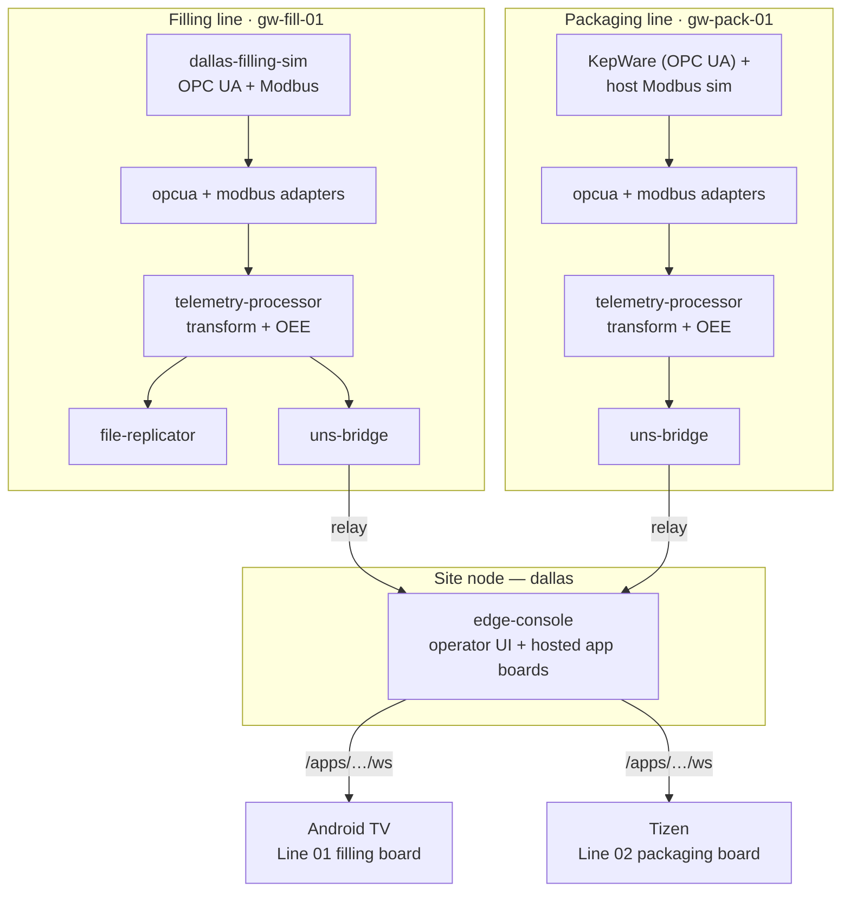

import { Aside, CardGrid, LinkCard } from "@astrojs/starlight/components";

The **Dallas** demo is a complete EdgeCommons plant you can stand up on one machine: a fictional beverage
bottler running two production lines, simulated from the field signals up, with **OEE derived on the edge**
and rendered live in the [edge-console](/components/edge-console/) and on purpose-built line boards —
including a **native Android TV** dashboard mounted over the filling line.

It exists to show the whole platform composing into something real: field protocols in, a
[Unified Namespace](/guides/unified-namespace/) in the middle, and operator-ready dashboards out — with
every layer being a standard EdgeCommons component you could deploy the same way in production.

## The plant

Every box is a standard component. Each line device runs its protocol adapters, a telemetry-processor, and
a [`uns-bridge`](/components/uns-bridge/) that relays its device-local bus up to the **site broker**; the
site node runs the [edge-console](/components/edge-console/). Nothing above the field ever parses a topic
string — every message is self-identifying through its [UNS identity](/guides/unified-namespace/).

## The two lines

<CardGrid>
<LinkCard title="Filling line — gw-fill-01" href="/components/edge-console/" description="A rotary filler running ~126 bottles/min against a 132 target, with a periodic fill-pressure-drift episode that biases fill volume high and lifts under/overfill rejects. Fully self-contained: its OPC UA + Modbus sources are one in-container simulator." />
<LinkCard title="Packaging line — gw-pack-01" href="/components/edge-console/" description="A case packer with a motor-current precursor → jam → paused-throughput → recovery-reject-burst scenario, fed from a LAN OPC UA server (KepWare) and a host Modbus source." />
</CardGrid>

The filling line is the one to watch first — it is self-contained (no external dependencies) and it drives
the native TV board. Its simulator emits both the scalar Modbus counters (`GoodBottleCount`, `RejectCount`,
the reject breakdown, bowl level, conveyor/infeed/e-stop health) and an OPC UA `OeeShiftSnapshot`, from a
**single shared scenario** so the two always agree.

## From field signal to OEE

The pipeline is the same on both lines:

1. **Adapters** — the [OPC UA](/components/opcua-adapter/) and [Modbus](/components/modbus-adapter/)
   adapters read the field sources and publish each signal onto the device's UNS `data` class.
2. **Transform** — the line's [telemetry-processor](/components/telemetry-processor/) runs a per-signal
   Lua transform (engineering-unit scaling, rate, alarm banding) and tees a rolling **Parquet** sink that
   the [file-replicator](/components/file-replicator/) ships off the device.
3. **OEE** — the same telemetry-processor runs an OEE route that derives
   **Availability × Performance × Quality = OEE** and republishes them to the bus. On the filling line
   these come from the simulator's `OeeShiftSnapshot` = `[plannedMs, runMs, good+rejects, good,
   idealMsPerBottle]`; the route rejects any snapshot where `runMs > plannedMs`.
4. **Relay** — each line's `uns-bridge` relays the device-local bus (signals *and* the derived OEE) up to
   the site broker.
5. **Console** — the edge-console subscribes the site broker's [class wildcards](/guides/unified-namespace/),
   builds its in-memory fleet model, and serves it to browsers and hosted apps.

<Aside type="note" title="OEE is derived on the edge, not in the cloud">
Availability, Performance, Quality and OEE are computed by the line's own telemetry-processor and published
back onto the UNS as ordinary signals. The console and every board just render them — no dashboard does OEE
math, and the numbers are identical everywhere because they come from one place.
</Aside>

## The dashboards

Two surfaces render the same fleet model:

- **The edge-console operator UI** — fleet health, the components tree, site topology, events & alarms,
  metrics, and a Signals browser over the `data` class. This is the general-purpose console; see the
  [edge-console docs](/components/edge-console/).
- **Purpose-built line boards, hosted by the console.** Besides its own UI, the console
  [hosts additional applications](/components/edge-console/explanation/#hosting-additional-applications):
  a **native Android TV** board mounted over the filling line (Line 01) and a packaged **Samsung Tizen**
  board over the packaging line (Line 02). Each is served at `/apps/{id}/`, connects over a rate-limited
  application WebSocket, and is scoped to what it may see by its own origins, roles, and data capabilities
  — a wall display that renders the line without being able to command it.

The native filling board shows the OEE band, an INFEED ▸ FILLER ▸ CAPPER flow strip, a fill-quality panel
(tank level plus pressure / volume / temperature / CO₂ against their spec bands), a rate-vs-target gauge,
and a reject breakdown — all driven live from the signals above, with colour used only where it means
something (amber caution, red fault).

<CardGrid>
<LinkCard title="Register the board" href="/components/edge-console/reference-configuration/#componentglobalconsoleapps" description="The console.apps entry: id, static bundle, allowed origins, roles, and data capabilities." />
<LinkCard title="Point a client at it" href="/components/edge-console/how-to-guides/#host-an-additional-browser-or-native-app" description="Serve a browser board, or point a native client (Android TV / kiosk) at /apps/{id}/ws with the right Origin." />
</CardGrid>

## Running it

The demo is stood up by the org's `docker compose` system-test harness — one container per edge device,
every component running as a supervised process against a per-device broker, exactly matching the topology
above. Bringing the whole plant up is a single `docker compose up`; the filling line needs no external
dependencies, while the packaging line expects LAN reachability to its OPC UA server and host Modbus
source. From there, open the edge-console in a browser to watch both lines, and install the TV board on an
Android TV / Tizen panel pointed at the console's application WebSocket.

<Aside type="caution" title="Trusted networks only">
The demo runs over plain HTTP/`ws://` for convenience. In production, terminate TLS in front of the console
and serve boards over `wss://`; the application WebSocket's origin and role gates are coarse boundaries,
not user authentication. See [edge-console → security](/components/edge-console/explanation/#a-note-on-security).
</Aside>

## See also

<CardGrid>
<LinkCard title="Unified Namespace" href="/guides/unified-namespace/" description="The topic grammar and identity model every component in the demo speaks." />
<LinkCard title="edge-console" href="/components/edge-console/" description="The console that models the fleet and hosts the line boards." />
<LinkCard title="telemetry-processor" href="/components/telemetry-processor/" description="The transform + OEE stage on each line." />
<LinkCard title="Hosting additional apps" href="/components/edge-console/explanation/#hosting-additional-applications" description="How the console serves purpose-built browser and native boards." />
</CardGrid>
